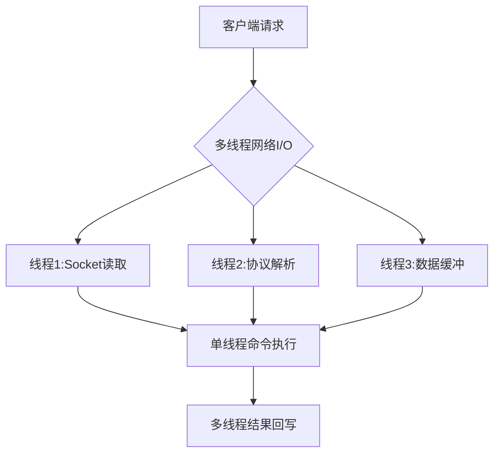
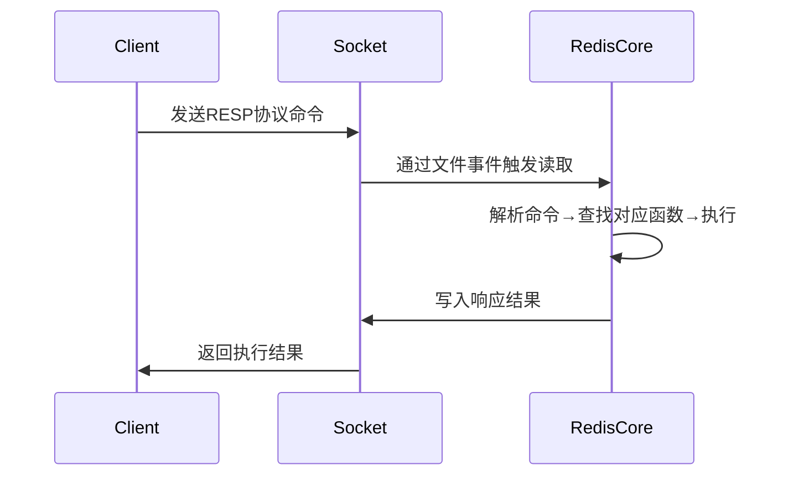
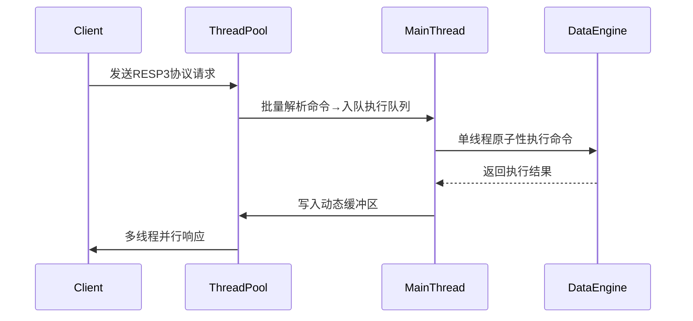
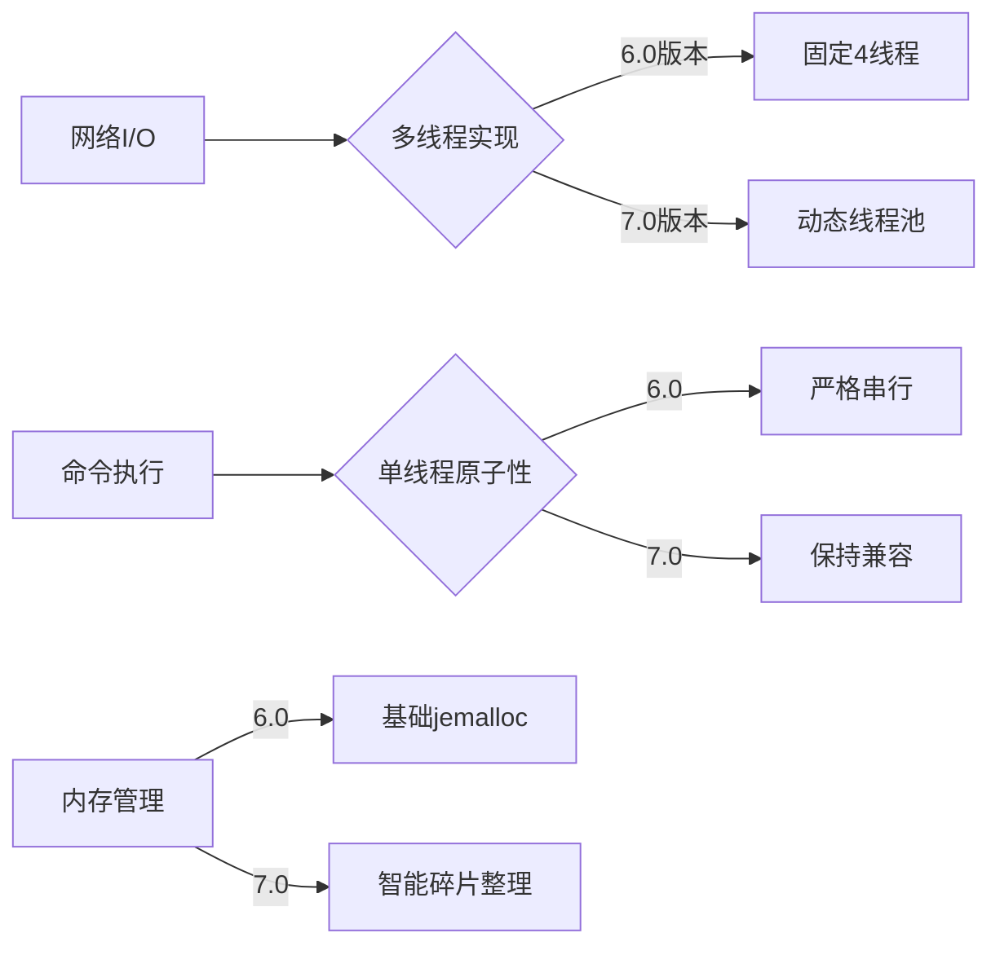

## 2、Redis

内存型数据库，c语言编写，旨在加速查存

### 2-1、基本数据类型剖析

​	Redis使用c语言编写，封装了八种基本数据类型，string、set、zset、list、hash、hyperloglog、geospatial、，这八种数据结构基本满足需求。

#### 2-1-1、String

一、基础特性

1. ‌**二进制安全存储**‌

   - 可存储任意格式数据（包括序列化对象、图片二进制等）
   - 最大容量512MB，支持文本、数字、二进制混合内容

2. ‌**底层实现**‌

   - 采用简单动态字符串（SDS）结构，包含：

     ```c
     struct sdshdr {
         int len;    // 已用字节数
         int free;   // 剩余空间
         char buf[]; // 实际数据存储
     };
     ```

   - 预分配空间减少内存重分配次数

------

二、核心操作命令

| 命令类型     | 示例                   | 作用                     |
| ------------ | ---------------------- | ------------------------ |
| ‌**基础操作**‌ | `SET key value`        | 设置键值对               |
|              | `GET key`              | 获取值（不存在返回nil）  |
| ‌**数字运算**‌ | `INCR key`             | 值自增1（原子操作）      |
|              | `INCRBY key increment` | 指定步长自增             |
| ‌**位操作**‌   | `SETBIT key offset 1`  | 设置二进制位（支持位图） |
|              | `BITCOUNT key`         | 统计值为1的位数          |
| ‌**批量操作**‌ | `MSET k1 v1 k2 v2`     | 批量设置键值             |

------

三、高级特性

1. ‌**动态扩展**‌
   - 空间不足时自动扩容（小于1MB时加倍，大于1MB时每次扩1MB）
2. ‌**内存优化**‌
   - 对短字符串（≤39字节）采用embstr编码，减少内存碎片
   - 长字符串使用raw编码，独立分配内存
3. ‌**过期控制**‌
   - 支持`SETEX key seconds value`设置过期时间
   - 结合惰性删除+定期删除机制清理过期键

------

四、典型应用场景

1. ‌**缓存加速**‌
   - 存储热点数据（如商品详情）
2. ‌**计数器**‌
   - 利用`INCR`实现阅读量/点赞统计
3. ‌**分布式锁**‌
   - 通过`SETNX`实现互斥锁
4. ‌**位图处理**‌
   - 用户签到记录（每日1bit）

> 注：String类型在Redis 5.0后支持更紧凑的存储格式优化

#### 2-1-2、Set

一、核心特性

1. ‌**数据结构本质**‌

   - 无序且唯一的字符串集合，底层通过哈希表实现
   - 最大可存储2³²-1个元素（约40亿）
   - 所有操作时间复杂度为O(1)

2. ‌**底层编码**‌

   | 编码类型    | 触发条件                 | 特点                   |
   | ----------- | ------------------------ | ---------------------- |
   | `intset`    | 元素均为整数且数量≤5123  | 连续内存存储，节省空间 |
   | `hashtable` | 元素含非整数或数量＞5123 | 标准哈希表结构         |

------

二、核心操作命令

| ‌**命令组**‌   | ‌**示例**‌              | ‌**作用**‌             |
| ------------ | --------------------- | -------------------- |
| ‌**元素操作**‌ | `SADD myset "A" "B"`  | 添加元素（自动去重） |
|              | `SREM myset "A"`      | 删除指定元素         |
| ‌**查询操作**‌ | `SMEMBERS myset`      | 获取所有元素（无序） |
|              | `SISMEMBER myset "B"` | 检查元素是否存在     |
| ‌**集合运算**‌ | `SINTER set1 set2`    | 返回交集             |
|              | `SUNION set1 set2`    | 返回并集             |
| ‌**随机操作**‌ | `SPOP myset`          | 随机移除并返回元素   |

------

三、典型应用场景

1. ‌**去重存储**‌
   - 专利中的物流单号去重（动态选择Set或Bitmap）
   - 用户标签系统存储
2. ‌**关系运算**‌
   - 共同好友推荐（SINTER）
   - 商品品类筛选组合
3. ‌**随机抽奖**‌
   - 通过SPOP实现公平随机选取

------

四、性能优化建议

1. ‌**控制元素类型**‌
   - 尽量使用整数元素以触发intset编码
2. ‌**避免大Key**‌
   - 元素超过1万时考虑分片存储（如`set:part1`/`set:part2`）
3. ‌**替代方案选择**‌
   - 超大数据量（亿级）可结合Bitmap优化内存

> 注：Set与Zset的主要区别在于是否维护元素顺序

#### 2-1-3、Zset

一、核心特性

1. ‌**数据结构本质**‌
   - 在Set基础上增加score排序维度，元素唯一但score可重复
   - 默认按score升序排列，score相同时按字典序排序
2. ‌**底层实现演进**‌
   - ‌Redis 7.0前：
     - 小数据量（元素<128且单元素<64B）使用Ziplist，大数据量用跳表（Skiplist）
   - ‌Redis 7.0+：
     - Listpack完全替代Ziplist，仍与跳表组合使用

二、底层结构详解

| 结构类型     | 适用场景         | 时间复杂度              | 内存效率           |
| ------------ | ---------------- | ----------------------- | ------------------ |
| ‌**Listpack**‌ | 元素少且体积小   | 插入/删除O(N)           | 极高（连续存储）   |
| ‌**跳表**‌     | 大数据量或大元素 | 插入/删除/查询均O(logN) | 中等（需存储指针） |

‌**跳表特殊设计**‌：

- 多层索引结构，最高32层，每层以1/4概率升级
- 节点同时存储score和member，支持O(1)分数查询

三、典型应用场景

1. ‌实时排行榜
   - 通过`ZREVRANGE`获取TOP N，`ZINCRBY`动态更新分数
2. ‌延时队列
   - 以时间戳为score，定时扫描到期任务
3. ‌滑动窗口限流
   - 用ZSet存储请求时间戳，通过`ZREMRANGEBYSCORE`维护窗口

四、性能优化建议

1. ‌参数调优
   - 调整`zset-max-listpack-entries`（默认128）和`zset-max-listpack-value`（默认64）控制结构转换阈值
2. ‌批量操作
   - 使用`ZADD`批量插入替代循环单次插入，减少内存重分配次数

当前版本（Redis 7.0+）中，ZSet在百万级数据量下仍能保持99%操作性能在10ms内

#### 2-1-4、List

一、核心特性

1. ‌**数据结构本质**‌

   - 有序的字符串元素集合，支持重复值，最大容量2³²-1个元素
   - 支持双向操作（头插/尾插），时间复杂度O(1)

2. ‌**底层实现演进**‌

   | 版本        | 数据结构                      | 特点                                    |
   | ----------- | ----------------------------- | --------------------------------------- |
   | Redis 3.2前 | ziplist + linkedlist          | 小数据用压缩列表，大数据转双向链表      |
   | Redis 3.2+  | quicklist                     | 双向链表嵌套ziplist节点，平衡内存与性能 |
   | Redis 7.0   | quicklist+listpack替代ziplist | 解决连锁更新问题                        |

二、操作命令

1. ‌**基础操作**‌
   - `LPUSH/RPUSH`：头插/尾插元素（批量操作时间复杂度O(N)）
   - `LPOP/RPOP`：非阻塞式弹出元素，`BLPOP/BRPOP`为阻塞版本
   - `LRANGE`：获取区间元素（左闭右闭），时间复杂度O(S+N)
2. ‌**特殊场景命令**‌
   - `LTRIM`：裁剪列表，仅保留指定区间
   - `RPOPLPUSH`：原子化移动元素到另一列表

三、应用场景

1. ‌**消息队列**‌
   - 组合`LPUSH+BRPOP`实现生产者-消费者模型
   - 相比Pub/Sub模式可持久化消息
2. ‌**栈结构**‌
   - `LPUSH+LPOP`实现后进先出
3. ‌**实时排行榜**‌
   - 通过`LRANGE`快速获取最新N条数据

四、性能优化点

1. ‌**内存控制**‌
   - quicklist默认单个ziplist节点8KB，可通过`list-max-ziplist-size`调整
   - 大元素建议拆分存储避免节点膨胀
2. ‌**阻塞操作注意**‌
   - `BLPOP`多key时按顺序检查，超时设置需谨慎

当前最新版本(2025年)推荐使用quicklist+listpack组合，在内存效率和操作性能间取得最佳平衡


#### 2-1-5、Hash

一、数据结构特性

1. ‌**存储结构**‌

   - 采用`field-value`嵌套映射，形如`key={ {field1,value1},...,{fieldN,valueN} }`
   - 每个Hash最多可存储2³²-1个键值对（约40亿）

2. ‌**底层实现**‌

   | 编码类型    | 触发条件                    | 特点                   |
   | ----------- | --------------------------- | ---------------------- |
   | `ziplist`   | 字段数＜512且值长度＜64字节 | 内存连续存储，节省空间 |
   | `hashtable` | 超出ziplist限制时           | 查询时间复杂度O(1)     |

------

二、核心操作命令

| ‌**命令组**‌   | ‌**示例**‌                              | ‌**作用**‌       |
| ------------ | ------------------------------------- | -------------- |
| ‌**字段操作**‌ | `HSET user:1 name "John"`             | 设置单个字段   |
|              | `HGET user:1 name`                    | 获取字段值     |
| ‌**批量操作**‌ | `HMSET product:100 price 99 stock 50` | 批量设置字段   |
|              | `HMGET product:100 price stock`       | 批量获取字段   |
| ‌**数字运算**‌ | `HINCRBY user:1 age 1`                | 字段值原子递增 |
| ‌**扩展操作**‌ | `HSCAN user:1 0 MATCH *name*`         | 增量迭代字段   |

------

三、应用场景

1. ‌对象存储
   - 存储用户信息（如`user:id`包含name/age/email字段）
2. ‌商品属性
   - 商品ID关联多维度属性（价格/库存/规格）
3. ‌聚合统计
   - 通过`HINCRBY`实现实时计数器

------

四、性能优化建议

1. ‌控制字段数量
   - 避免单个Hash超过500字段，防止ziplist转hashtable
2. ‌大Key拆分
   - 字段过多时可按业务维度拆分（如`user:1:base`和`user:1:ext`）
3. ‌集群分片
   - 在Redis Cluster中，Hash整体存储在单个分片

> 注：Hash类型相比String更节省内存（存储相同字段时减少key元数据开销）

### 2-2、键的管理

#### 2-2-1、淘汰策略

内存快满了决定哪些key需要被淘汰，为新键腾空间

1、默认不淘汰 noevication，内存满了，执行拒绝策略

2、设置了key的超时时间的

​		1、volitile-lru：最近最少使用优先淘汰

​		2、volitile-lfu：最少使用频率的优先淘汰

​		3、volitile-random：从设置了超时时间的里面随机选一个

​		4、volitile-ttl：超时时间剩余最少的key优先（快要过期的）

3、全局键空间

​		1、all-lru：最近最少使用的优先淘汰

​		2、all-lfu：最少使用的

​		3、all-random：随机淘汰

4、策略选择建议

1. ‌**缓存系统**‌：优先选择`allkeys-lru`（存在热点数据）或`allkeys-lfu`（访问频率差异大）
2. ‌**临时数据**‌：使用`volatile-ttl`快速清理过期数据，或`volatile-lru`保留常用临时数据
3. ‌**配置方法**‌：在redis.conf中设置`maxmemory-policy`参数

> 注：LRU/LFU算法在Redis中采用近似实现，通过随机采样而非全量统计

#### 2-2-2、过期策略

这个仅针对设置了过期时间的key

​		1、惰性删除

设置了过期时间，仅在客户端访问key时去检测是否超时

好处，对服务器的影响较小。

​		2、定期删除

服务器内部定时器定时隔100ms去随机采样一批20个键，若过期率达20%，重复扫描直至低于20%

需要额外线程资源处理

### 2-3、Redis的执行流程

基础流程




#### 2-3-1 、6.0版本的执行流程

一、核心执行模型

1. ‌**单线程事件循环**‌
   - 采用Reactor模式处理I/O事件，主线程通过`aeEventLoop`实现事件分发
   - 单线程避免锁竞争，命令执行平均耗时0.1ms级
2. ‌**I/O多路复用机制**‌
   - 封装epoll/kqueue等系统调用，单线程可处理10万级并发连接
   - 事件处理器分为：连接应答处理器/命令请求处理器/命令回复处理器

二、命令执行全流程



1. ‌**请求处理阶段**‌
   - 客户端命令转换为RESP协议格式传输
   - `redisClient`结构体存储连接状态和命令参数
2. ‌**命令执行阶段**‌
   - 通过`redisCommand`结构体查找对应执行函数
   - 执行过程严格单线程化，保障Lua脚本/事务的原子性

三、关键技术实现

1. ‌**内存管理**‌
   - 使用jemalloc分配器减少内存碎片
   - 渐进式rehash解决哈希表扩容阻塞问题
2. ‌**持久化机制**‌
   - RDB快照采用COW(Copy-On-Write)技术生成
   - AOF日志通过`fsync`策略控制数据安全级别

四、性能优化设计

| 设计要点   | 实现方式                   | 效果提升         |
| ---------- | -------------------------- | ---------------- |
| 网络通信   | I/O多路复用+非阻塞Socket   | 连接数突破10万级 |
| 数据结构   | SDS动态字符串+压缩列表优化 | 内存节省40%      |
| 过期键清理 | 惰性删除+定期删除双策略    | CPU占用降低35%   |

> 注：Redis 7.0在保留核心单线程模型基础上，新增多线程网络I/O处理能力

#### 2-3-2 、7.0以及之后的执行优化

一、核心执行流程（多线程I/O增强版）



二、关键优化点

1. ‌**动态线程池管理**‌
   - I/O线程数可运行时调整（默认4-16线程），通过`io-threads`参数配置
   - 智能负载均衡：根据连接数自动分配线程资源
2. ‌**网络处理优化**‌
   - 批量解析请求：减少线程切换开销，吞吐量较6.0提升40%
   - 响应缓冲区动态扩容：避免大包阻塞主线程
3. ‌**协议层增强**‌
   - 优先使用RESP3协议，支持多模态数据返回
   - 客户端缓存通知机制优化

------

三、与传统版本的差异对比

| 阶段           | Redis 6.0      | Redis 7.0改进         |
| -------------- | -------------- | --------------------- |
| ‌**网络I/O**‌    | 固定4线程处理  | 动态线程池+自适应缓冲 |
| ‌**命令执行**‌   | 严格单线程     | 保持单线程原子性      |
| ‌**大请求处理**‌ | 可能阻塞主线程 | 分片处理+零拷贝优化   |
| ‌**内存管理**‌   | 基础jemalloc   | 智能碎片整理算法      |

------





四、性能表现

- ‌**延迟**‌：P99延迟降低30%，尤其改善10KB以上大包场景5
- ‌**吞吐量**‌：单节点QPS可达15万+（16线程配置）35
- ‌**资源利用率**‌：CPU利用率提升至65%（原50%）17

> 注：需在redis.conf中配置`io-threads-do-reads yes`启用多线程读

### 2-4、使用及其常见问题

2-4-1、

2-4-2、

#### 2-4-3、缓存不一致问题


2-4-4、

### 2-5、分布式集群

#### 2-5-1、Redis集群核心概念

1. 集群定义与背景

Redis集群是Redis提供的分布式数据库方案，通过分片(sharding)实现数据共享，并提供复制和故障转移功能。随着互联网应用数据量爆发式增长，单机Redis在存储容量、读写性能和高可用性等方面逐渐难以满足需求，集群方案应运而生。

2. 集群核心功能

- ‌**数据分片**‌：将数据分散存储在多个节点上，突破单机存储容量限制
- ‌**高可用性**‌：通过节点复制和自动故障转移确保服务连续性
- ‌**读写分离**‌：从节点分担读请求，提升系统读性能
- ‌**水平扩展**‌：通过增加节点实现容量和性能的线性增长

#### 2-5-2、集群架构与原理

1. 节点组成

- ‌**主节点(Master)**‌：负责处理槽位数据读写
- ‌**从节点(Slave)**‌：复制主节点数据，提供读服务
- ‌**推荐配置**‌：至少3个主节点，每个主节点配1个从节点

2. 数据分片机制

```java
// 键到槽位的哈希计算
slot = CRC16(key) % 16384  // 共16384个槽位
```

- 每个主节点负责部分槽位（默认每个节点5461个槽位）
- 客户端直接路由到负责对应槽位的节点

3. 节点通信

- 使用Gossip协议进行元数据同步
- 默认通过6379端口进行TCP/IP通信
- 心跳检测：节点间定期PING/PONG

#### 2-5-3、集群搭建实践

1. 环境准备

```bash
# 下载Redis
wget https://download.redis.io/releases/redis-7.0.5.tar.gz
tar -xzf redis-7.0.5.tar.gz
cd redis-7.0.5

# 启动6个节点(7000-7005端口)
for port in {7000..7005}; do
  ./src/redis-server --port $port --cluster-enabled yes --cluster-config-file nodes-$port.conf &
done:ml-citation{ref="3" data="citationList"}
```

2. 集群创建

```bash
# 使用redis-cli创建集群
redis-cli --cluster create \
  127.0.0.1:7000 127.0.0.1:7001 127.0.0.1:7002 \
  127.0.0.1:7003 127.0.0.1:7004 127.0.0.1:7005 \
  --cluster-replicas 1:ml-citation{ref="3" data="citationList"}
```

3. 集群验证

```bash
redis-cli -p 7000 cluster nodes  # 查看节点列表
redis-cli -p 7000 cluster info  # 查看集群状态:ml-citation{ref="3" data="citationList"}
```

#### 2-5-4、集群核心机制

1. 故障转移

- 主节点故障时，从节点自动升级为主节点
- 故障检测通过节点间心跳实现
- 需多数节点确认故障才会触发转移

2. 数据迁移

- 使用`CLUSTER ADDSLOTS`手动分配槽位
- 支持在线重新分片(resharding)
- 迁移过程中保证数据一致性

3. 客户端路由

- 智能客户端(如JedisCluster)自动处理重定向
- MOVED错误：永久重定向到正确节点
- ASK错误：临时重定向用于迁移场景

#### 2-5-5、集群优化建议

1. 性能调优

- ‌**合理分片**‌：避免数据倾斜，均匀分布槽位
- ‌**连接池配置**‌：优化客户端连接参数
- ‌**批量操作**‌：使用Pipeline减少网络往返

2. 高可用保障

- 每个分片配置至少一个从节点
- 跨机房部署提升容灾能力
- 监控集群状态和性能指标

3. 扩容策略

- 预先规划容量，避免频繁扩容
- 扩容后执行重新分片平衡数据
- 使用`--cluster-use-empty-masters`避免空节点

#### 2-5-6、与其他方案对比

| ‌**方案**‌ | ‌**优点**‌                 | ‌**缺点**‌                       |
| -------- | ------------------------ | ------------------------------ |
| 主从复制 | 实现简单，读写分离       | 写能力单点瓶颈，无自动故障转移 |
| 哨兵模式 | 自动故障转移，高可用     | 仍然存在写单点问题             |
| 集群模式 | 真正分布式，支持水平扩展 | 配置复杂，客户端需支持         |

> 📌 注：Redis集群适用于需要处理海量数据和高并发的场景，对于中小规模应用，哨兵模式可能更简单实用

#### 