[toc]

# 序

> **“不是面经，而是一面镜子。”**

在浩瀚如海的技术世界中，作为一名后端开发者，我们每天都在面对一个终极难题——如何系统地学习，如何高效地进阶。而“面镜”，正是为了解决这个痛点而诞生的。

这是我自己的“照妖镜”，一面能照出自身短板与知识死角的镜子，也是一个为所有程序员朋友准备的免费、开源的知识体系整理项目。在这里，没有东拼西凑的碎片化内容，也不需要付费订阅，所有内容全都开放，持续更新。

**面镜** 涵盖后端开发核心技能，包括但不限于 Java、Spring、MySQL、Redis、消息队列、分布式、微服务、系统设计、安全与性能优化等内容，力求打造一站式技术导航图谱，帮助你从容应对工作挑战、技术面试，乃至职场晋升。

希望这面镜子不仅能帮助我自身精进，也能为每一位在技术之路上跋涉的你，点亮前行的方向。

-- 猫鱼儿

# 一、数据库理论

业务系统离不开数据的存储与查询。

## 1、MongoDB

### 1-1、基本概念

集合（表）、文档（记录）、字段（字段）

### 1-2、存储引擎与索引

3.2版本后，使用WiredTiger存储引擎，B+树结构，存储单元为page，分为**root page、internal page、leaf page**，每一个节点是一个page，非叶子节点为索引节点，数据存储在叶子节点上

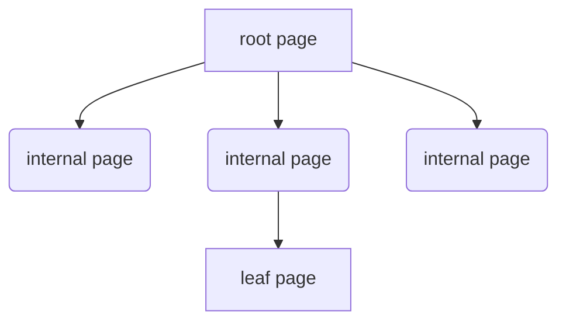

索引：

单键值索引、

复合索引（联合索引）、

多键索引（一个字段下可能是一个数组，存在多键情况）

哈希索引：顾名思义，字段哈希值索引

文本索引：内容检索，全文索引，一般通过一个或者多个字符串对文档内容进行索引

### 1-3、分片复制集群

三个组件router server、config server、sharding server。

router server：接受前段连接请求，然后根据config server进行路由转发

config server：存储元数据信息，不存具体业务数据

sharding server（主从结构）：数据实际储存位置，多主多从，高可用高并发

类似Redis的集群分片

## 2、Redis

内存型数据库，c语言编写，旨在加速查存

### 2-1、基本数据类型剖析

​	Redis使用c语言编写，封装了八种基本数据类型，string、set、zset、list、hash、hyperloglog、geospatial、，这八种数据结构基本满足需求。

#### 2-1-1、String

一、基础特性

1. ‌**二进制安全存储**‌

   - 可存储任意格式数据（包括序列化对象、图片二进制等）
   - 最大容量512MB，支持文本、数字、二进制混合内容

2. ‌**底层实现**‌

   - 采用简单动态字符串（SDS）结构，包含：

     ```c
     struct sdshdr {
         int len;    // 已用字节数
         int free;   // 剩余空间
         char buf[]; // 实际数据存储
     };
     ```

   - 预分配空间减少内存重分配次数

------

二、核心操作命令

| 命令类型     | 示例                   | 作用                     |
| ------------ | ---------------------- | ------------------------ |
| ‌**基础操作**‌ | `SET key value`        | 设置键值对               |
|              | `GET key`              | 获取值（不存在返回nil）  |
| ‌**数字运算**‌ | `INCR key`             | 值自增1（原子操作）      |
|              | `INCRBY key increment` | 指定步长自增             |
| ‌**位操作**‌   | `SETBIT key offset 1`  | 设置二进制位（支持位图） |
|              | `BITCOUNT key`         | 统计值为1的位数          |
| ‌**批量操作**‌ | `MSET k1 v1 k2 v2`     | 批量设置键值             |

------

三、高级特性

1. ‌**动态扩展**‌
   - 空间不足时自动扩容（小于1MB时加倍，大于1MB时每次扩1MB）
2. ‌**内存优化**‌
   - 对短字符串（≤39字节）采用embstr编码，减少内存碎片
   - 长字符串使用raw编码，独立分配内存
3. ‌**过期控制**‌
   - 支持`SETEX key seconds value`设置过期时间
   - 结合惰性删除+定期删除机制清理过期键

------

四、典型应用场景

1. ‌**缓存加速**‌
   - 存储热点数据（如商品详情）
2. ‌**计数器**‌
   - 利用`INCR`实现阅读量/点赞统计
3. ‌**分布式锁**‌
   - 通过`SETNX`实现互斥锁
4. ‌**位图处理**‌
   - 用户签到记录（每日1bit）

> 注：String类型在Redis 5.0后支持更紧凑的存储格式优化

#### 2-1-2、Set

一、核心特性

1. ‌**数据结构本质**‌

   - 无序且唯一的字符串集合，底层通过哈希表实现
   - 最大可存储2³²-1个元素（约40亿）
   - 所有操作时间复杂度为O(1)

2. ‌**底层编码**‌

   | 编码类型    | 触发条件                 | 特点                   |
   | ----------- | ------------------------ | ---------------------- |
   | `intset`    | 元素均为整数且数量≤5123  | 连续内存存储，节省空间 |
   | `hashtable` | 元素含非整数或数量＞5123 | 标准哈希表结构         |

------

二、核心操作命令

| ‌**命令组**‌   | ‌**示例**‌              | ‌**作用**‌             |
| ------------ | --------------------- | -------------------- |
| ‌**元素操作**‌ | `SADD myset "A" "B"`  | 添加元素（自动去重） |
|              | `SREM myset "A"`      | 删除指定元素         |
| ‌**查询操作**‌ | `SMEMBERS myset`      | 获取所有元素（无序） |
|              | `SISMEMBER myset "B"` | 检查元素是否存在     |
| ‌**集合运算**‌ | `SINTER set1 set2`    | 返回交集             |
|              | `SUNION set1 set2`    | 返回并集             |
| ‌**随机操作**‌ | `SPOP myset`          | 随机移除并返回元素   |

------

三、典型应用场景

1. ‌**去重存储**‌
   - 专利中的物流单号去重（动态选择Set或Bitmap）
   - 用户标签系统存储
2. ‌**关系运算**‌
   - 共同好友推荐（SINTER）
   - 商品品类筛选组合
3. ‌**随机抽奖**‌
   - 通过SPOP实现公平随机选取

------

四、性能优化建议

1. ‌**控制元素类型**‌
   - 尽量使用整数元素以触发intset编码
2. ‌**避免大Key**‌
   - 元素超过1万时考虑分片存储（如`set:part1`/`set:part2`）
3. ‌**替代方案选择**‌
   - 超大数据量（亿级）可结合Bitmap优化内存

> 注：Set与Zset的主要区别在于是否维护元素顺序

#### 2-1-3、Zset

一、核心特性

1. ‌**数据结构本质**‌
   - 在Set基础上增加score排序维度，元素唯一但score可重复
   - 默认按score升序排列，score相同时按字典序排序
2. ‌**底层实现演进**‌
   - ‌Redis 7.0前：
     - 小数据量（元素<128且单元素<64B）使用Ziplist，大数据量用跳表（Skiplist）
   - ‌Redis 7.0+：
     - Listpack完全替代Ziplist，仍与跳表组合使用

二、底层结构详解

| 结构类型     | 适用场景         | 时间复杂度              | 内存效率           |
| ------------ | ---------------- | ----------------------- | ------------------ |
| ‌**Listpack**‌ | 元素少且体积小   | 插入/删除O(N)           | 极高（连续存储）   |
| ‌**跳表**‌     | 大数据量或大元素 | 插入/删除/查询均O(logN) | 中等（需存储指针） |

‌**跳表特殊设计**‌：

- 多层索引结构，最高32层，每层以1/4概率升级
- 节点同时存储score和member，支持O(1)分数查询

三、典型应用场景

1. ‌实时排行榜
   - 通过`ZREVRANGE`获取TOP N，`ZINCRBY`动态更新分数
2. ‌延时队列
   - 以时间戳为score，定时扫描到期任务
3. ‌滑动窗口限流
   - 用ZSet存储请求时间戳，通过`ZREMRANGEBYSCORE`维护窗口

四、性能优化建议

1. ‌参数调优
   - 调整`zset-max-listpack-entries`（默认128）和`zset-max-listpack-value`（默认64）控制结构转换阈值
2. ‌批量操作
   - 使用`ZADD`批量插入替代循环单次插入，减少内存重分配次数

当前版本（Redis 7.0+）中，ZSet在百万级数据量下仍能保持99%操作性能在10ms内

#### 2-1-4、List

一、核心特性

1. ‌**数据结构本质**‌

   - 有序的字符串元素集合，支持重复值，最大容量2³²-1个元素
   - 支持双向操作（头插/尾插），时间复杂度O(1)

2. ‌**底层实现演进**‌

   | 版本        | 数据结构                      | 特点                                    |
   | ----------- | ----------------------------- | --------------------------------------- |
   | Redis 3.2前 | ziplist + linkedlist          | 小数据用压缩列表，大数据转双向链表      |
   | Redis 3.2+  | quicklist                     | 双向链表嵌套ziplist节点，平衡内存与性能 |
   | Redis 7.0   | quicklist+listpack替代ziplist | 解决连锁更新问题                        |

二、操作命令

1. ‌**基础操作**‌
   - `LPUSH/RPUSH`：头插/尾插元素（批量操作时间复杂度O(N)）
   - `LPOP/RPOP`：非阻塞式弹出元素，`BLPOP/BRPOP`为阻塞版本
   - `LRANGE`：获取区间元素（左闭右闭），时间复杂度O(S+N)
2. ‌**特殊场景命令**‌
   - `LTRIM`：裁剪列表，仅保留指定区间
   - `RPOPLPUSH`：原子化移动元素到另一列表

三、应用场景

1. ‌**消息队列**‌
   - 组合`LPUSH+BRPOP`实现生产者-消费者模型
   - 相比Pub/Sub模式可持久化消息
2. ‌**栈结构**‌
   - `LPUSH+LPOP`实现后进先出
3. ‌**实时排行榜**‌
   - 通过`LRANGE`快速获取最新N条数据

四、性能优化点

1. ‌**内存控制**‌
   - quicklist默认单个ziplist节点8KB，可通过`list-max-ziplist-size`调整
   - 大元素建议拆分存储避免节点膨胀
2. ‌**阻塞操作注意**‌
   - `BLPOP`多key时按顺序检查，超时设置需谨慎

当前最新版本(2025年)推荐使用quicklist+listpack组合，在内存效率和操作性能间取得最佳平衡


#### 2-1-5、Hash

一、数据结构特性

1. ‌**存储结构**‌

   - 采用`field-value`嵌套映射，形如`key={ {field1,value1},...,{fieldN,valueN} }`
   - 每个Hash最多可存储2³²-1个键值对（约40亿）

2. ‌**底层实现**‌

   | 编码类型    | 触发条件                    | 特点                   |
   | ----------- | --------------------------- | ---------------------- |
   | `ziplist`   | 字段数＜512且值长度＜64字节 | 内存连续存储，节省空间 |
   | `hashtable` | 超出ziplist限制时           | 查询时间复杂度O(1)     |

------

二、核心操作命令

| ‌**命令组**‌   | ‌**示例**‌                              | ‌**作用**‌       |
| ------------ | ------------------------------------- | -------------- |
| ‌**字段操作**‌ | `HSET user:1 name "John"`             | 设置单个字段   |
|              | `HGET user:1 name`                    | 获取字段值     |
| ‌**批量操作**‌ | `HMSET product:100 price 99 stock 50` | 批量设置字段   |
|              | `HMGET product:100 price stock`       | 批量获取字段   |
| ‌**数字运算**‌ | `HINCRBY user:1 age 1`                | 字段值原子递增 |
| ‌**扩展操作**‌ | `HSCAN user:1 0 MATCH *name*`         | 增量迭代字段   |

------

三、应用场景

1. ‌对象存储
   - 存储用户信息（如`user:id`包含name/age/email字段）
2. ‌商品属性
   - 商品ID关联多维度属性（价格/库存/规格）
3. ‌聚合统计
   - 通过`HINCRBY`实现实时计数器

------

四、性能优化建议

1. ‌控制字段数量
   - 避免单个Hash超过500字段，防止ziplist转hashtable
2. ‌大Key拆分
   - 字段过多时可按业务维度拆分（如`user:1:base`和`user:1:ext`）
3. ‌集群分片
   - 在Redis Cluster中，Hash整体存储在单个分片

> 注：Hash类型相比String更节省内存（存储相同字段时减少key元数据开销）

### 2-2、键的管理

#### 2-2-1、淘汰策略

内存快满了决定哪些key需要被淘汰，为新键腾空间

1、默认不淘汰 noevication，内存满了，执行拒绝策略

2、设置了key的超时时间的

​		1、volitile-lru：最近最少使用优先淘汰

​		2、volitile-lfu：最少使用频率的优先淘汰

​		3、volitile-random：从设置了超时时间的里面随机选一个

​		4、volitile-ttl：超时时间剩余最少的key优先（快要过期的）

3、全局键空间

​		1、all-lru：最近最少使用的优先淘汰

​		2、all-lfu：最少使用的

​		3、all-random：随机淘汰

4、策略选择建议

1. ‌**缓存系统**‌：优先选择`allkeys-lru`（存在热点数据）或`allkeys-lfu`（访问频率差异大）
2. ‌**临时数据**‌：使用`volatile-ttl`快速清理过期数据，或`volatile-lru`保留常用临时数据
3. ‌**配置方法**‌：在redis.conf中设置`maxmemory-policy`参数

> 注：LRU/LFU算法在Redis中采用近似实现，通过随机采样而非全量统计

#### 2-2-2、过期策略

这个仅针对设置了过期时间的key

​		1、惰性删除

设置了过期时间，仅在客户端访问key时去检测是否超时

好处，对服务器的影响较小。

​		2、定期删除

服务器内部定时器定时隔100ms去随机采样一批20个键，若过期率达20%，重复扫描直至低于20%

需要额外线程资源处理

### 2-3、Redis的执行流程

基础流程

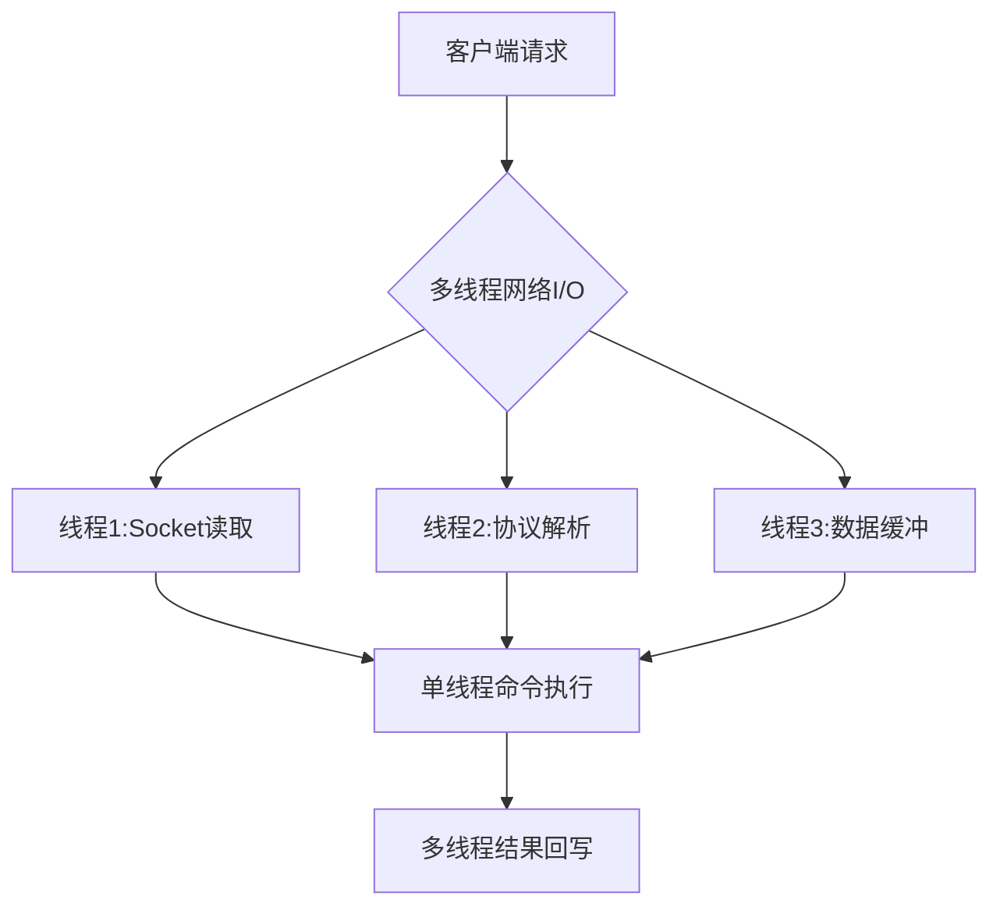


#### 2-3-1 、6.0版本的执行流程

一、核心执行模型

1. ‌**单线程事件循环**‌
   - 采用Reactor模式处理I/O事件，主线程通过`aeEventLoop`实现事件分发
   - 单线程避免锁竞争，命令执行平均耗时0.1ms级
2. ‌**I/O多路复用机制**‌
   - 封装epoll/kqueue等系统调用，单线程可处理10万级并发连接
   - 事件处理器分为：连接应答处理器/命令请求处理器/命令回复处理器

二、命令执行全流程

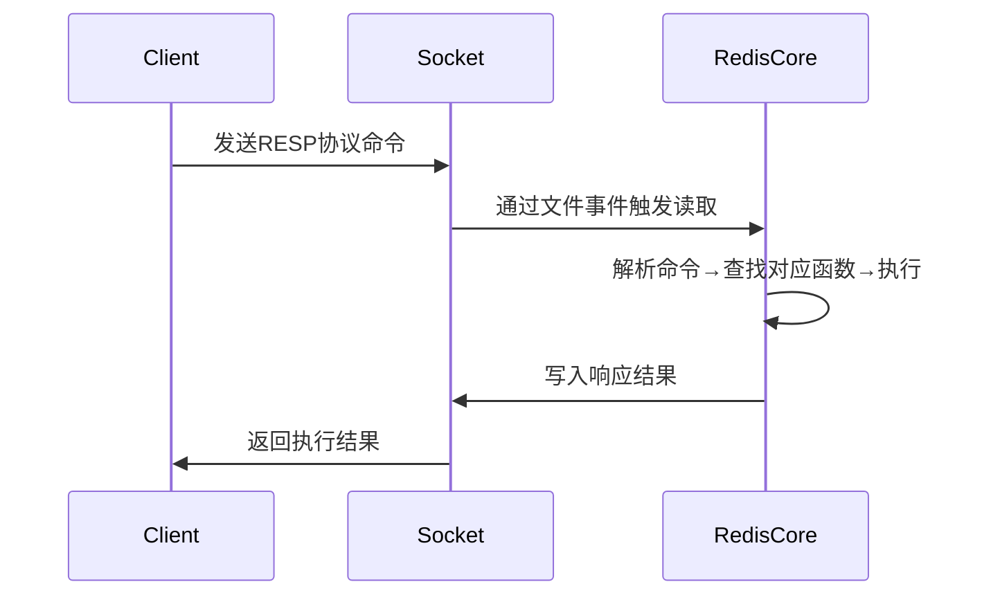

1. ‌**请求处理阶段**‌
   - 客户端命令转换为RESP协议格式传输
   - `redisClient`结构体存储连接状态和命令参数
2. ‌**命令执行阶段**‌
   - 通过`redisCommand`结构体查找对应执行函数
   - 执行过程严格单线程化，保障Lua脚本/事务的原子性

三、关键技术实现

1. ‌**内存管理**‌
   - 使用jemalloc分配器减少内存碎片
   - 渐进式rehash解决哈希表扩容阻塞问题
2. ‌**持久化机制**‌
   - RDB快照采用COW(Copy-On-Write)技术生成
   - AOF日志通过`fsync`策略控制数据安全级别

四、性能优化设计

| 设计要点   | 实现方式                   | 效果提升         |
| ---------- | -------------------------- | ---------------- |
| 网络通信   | I/O多路复用+非阻塞Socket   | 连接数突破10万级 |
| 数据结构   | SDS动态字符串+压缩列表优化 | 内存节省40%      |
| 过期键清理 | 惰性删除+定期删除双策略    | CPU占用降低35%   |

> 注：Redis 7.0在保留核心单线程模型基础上，新增多线程网络I/O处理能力

#### 2-3-2 、7.0以及之后的执行优化

一、核心执行流程（多线程I/O增强版）

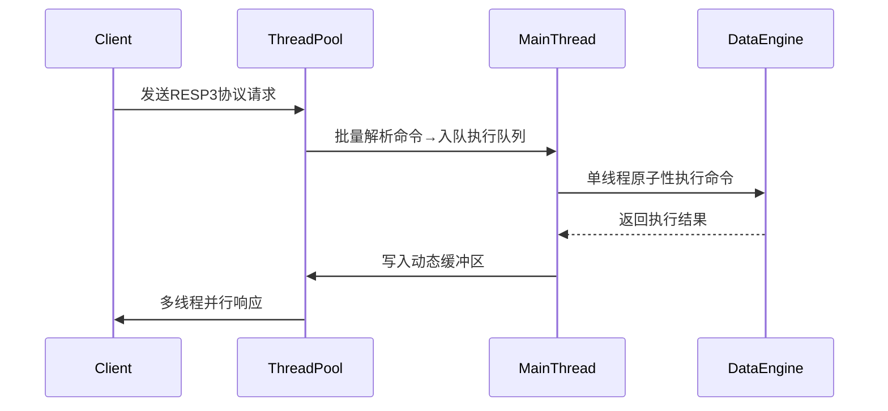

二、关键优化点

1. ‌**动态线程池管理**‌
   - I/O线程数可运行时调整（默认4-16线程），通过`io-threads`参数配置
   - 智能负载均衡：根据连接数自动分配线程资源
2. ‌**网络处理优化**‌
   - 批量解析请求：减少线程切换开销，吞吐量较6.0提升40%
   - 响应缓冲区动态扩容：避免大包阻塞主线程
3. ‌**协议层增强**‌
   - 优先使用RESP3协议，支持多模态数据返回
   - 客户端缓存通知机制优化

------

三、与传统版本的差异对比

| 阶段           | Redis 6.0      | Redis 7.0改进         |
| -------------- | -------------- | --------------------- |
| ‌**网络I/O**‌    | 固定4线程处理  | 动态线程池+自适应缓冲 |
| ‌**命令执行**‌   | 严格单线程     | 保持单线程原子性      |
| ‌**大请求处理**‌ | 可能阻塞主线程 | 分片处理+零拷贝优化   |
| ‌**内存管理**‌   | 基础jemalloc   | 智能碎片整理算法      |

------


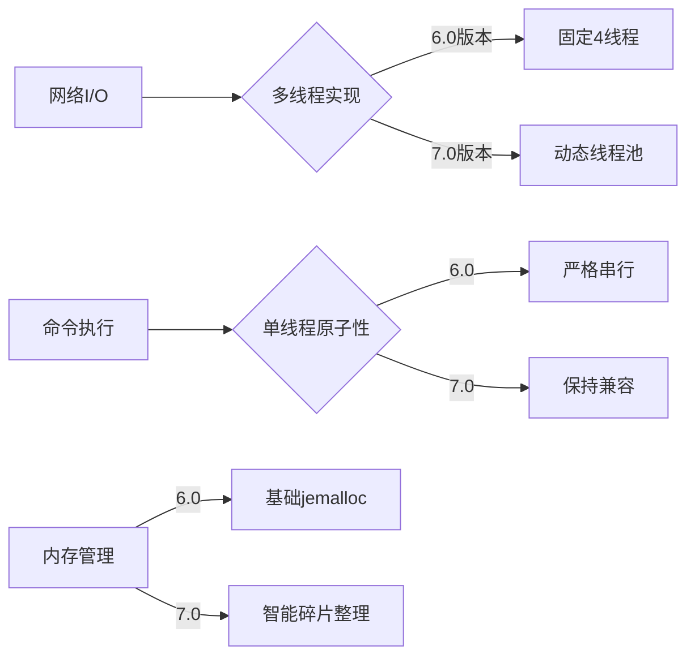


四、性能表现

- ‌**延迟**‌：P99延迟降低30%，尤其改善10KB以上大包场景5
- ‌**吞吐量**‌：单节点QPS可达15万+（16线程配置）35
- ‌**资源利用率**‌：CPU利用率提升至65%（原50%）17

> 注：需在redis.conf中配置`io-threads-do-reads yes`启用多线程读

### 2-4、使用及其常见问题

2-4-1、

2-4-2、

#### 2-4-3、缓存不一致问题


2-4-4、

### 2-5、分布式集群

#### 2-5-1、Redis集群核心概念

1. 集群定义与背景

Redis集群是Redis提供的分布式数据库方案，通过分片(sharding)实现数据共享，并提供复制和故障转移功能。随着互联网应用数据量爆发式增长，单机Redis在存储容量、读写性能和高可用性等方面逐渐难以满足需求，集群方案应运而生。

2. 集群核心功能

- ‌**数据分片**‌：将数据分散存储在多个节点上，突破单机存储容量限制
- ‌**高可用性**‌：通过节点复制和自动故障转移确保服务连续性
- ‌**读写分离**‌：从节点分担读请求，提升系统读性能
- ‌**水平扩展**‌：通过增加节点实现容量和性能的线性增长

#### 2-5-2、集群架构与原理

1. 节点组成

- ‌**主节点(Master)**‌：负责处理槽位数据读写
- ‌**从节点(Slave)**‌：复制主节点数据，提供读服务
- ‌**推荐配置**‌：至少3个主节点，每个主节点配1个从节点

2. 数据分片机制

```java
// 键到槽位的哈希计算
slot = CRC16(key) % 16384  // 共16384个槽位
```

- 每个主节点负责部分槽位（默认每个节点5461个槽位）
- 客户端直接路由到负责对应槽位的节点

3. 节点通信

- 使用Gossip协议进行元数据同步
- 默认通过6379端口进行TCP/IP通信
- 心跳检测：节点间定期PING/PONG

#### 2-5-3、集群搭建实践

1. 环境准备

```bash
# 下载Redis
wget https://download.redis.io/releases/redis-7.0.5.tar.gz
tar -xzf redis-7.0.5.tar.gz
cd redis-7.0.5

# 启动6个节点(7000-7005端口)
for port in {7000..7005}; do
  ./src/redis-server --port $port --cluster-enabled yes --cluster-config-file nodes-$port.conf &
done:ml-citation{ref="3" data="citationList"}
```

2. 集群创建

```bash
# 使用redis-cli创建集群
redis-cli --cluster create \
  127.0.0.1:7000 127.0.0.1:7001 127.0.0.1:7002 \
  127.0.0.1:7003 127.0.0.1:7004 127.0.0.1:7005 \
  --cluster-replicas 1:ml-citation{ref="3" data="citationList"}
```

3. 集群验证

```bash
redis-cli -p 7000 cluster nodes  # 查看节点列表
redis-cli -p 7000 cluster info  # 查看集群状态:ml-citation{ref="3" data="citationList"}
```

#### 2-5-4、集群核心机制

1. 故障转移

- 主节点故障时，从节点自动升级为主节点
- 故障检测通过节点间心跳实现
- 需多数节点确认故障才会触发转移

2. 数据迁移

- 使用`CLUSTER ADDSLOTS`手动分配槽位
- 支持在线重新分片(resharding)
- 迁移过程中保证数据一致性

3. 客户端路由

- 智能客户端(如JedisCluster)自动处理重定向
- MOVED错误：永久重定向到正确节点
- ASK错误：临时重定向用于迁移场景

#### 2-5-5、集群优化建议

1. 性能调优

- ‌**合理分片**‌：避免数据倾斜，均匀分布槽位
- ‌**连接池配置**‌：优化客户端连接参数
- ‌**批量操作**‌：使用Pipeline减少网络往返

2. 高可用保障

- 每个分片配置至少一个从节点
- 跨机房部署提升容灾能力
- 监控集群状态和性能指标

3. 扩容策略

- 预先规划容量，避免频繁扩容
- 扩容后执行重新分片平衡数据
- 使用`--cluster-use-empty-masters`避免空节点

#### 2-5-6、与其他方案对比

| ‌**方案**‌ | ‌**优点**‌                 | ‌**缺点**‌                       |
| -------- | ------------------------ | ------------------------------ |
| 主从复制 | 实现简单，读写分离       | 写能力单点瓶颈，无自动故障转移 |
| 哨兵模式 | 自动故障转移，高可用     | 仍然存在写单点问题             |
| 集群模式 | 真正分布式，支持水平扩展 | 配置复杂，客户端需支持         |

> 📌 注：Redis集群适用于需要处理海量数据和高并发的场景，对于中小规模应用，哨兵模式可能更简单实用

## 3、MySQL

​	关系型数据库，强结构型数据库，5.5版本后为默认存储引擎innoDB

### 3-1、 MySQL基本结构

#### 3-1-1、逻辑架构分层

MySQL采用两层架构设计：

- ‌**Server层**‌：
  - 连接层：处理客户端连接/认证（TCP三次握手建立连接）
  - 查询缓存：8.0版本已移除，由性能Schema替代
  - 分析器：SQL语法解析与语义检查
  - 优化器：生成执行计划，选择索引策略
  - 执行器：调用存储引擎接口操作数据
- ‌**存储引擎层**‌：
  - 插件式架构，支持InnoDB/MyISAM/Memory等多种引擎
  - 负责数据存储/检索，实现索引结构（如B+Tree）

#### 3-1-2、物理文件组成

| 文件类型  | 存储内容      | 对应引擎 |
| --------- | ------------- | -------- |
| .frm/.sdi | 表结构定义    | 所有引擎 |
| .ibd      | 表数据+索引   | InnoDB   |
| .MYD/.MYI | 数据/索引文件 | MyISAM   |

### 3-2、MySQL存储引擎

#### 3-2-1、主流引擎对比

| 特性         | InnoDB     | MyISAM     | Memory       |
| ------------ | ---------- | ---------- | ------------ |
| ‌**事务支持**‌ | ACID兼容   | 不支持     | 不支持       |
| ‌**锁机制**‌   | 行级锁     | 表级锁     | 表级锁       |
| ‌**外键**‌     | 支持       | 不支持     | 不支持       |
| ‌**崩溃恢复**‌ | 支持       | 需修复工具 | 数据丢失     |
| ‌**适用场景**‌ | 高并发写入 | 读密集型   | 临时数据缓存 |

#### 3-2-2、InnoDB核心特性

- ‌表空间管理：
  - `innodb_file_per_table`参数控制（ON时每表独立.ibd文件）
  - 包含表结构、数据、索引（聚集索引存储数据）
- ‌内存结构‌：
  - Buffer Pool：缓存数据页（默认占80%内存）
  - Change Buffer：优化非唯一索引更新
  - Redo Log：保证事务持久性

### 3-3、MySQL优化分析

#### 3-3-1、SQL性能分析工具

| 工具                   | 功能描述        | 启用方式           |
| ---------------------- | --------------- | ------------------ |
| ‌**慢查询日志**‌         | 记录超阈值的SQL | `slow_query_log=1` |
| ‌**EXPLAIN**‌            | 执行计划分析    | EXPLAIN SELECT...  |
| ‌**Performance Schema**‌ | 实时性能监控    | 默认启用6          |
| ‌**Profiling**‌          | 单SQL资源消耗   | `SET profiling=1`  |

#### 3-3-2、索引优化策略

- ‌索引失效场景：
  - 违反最左前缀原则（联合索引）
  - 对索引列使用函数/运算
  - 隐式类型转换（如字符串用数字比较）
- ‌优化建议：
  - 优先使用覆盖索引（避免回表）
  - 长字符串使用前缀索引
  - 定期使用`ANALYZE TABLE`更新统计信息

#### 3-3-3、配置优化参数

```sql
-- 关键参数调整示例
SET GLOBAL innodb_buffer_pool_size=8G;  -- 建议设为物理内存70-80%:ml-citation{ref="4" data="citationList"}
SET GLOBAL innodb_flush_log_at_trx_commit=2;  -- 平衡性能与可靠性:ml-citation{ref="4" data="citationList"}
SET GLOBAL sync_binlog=100;  -- 组提交优化:ml-citation{ref="7" data="citationList"}
```

> 注：2025年MySQL 8.4版本新增AI优化器提示功能，可通过`/*+ OPTIMIZER_HINT */`语法指导执行计划选择

## 4、Oracle

### 4-1、基础概述

Oracle数据库（Oracle Database）是由甲骨文公司(Oracle Corporation)开发的关系数据库管理系统(RDBMS)，目前最新版本为Oracle Database 23ai。作为全球领先的企业级数据库解决方案，Oracle以其卓越的性能、可靠性和安全性著称，被财富1000强企业广泛采用

### 4-2、核心特性

#### 4‌-2-1、架构设计‌

- 采用对象-关系模型，支持用户自定义类型和继承等面向对象特性

- 独特的实例(Instance)和数据库(Database)分离架构

  - ‌**Oracle实例(Instance)**‌：
    - 动态运行组件，包含SGA(系统全局区)内存结构和后台进程
    - 必须启动实例才能访问数据库，实例与数据库通常为1:1关系
    - RAC架构下可实现多实例访问单数据库的集群模式
  - ‌**Oracle数据库(Database)**‌：
    - 静态存储组件，包含三类核心文件：
      - 数据文件(存储表/索引等用户数据)
      - 控制文件(记录数据库物理结构)
      - 重做日志文件(记录数据变更)

- 系统全局区(SGA)和程序全局区(PGA)的内存管理机制

  - 内存架构详解

    1. SGA系统全局区

    | 组件           | 功能描述                | 关键特性        |
    | -------------- | ----------------------- | --------------- |
    | 共享池         | 缓存SQL解析树和执行计划 | 影响SQL执行效率 |
    | 数据库缓冲区   | 缓存数据块              | 通过LRU算法管理 |
    | 重做日志缓冲区 | 临时存储redo记录        | 确保事务持久性  |

    2. PGA程序全局区

    - 每个服务进程独占的内存区域
    - 包含排序区、会话信息等私有数据结构

#### 4-2-2、技术优势‌

- 支持分布式数据库和网格计算架构
- 提供完整的数据泵(Data Pump)导入导出工具
- 内置ASM(自动存储管理)和RAC(实时应用集群)等高可用方案

### 4-3、技术组件

#### 4‌-3-1、核心模块‌

- SQL*Plus：传统命令行管理工具
- SQLcl：现代化命令行界面
- Oracle即时客户端(Instant Client)：轻量级连接工具

1. ‌**存储架构**‌：

      - 物理结构：数据文件、控制文件、重做日志文件

        - | 文件类型       | 存储内容        | 恢复作用       |
          | -------------- | --------------- | -------------- |
          | 数据文件(.dbf) | 用户表/索引数据 | 需配合归档日志 |
          | 控制文件(.ctl) | 数据库元数据    | 恢复必需文件   |
          | 联机日志(.log) | 事务记录        | 实例恢复基础   |

      - 逻辑结构：表空间、段、区和块

        - 表空间 → 段 → 区 → 数据块
        - 支持ASM(自动存储管理)实现条带化和镜像

#### 4-3-2、高可用架构

1. ‌**RAC集群**‌：
     - 多实例共享存储的Active-Active架构
       - 通过Cache Fusion实现节点间内存同步
2. ‌**Data Guard**‌：
     - 主备库日志同步机制
     - 支持物理备库和逻辑备库两种模式

### 4-4、应用领域

#### 4‌-4-1、企业级应用‌

- 银行金融系统核心数据库
- 电信运营商计费系统
- 大型ERP系统(如Oracle EBS)

#### 4-4-2、新兴技术‌

- 人工智能数据分析（23ai版本强化）
- 图数据处理和JSON文档存储
- 云原生数据库服务


# 二、Spring全家桶

## 1、SpringBoot

​	SpringBoot是Spring的成功后继者，继承了优秀的IOC/DI、AOP、模块化特点，IOC是设计原则，DI是实现

DI实现方式：

1、构造器注入（推荐，后面讲）

2、Setter注入

3、field注入

### 1-1、三大核心特性

#### 1-1-1、自动装配

​	1、开发者仅需引入依赖添加配置信息即可使用，是因为springboot是基于约定的，所有组件都需要基于starter引入到springboot框架，约定每一个自定义starter中都需要在META-IFO文件夹下创建spring.factories文件，此文件对应着自动配置类的完全限定名。

2、springboot容器会扫描该文件，涉及@autoconfigration@SelectorImport以及相关接口

#### 1-1-2、starter依赖

伟大的约定，具有了第三方的扩展能力。

自定义starter

一、引入starter相关依赖包（starter、process、parent）

二、编写自动配置类

三、编写ConfigrationProperties类，接收配置信息

四、（核心）classpath下创建META-IFO文件夹，在该文件夹下创建spring.factories。将自动配置类引入到这里。

#### 1-1-3、嵌入式服务器

tomcat、jetty、undertow

### 1-2、注解的使用

#### 1-2-1、常见注解

@Service、@Component、@Controller、@Configuration、@Repository

@Bean、@postConstruct

@Autowired、@Resource、@scope

@RequestMapping @Pathvariable  @RequestParam @RequestBody


#### 1-2-2、使用场景

行一、注册为spring容器的bean

行二、@bean可以灵活地注册为bean，使用第三方组件想进入spring容器的

行三、数据请求时，@RequestMapping用于地址uri映射，@Pathvariable用于url的？前面参数，@RequestParam用于？后面参数，@RequestBody用于请求体

### 1-3、理解spring容器

applicationcontext继承了beanFactory根接口，并且扩展了国际化、监听器注册等功能。


#### 1-3-1、beanFactory和FactoryBean区别？

1、beanFactory是spring容器的根接口，getBean、containsBean、getType方法。是spring容器的顶层设计

2、FactoryBean其实就是工具人，具备生产某一种bean的能力。getObject、getObjectType

**核心区别对比**‌

| ‌**维度**‌         | ‌**BeanFactory**‌             | ‌**FactoryBean**‌                            |
| ---------------- | --------------------------- | ------------------------------------------ |
| ‌**角色**‌         | 容器（管理所有 Bean）       | 特殊 Bean（生产其他 Bean）                 |
| ‌**获取对象**‌     | 直接返回 Bean 实例          | 返回 `getObject()` 方法创建的代理/复杂对象 |
| ‌**设计目的**‌     | 提供基础的依赖注入能力      | 扩展 Spring 的实例化逻辑                   |
| ‌**典型使用场景**‌ | 所有 Spring Bean 的基础管理 | 集成第三方框架（如 MyBatis、Hibernate）    |

#### 1-3-2、bean的生命周期

1、加载beanDefinition->实例化->属性填充->初始化->缓存使用->销毁

2、详细阶段说明

1. ‌**加载Bean定义**‌
   - 容器解析XML/注解配置生成BeanDefinition
   - 触发`BeanFactoryPostProcessor`修改定义
2. ‌**实例化**‌
   - 调用构造器创建原始对象（反射或工厂方法）
   - 注意：此时属性均为默认值
3. ‌**属性填充**‌
   - 通过`populateBean()`完成依赖注入
   - 包括@Autowired/@Value等注解处理
4. ‌**Aware接口注入**‌
   - 回调`BeanNameAware`/`ApplicationContextAware`等接口
5. ‌**初始化扩展点**‌
   - `@PostConstruct`标注的方法
   - `InitializingBean.afterPropertiesSet()`
   - XML中配置的`init-method`
6. ‌**AOP代理生成**‌
   - 通过`BeanPostProcessor.postProcessAfterInitialization`创建代理对象
7. ‌**销毁阶段**‌
   - `@PreDestroy`标注的方法
   - `DisposableBean.destroy()`
   - XML中配置的`destroy-method`


#### 1-3-3、循环依赖

问题描述

1. ‌**属性注入循环依赖**‌

   ```java
   @Component
   public class A {
       @Autowired
       private B b;  // A 依赖 B
   }
   
   @Component
   public class B {
       @Autowired
       private A a;  // B 又依赖 A
   }
   ```

   - ‌**解决方式**‌：通过 ‌**三级缓存**‌ 提前暴露未初始化的 Bean 引用。

2. ‌**构造器注入循环依赖**‌

   ```java
   @Component
   public class A {
       private final B b;
       public A(B b) { this.b = b; }  // 构造器依赖 B
   }
   
   @Component
   public class B {
       private final A a;
       public B(A a) { this.a = a; }  // 构造器依赖 A
   }
   ```

   - ‌**无法解决**‌：Spring 会直接抛出 `BeanCurrentlyInCreationException`

三级缓存定义与作用

1. ‌**一级缓存（singletonObjects）**‌
   - 存储已完成初始化（实例化+依赖注入+初始化）的完整Bean
   - 通过`getBean()`直接获取的最终对象来源
2. ‌**二级缓存（earlySingletonObjects）**‌
   - 存储已实例化但未完成初始化的"早期对象"
   - 解决多线程环境下重复创建代理对象的问题
3. ‌**三级缓存（singletonFactories）**‌
   - 存储生成对象的`ObjectFactory`工厂（Lambda表达式）
   - 核心作用：在存在AOP代理时，确保返回的是代理对象而非原始对象


### 1-4、事务管理

#### 1-4-1、声明式

@transaction

#### 1-4-2、编程式

transactiontemplate

#### 1-4-3、事务传播


## 2、SpringCloud升级

### 2-1、基本五大组件

注册中心：eureka/consul/Nacos/zookeeper

负载均衡：Ribbon

远程调用：feign

网关：gateway/zunnl

熔断：Hystrix

### 2-2、如何理解各组件

#### 2-2-1 注册中心

​	eureka是ap模型，注重可用性，zookeeper是cp，侧向于一致性结果

#### 2-2-2 负载均衡

​	Ribbon和feign组合使用，在调用过后，需要执行相应的负载均衡策略，选择其中一个实例进行转发。

IRule自定义负载均衡策略，常见有轮询/权重/随机/最好可行

#### 2-2-3 网关

​	对外接口的聚合，提供认证鉴权/动态路由/流量控制/请求响应处理;权限控制、负载均衡、路由转发、监控、安全控制黑名单和白名单等

认证鉴权：登陆验证（Qauth2/JWT）

动态路由：屏蔽内部接口（安全性），通过路由转发提供服务

流量控制：应对大流量时，能够提供防火墙功能，防止冲垮内部服务，配置独立的线程池/接口限流/服务降级等

请求响应再处理：通过前置/后置过滤器

- ‌**前置过滤器（Pre Filter）**‌

  - 在请求路由到下游服务前执行，可进行请求头修改、参数校验等操作
  - 典型应用场景：JWT 鉴权、请求参数加密、流量标记

- ‌**后置过滤器（Post Filter）**‌

  - 在下游服务返回响应后执行，用于修改响应数据或记录日志
  - 典型应用场景：响应数据脱敏、统一错误格式封装

  ### 过滤器分类

  | 类型           | 作用范围 | 执行阶段 | 示例                                     |
  | -------------- | -------- | -------- | ---------------------------------------- |
  | ‌**全局过滤器**‌ | 所有路由 | Pre/Post | `NettyWriteResponseFilter`（响应写入）25 |
  | ‌**局部过滤器**‌ | 指定路由 | Pre/Post | `AddRequestHeader`（添加请求头）         |

```java
@Component
@Order(-1)  // 最高优先级
public class AuthFilter implements GlobalFilter {
    @Override
    public Mono<Void> filter(ServerWebExchange exchange, GatewayFilterChain chain) {
        // Pre 处理逻辑
        return chain.filter(exchange).then(Mono.fromRunnable(() -> {
            // Post 处理逻辑
        }));
    }
}

```

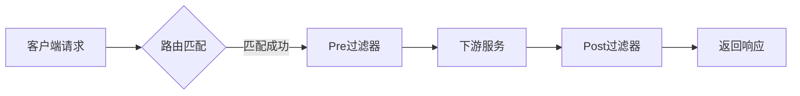

#### 2-2-4 feign

​	Rest API风格的调用，定义接口，定义方法，通过动态代理实现调用。

#### 2-2-5 熔断降级

Hystrix和reillence4j。

熔断降级有什么区别？


### 2-3、SpringCloud alibaba中的Nacos

alibaba cloud中服务注册中心，同时是配置中心

#### 2-3-1 注册中心

配置服务器地址添加必要注解，根据server.name注册服务

#### 2-3-2 配置中心

使用方法：命名空间隔离+多层次配置

云环境中通常在部署实例时，会在镜像脚本Dockfile中添加 [CMD] jar -jar .... spring.profiles.active=dev/test/prod

参数值随着不同的环境变化，从而起到加载不同配置文件作用，通常配置文件数据私密，不会在服务中出现，只会配置不同隔离环境的命名空间，从Nacos的服务器中获取配置信息。

```yaml
--spring.profiles.active=dev、test、prod
可以在application.yaml文件中单独配置
# 测试环境独立配置
spring:
  profiles: test
  cloud:
    nacos:
      config:
        server-addr: 192.168.1.100:8848  # 测试环境Nacos地址
        namespace: test-ns-id

# 生产环境独立配置
---
spring:
  profiles: prod
  cloud:
    nacos:
      config:
        server-addr: 10.0.0.100:8848  # 生产环境Nacos地址
        namespace: prod-ns-id
进行环境隔离
```

#### 2-3-3 配置动态更新

核心原理

1.长轮询监听。客户端向服务端注册一个监听器，服务端开始数30s，30s内有变更，通知给客户端

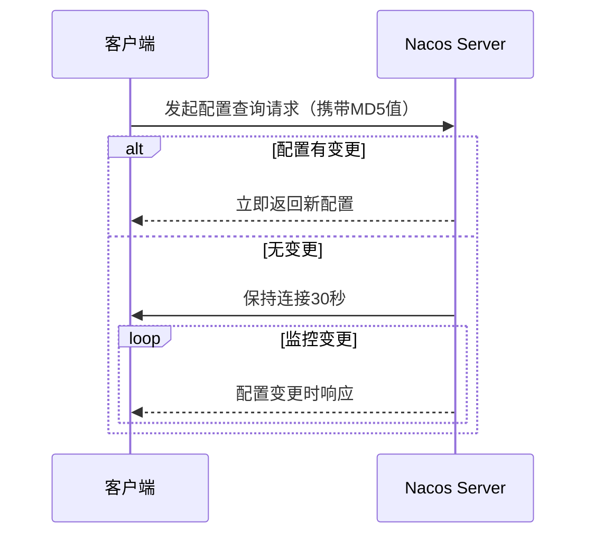

2.事件驱动更新

有变更，通知给客户端，本地通过@RefreshScope或者@ConfigurationProperties重新初始化

#### 2-3-4 Nacos 中的实现细节

1. ‌**客户端行为**‌
   - 首次启动拉取配置后，立即注册监听器并开启长轮询
   - 每次请求携带本地配置的MD5值，服务端通过对比判断是否变更
2. ‌**服务端处理**‌
   - 无变更时：TCP连接保持打开状态（非HTTP轮询），减少重复握手开销
   - 有变更时：立即返回新配置并关闭当前连接
3. ‌**超时控制**‌
   - 默认30秒超时后，客户端会重新发起长轮询请求
   - 服务端配置`nacos.config.long-poll.timeout`可调整该阈值

# 三、计算机网络与Linux

## 1、网络体系结构

### 1-1、分层模型对比

| 模型类型       | 核心分层（自底向上）                                 | 关键差异点                   |
| -------------- | ---------------------------------------------------- | ---------------------------- |
| ‌**OSI七层**‌    | 物理层→数据链路层→网络层→传输层→会话层→表示层→应用层 | 理论参考模型，实际未完全采用 |
| ‌**TCP/IP四层**‌ | 网络接口层→网际层→传输层→应用层                      | 实际工程实现标准             |
| ‌**五层协议**‌   | 物理层→数据链路层→网络层→传输层→应用层               | 教学常用简化模型             |

> 注：表示层负责数据格式转换/加密，会话层管理通信会话56

## 2、核心协议解析

### 2-1、TCP与UDP对比

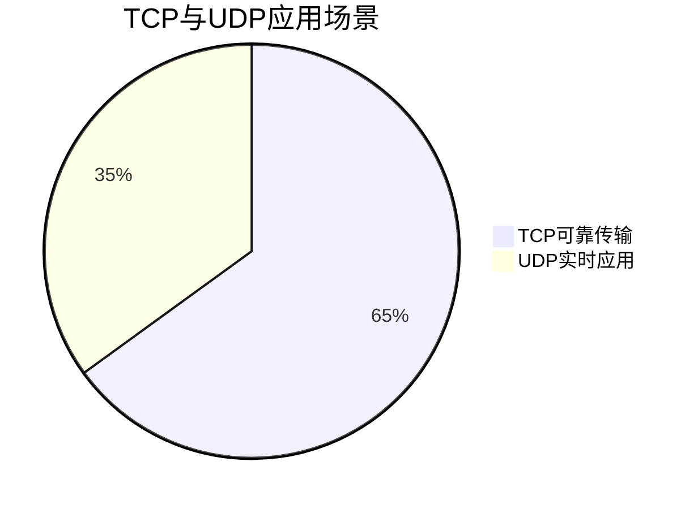

- ‌TCP特性：
  - 面向连接（三次握手/四次挥手）
  - 可靠传输（超时重传、滑动窗口）
  - 流量控制（动态窗口调整）
- ‌UDP特性：
  - 首部仅8字节
  - 支持广播/多播
  - 典型应用：DNS、视频会议

### 2-2、HTTP协议族

- ‌版本演进‌：

  | 版本     | 核心改进                      | 默认端口 |
  | -------- | ----------------------------- | -------- |
  | HTTP/1.0 | 短连接（每个请求新建TCP连接） | 80       |
  | HTTP/1.1 | 长连接、管道化                | 80       |
  | HTTP/2   | 二进制分帧、头部压缩          | 80       |
  | HTTP/3   | 基于QUIC协议（UDP实现）       | 443      |

## 3、关键通信过程

### 3-1、TCP三次握手

#### 3-1-1、基本概念

TCP三次握手是建立可靠网络连接的标准过程，通过三个步骤的报文交换确保通信双方具备收发能力。该机制是TCP协议可靠传输的基础，防止历史连接干扰正常通信。

#### 3-1-2、详细流程

1. 握手过程分解

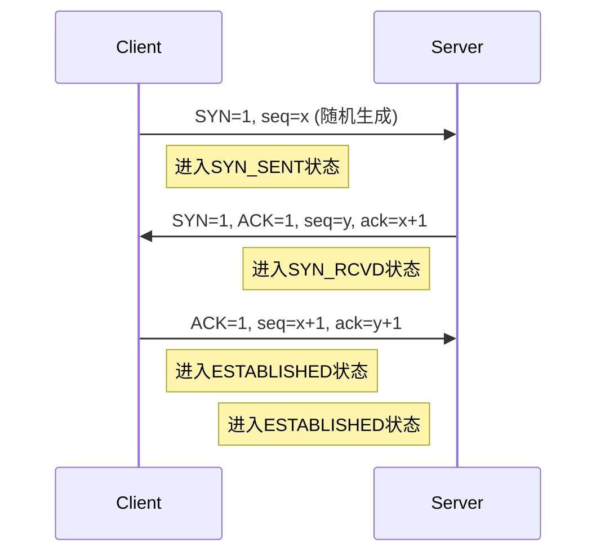

2. 关键字段说明

| 字段名 | 第一次握手值 | 第二次握手值 | 第三次握手值 | 作用                     |
| ------ | ------------ | ------------ | ------------ | ------------------------ |
| SYN    | 1            | 1            | 0            | 同步序列号标志           |
| ACK    | 0            | 1            | 1            | 确认标志                 |
| seq    | 随机初始值x  | 随机初始值y  | x+1          | 数据字节流编号           |
| ack    | 0            | x+1          | y+1          | 期望收到的下一个字节编号 |

#### 3-1-3、技术原理

1. 为什么需要三次？

- ‌**全双工确认**‌：双方均需确认收发能力（两次无法确认客户端的接收能力）
- ‌**防止历史连接**‌：通过随机序列号避免旧连接报文干扰
- ‌**资源分配同步**‌：确保双方都准备好通信资源

2. 序列号机制

- ‌**初始序列号(ISN)**‌：基于时钟的随机值（每4ms+1）
- ‌**防预测攻击**‌：现代系统使用加密哈希生成ISN
- ‌**字节流定位**‌：seq/ack实现精确数据定位和重传

#### 3-1-4、异常处理

1. 常见问题解决方案

| 问题类型    | 现象               | 解决方案                    |
| ----------- | ------------------ | --------------------------- |
| SYN洪泛攻击 | 大量半连接耗尽资源 | SYN Cookie技术              |
| 握手丢包    | 超时未收到响应     | 指数退避重传（默认重试5次） |
| 序列号回绕  | 长期连接序列号溢出 | 时间戳选项扩展              |

2. 性能优化

- ‌**TCP Fast Open**‌：在TLS握手阶段携带数据（减少1RTT）
- ‌**SYN缓存优化**‌：Linux默认维护256个半连接
- ‌**多路径TCP**‌：同时使用多个网络接口握手

#### 3-1-5、与四次挥手对比


- ‌核心差异：
  - 握手只需确认通信能力
  - 挥手需分别关闭两个独立数据流
- ‌状态转换：
  - 握手经历SYN_SENT→SYN_RCVD→ESTABLISHED
  - 挥手经历FIN_WAIT→CLOSE_WAIT→LAST_ACK→TIME_WAIT

### 3-2、四次挥手


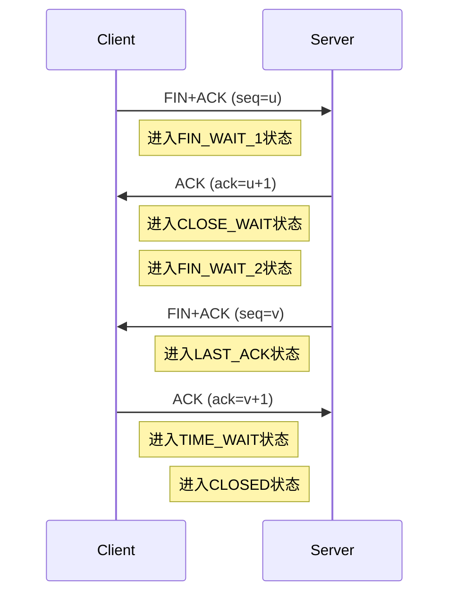

#### 3-2-1、各阶段说明

1. ‌**第一次挥手**‌
   - 主动关闭方发送FIN+ACK报文，seq=u
   - 进入FIN_WAIT_1状态
2. ‌**第二次挥手**‌
   - 被动关闭方返回ACK报文，ack=u+1
   - 进入CLOSE_WAIT状态
   - 主动方收到后进入FIN_WAIT_2状态
3. ‌**第三次挥手**‌
   - 被动关闭方发送FIN+ACK报文，seq=v
   - 进入LAST_ACK状态
4. ‌**第四次挥手**‌
   - 主动关闭方返回ACK报文，ack=v+1
   - 进入TIME_WAIT状态
   - 被动方收到后立即进入CLOSED状态

#### 3-2-2、关键机制解析

1. **TIME_WAIT**状态

- ‌**持续时间**‌：2MSL（Maximum Segment Lifetime）
- ‌作用‌：
  - 确保最后一个ACK到达对端
  - 让网络中残留报文失效
- ‌**问题**‌：大量TIME_WAIT会消耗端口资源
- ‌**解决方案**‌：调整内核参数或使用连接池

2. **为什么需要四次**？

- ‌**双向通道独立关闭**‌：TCP是全双工协议，需分别关闭两个方向的数据流
- ‌**数据收尾处理**‌：被动方需要时间处理剩余数据

#### 3-2-3、异常情况处理

- ‌**ACK丢失**‌：被动方会重传FIN报文
- ‌**FIN丢失**‌：主动方在TIME_WAIT超时后强制关闭
- ‌**同时关闭**‌：双方都发起FIN时会产生特殊状态转换

### 3-3、网页访问全流程

1. ‌**DNS解析**‌：域名→IP地址（递归/迭代查询）
2. ‌**TCP连接**‌：三次握手建立通道
3. ‌**HTTP请求**‌：GET/POST方法传输数据
4. ‌**渲染解析**‌：浏览器构建DOM/CSSOM树

## 4、SSL/TLS解析

### 4-1、协议演进历程

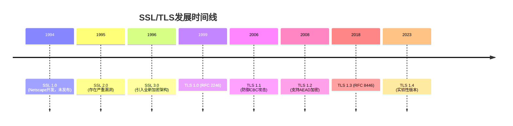

### 4-2、核心安全机制

#### 4-2-1、加密套件组成

| 组件类型     | 可选算法示例                   | 作用说明          |
| ------------ | ------------------------------ | ----------------- |
| ‌**密钥交换**‌ | RSA、ECDHE、DH                 | 协商预主密钥      |
| ‌**身份验证**‌ | RSA、ECDSA、EdDSA              | 服务器/客户端认证 |
| ‌**批量加密**‌ | AES-256-GCM、ChaCha20-Poly1305 | 数据加密传输      |
| ‌**哈希算法**‌ | SHA-384、BLAKE2s               | 完整性校验        |

> 注：TLS 1.3仅保留前向安全算法（如ECDHE），移除RSA密钥交换

#### 4-2-2、握手过程优化对比

TLS 1.2传统握手（2-RTT）

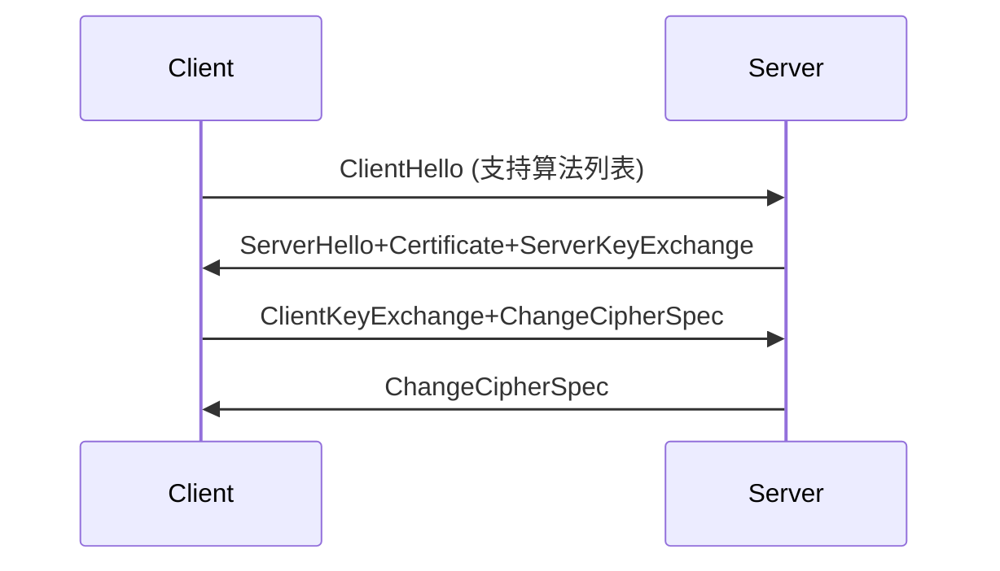

TLS 1.3高效握手（1-RTT/0-RTT）

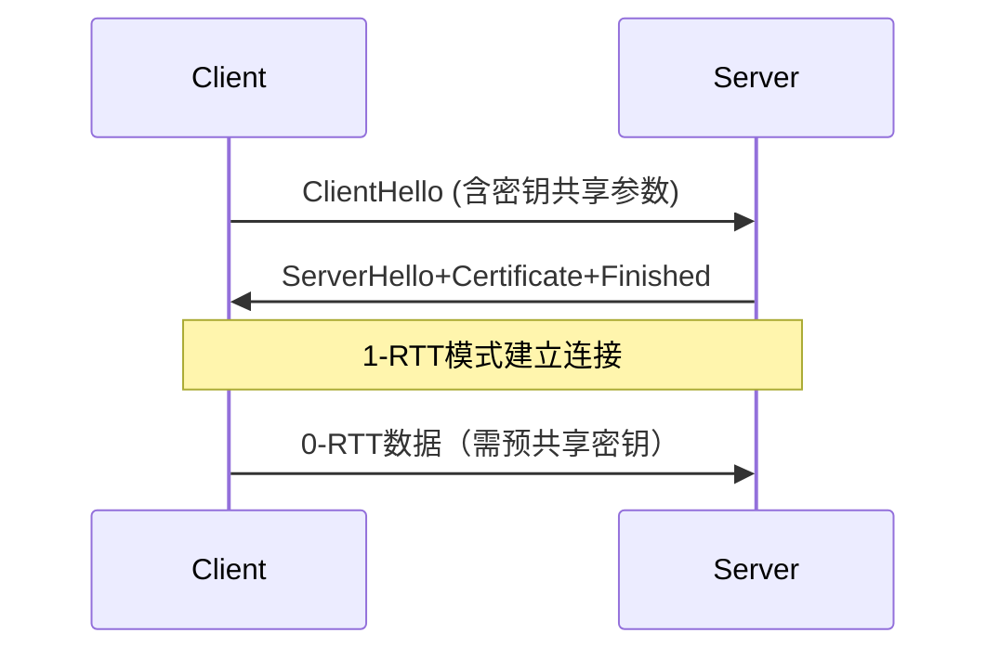

### 4-3、关键安全特性

#### 4-3-1、前向安全性保障

- ‌**原理**‌：会话密钥不依赖长期私钥
- ‌**实现**‌：ECDHE每次生成临时密钥对
- ‌**优势**‌：即使私钥泄露，历史会话仍安全

#### 4-3-2、证书验证体系

1. ‌证书链校验：
   - 终端实体证书→中间CA→根CA
   - OCSP在线状态检查
2. ‌扩展验证(EV)：
   - 绿色地址栏显示企业名称
   - 2023年后逐步取消可视化区别

### 4-4、实际应用场景

#### 4-4-1、HTTPS实现流程

1. TCP三次握手建立连接
2. TLS握手协商加密参数
3. HTTP报文加密传输
4. 会话恢复（Session ID/Tickets）

#### 4-4-2、性能优化技术

| 技术名称          | 效果提升          | 实现原理               |
| ----------------- | ----------------- | ---------------------- |
| ‌**会话恢复**‌      | 减少50%握手时间   | 重用之前协商的会话参数 |
| ‌**False Start**‌   | 提前100ms发送数据 | 在Finished之前开始加密 |
| ‌**OCSP Stapling**‌ | 减少证书验证延迟  | 服务器主动提供OCSP响应 |

### 4-5、最新安全标准

1. ‌禁用算法：
   - TLS 1.3强制移除RC4、SHA1、CBC模式
   - 2025年起禁止RSA-2048以下密钥
2. ‌后量子加密：
   - NIST选定CRYSTALS-Kyber作为标准
   - 实验性支持X25519+Kyber混合密钥交换
3. ‌隐私增强‌：
   - Encrypted Client Hello (ECH) 隐藏SNI
   - 证书透明度(CT)日志强制审计

## 5、典型面试问题

### 4-1、网络层核心问题

- ‌**IP协议功能**‌：寻址与路由选择（基于路由表）
- ‌IPv6改进：
  - 地址空间从32位扩展到128位
  - 取消首部校验和字段
  - 内置IPsec支持

### 4-2、高频考点

1. ‌**TIME_WAIT状态**‌：持续2MSL时间，确保最后一个ACK到达
2. ‌**HTTPS加密**‌：SSL/TLS实现传输加密（RSA+对称加密）
3. ‌**CDN原理**‌：边缘节点缓存+负载均衡

## 5、性能优化指标

| 指标类型      | 计算公式                 | 优化方向        |
| ------------- | ------------------------ | --------------- |
| 带宽利用率    | 实际吞吐量/理论带宽×100% | TCP窗口调整     |
| 往返时延(RTT) | 报文往返时间             | 启用TCP快速打开 |
| 并发连接数    | 活跃TCP连接数            | HTTP/2多路复用  |

> 最新趋势：5G网络端到端时延<1ms，QUIC协议实现0-RTT连接

## 6、Linux系统


# 四、Java仔摸底

## 1、JVM虚拟机运行时数据区

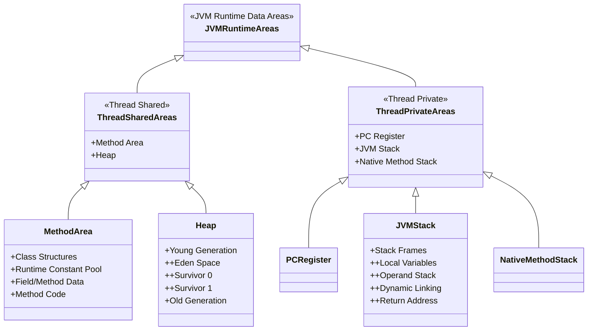

详细说明：

1. ‌**线程共享区域（Thread Shared）**‌

   - Method Area（方法区）

     - 存储类元数据、常量池、方法代码等
     - JDK8+称为Metaspace（使用本地内存）

   - Heap（堆）

     - 对象实例存储区域

     - 分代结构：

       ```mermaid
       flowchart LR
           Heap-->YoungGen
           Heap-->OldGen
           YoungGen-->Eden
           YoungGen-->S0(Survivor 0)
           YoungGen-->S1(Survivor 1)
       ```

2. ‌**线程私有区域（Thread Private）**‌

   - PC Register（程序计数器）

     - 当前线程执行的字节码行号指示器

   - JVM Stack（虚拟机栈）

     - 栈帧组成：

       ```mermaid
       flowchart TD
           StackFrame-->LocalVars[Local Variables]
           StackFrame-->OperandStack
           StackFrame-->DynamicLinking
           StackFrame-->ReturnAddress
       ```

   - Native Method Stack（本地方法栈）

     - 服务于Native方法调用

关键特性对比：

| 区域        | 线程共享 | 内存回收 | 溢出类型           | 配置参数             |
| ----------- | -------- | -------- | ------------------ | -------------------- |
| Method Area | ✓        | ✓        | OutOfMemoryError   | -XX:MaxMetaspaceSize |
| Heap        | ✓        | ✓        | OutOfMemoryError   | -Xmx/-Xms            |
| JVM Stack   | ✗        | ✗        | StackOverflowError | -Xss                 |
| PC Register | ✗        | ✗        | -                  | -                    |

## 2、基础知识点汇总

### 2-1、语言特性与运行机制

1. ‌**跨平台原理**‌
   - 基于JVM实现"一次编译，到处运行"，不同平台需安装对应JVM
   - 字节码文件（.class）通过JIT编译器动态转换为机器码
2. ‌**核心特性**‌
   - ‌**封装**‌：通过`private / protected / public / default`控制访问，隐藏实现细节
   - ‌**继承**‌：`extends`实现类复用，支持单继承多实现
   - ‌**多态**‌：包含编译时重载（Overload）和运行时重写（Override）
   - ‌**抽象**‌：`abstract`类/方法定义规范，接口（`interface`）实现多继承

------

### 2-2、基础语法规范

1. ‌**数据类型**‌

   | 类型     | 说明                                                         | 示例                    |
   | -------- | ------------------------------------------------------------ | ----------------------- |
   | 基本类型 | 8种。整数型：byte（1字节）、short（2字节）、int（4字节）、long（8字节）<br />浮点型：float（4字节）、double（8字节）<br />字符型：char（2字节）<br />布尔型：boolean（1位） | a = 10;`                |
   | 关键字   | final、static、this、super、transient、volatile、synchronized | final static int a = 0; |
   | 引用类型 | 类/接口/数组，数组当然是对象                                 | `String s = "Hi";`      |
   | 自动装箱 | 基本类型与包装类自动转换，有性能损失，勿频繁转换             | `Integer i = 100;`      |

2. ‌**运算符与流程控制**‌

   - 三目运算符：`x = (a>b) ? a : b;`
   - `switch`支持字符串和枚举（JDK12+支持表达式）
   - 循环控制：`break`跳出循环，`continue`跳过本次迭代

------

### 2-3、面向对象编程OOP

#### 2‌-3-1、类与对象‌

```java
public class Person {
    private String name;  // 封装字段
    public Person(String name) {  // 构造方法
        this.name = name;
    }
    @Override  // 多态实现
    public String toString() { 
        return "Person:" + name;
    }
}
```

#### 2‌-3-2、核心类库‌

- ‌**String**‌：不可变类，操作需用`StringBuilder`（线程不安全）或`StringBuffer`

- ‌集合框架：

  ```mermaid
  classDiagram
      class Collection {
          <<interface>>
          +add()
          +remove()
          +iterator()
      }
  
      class List {
          <<interface>>
          +get(index)
          +set(index, element)
      }
  
      class Set {
          <<interface>>
          +unique elements
      }
  
      class Queue {
          <<interface>>
          +offer()
          +poll()
      }
  
      class Deque {
          <<interface>>
          +addFirst()
          +removeLast()
      }
  
      class Map {
          <<interface>>
          +put(key, value)
          +get(key)
      }
  
      Collection <|-- List
      Collection <|-- Set
      Collection <|-- Queue
      Queue <|-- Deque
  
      class ArrayList {
          +Object[] elementData
          +动态扩容机制
          +随机访问O(1)
      }
  
      class LinkedList {
          +Node first/last
          +双向链表结构
          +插入删除O(1)
      }
  
      class HashSet {
          +HashMap 实例存储
          +哈希冲突解决: 链表+红黑树
      }
  
      class TreeSet {
          +TreeMap 实例存储
          +自然排序/Comparator
      }
  
      class HashMap {
          +Node[] table
          +负载因子0.75
          +树化阈值8
      }
  
      class TreeMap {
          +红黑树实现
          +NavigableMap接口
      }
  
      class ArrayDeque {
          +循环数组实现
          +无容量限制增长
      }
  
      List <|.. ArrayList
      List <|.. LinkedList
      Set <|.. HashSet
      Set <|.. TreeSet
      Map <|.. HashMap
      Map <|.. TreeMap
      Deque <|.. ArrayDeque
      Deque <|.. LinkedList
  
  ```

------

### 2-4、高级特性

#### 2‌-4-1、异常处理‌

| 异常类型      | 特点                                 |
| ------------- | ------------------------------------ |
| Checked异常   | 必须捕获（如IOException）            |
| Unchecked异常 | 运行时异常（如NullPointerException） |

1. 异常分类

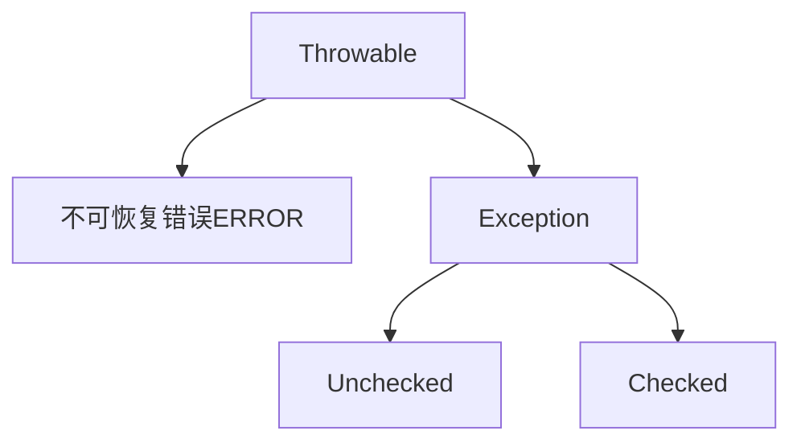

2. 异常处理实践

```java
try {
    Files.readAllBytes(Paths.get("file.txt"));
} catch (IOException e) {  // 必须捕获的Checked异常
    throw new MyAppException("Read failed", e);  // 异常链
}

// Unchecked异常（RuntimeException）通常不强制捕获
if (obj == null) {
    throw new NullPointerException("Object is null");
}
```

#### 2‌-4-2、多线程‌

- 创建方式：继承`Thread`或实现`Runnable`
- 同步机制：`synchronized`关键字或`ReentrantLock`

#### 2‌-4-3、I/O操作‌

- 字节流：`InputStream/OutputStream`
- 字符流：`Reader/Writer`（处理文本推荐）

#### 2-4-4、泛型、反射、注解


------

### 2-5、关键补充

1. ‌**内存管理**‌
   - 堆存储对象实例，栈存储局部变量和方法调用
   - 垃圾回收主要针对堆内存（分代收集算法）
2. ‌**新版本特性**‌
   - JDK17+：密封类（`sealed class`）、模式匹配
   - JDK21：虚拟线程（轻量级线程）

------

学习路线建议

1. ‌**基础阶段**‌：语法→OOP→集合→IO
2. ‌**进阶阶段**‌：多线程→JVM→框架原理
3. ‌**工具推荐**‌：IntelliJ IDEA（集成JDK）


## 3、数据结构

### 3-1、线性结构

1. ‌**数组(Array)**‌
   - 固定大小连续内存存储
   - 随机访问O(1)，插入删除O(n)
2. ‌**链表(Linked List)**‌
   - 单向/双向/循环链表实现
   - 插入删除O(1)，查询O(n)
3. ‌**栈(Stack)**‌
   - LIFO（后进先出）原则
   - 应用：方法调用栈、括号匹配
4. ‌**队列(Queue)**‌
   - FIFO（先进先出）原则
   - 变体：双端队列(Deque)、优先队列(PriorityQueue)
5. ‌**哈希表(Hash Table)**‌
   - 数组+链表+红黑树（JDK8+ HashMap结构）
   - 平均查询O(1)，解决哈希冲突

### 3-2、非线性结构

1. ‌**树(Tree)**‌
   - 二叉树、二叉搜索树(BST)
   - 平衡树：AVL树、红黑树（TreeMap底层实现）
   - 特殊结构：B树（数据库索引）、B+树、哈夫曼树
2. ‌**堆(Heap)**‌
   - 完全二叉树实现，分为大顶堆/小顶堆
   - 应用：优先队列、TopK问题
3. ‌**图(Graph)**‌
   - 邻接矩阵/邻接表存储
   - 应用：社交网络、路径规划

### 3-3、Java集合框架实现

| 接口    | 实现类        | 底层结构      |
| ------- | ------------- | ------------- |
| `List`  | ArrayList     | 动态数组      |
|         | LinkedList    | 双向链表      |
| `Set`   | HashSet       | 哈希表        |
|         | TreeSet       | 红黑树        |
| `Map`   | HashMap       | 哈希表+红黑树 |
|         | TreeMap       | 红黑树        |
| `Queue` | PriorityQueue | 堆            |
| `Deque` | ArrayDeque    | 循环数组      |

> 注：实际开发中优先使用Java集合框架的实现类，而非手动实现基础数据结构

## 4 、GC算法

### 4-1、GC核心原理

#### 4‌-1-1、基本机制‌

- 通过可达性分析算法（从GC Roots出发遍历对象引用链）标记存活对象
- 自动回收不可达对象内存，避免手动释放导致的内存泄漏
- 典型GC Roots包括：栈帧局部变量、静态变量、JNI引用等

#### 4‌-1-2、分代回收策略

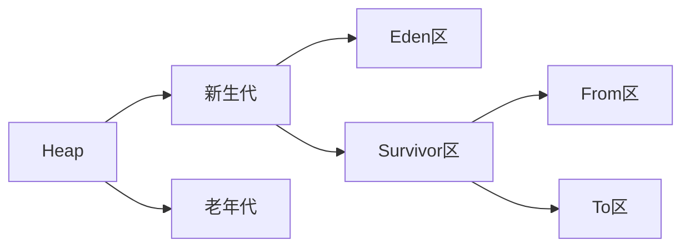

- 新生代采用复制算法（Minor GC），老年代采用标记-整理算法（Full GC）
- 对象晋升规则：默认经历15次Minor GC存活则进入老年代

### 4-2、关键算法演进

| 算法类型  | 特点                     | 应用场景     |
| --------- | ------------------------ | ------------ |
| 标记-清除 | 产生内存碎片，适合老年代 | CMS收集器    |
| 复制算法  | 空间利用率50%，但无碎片  | 新生代回收   |
| 标记-整理 | 解决碎片问题，但耗时较长 | G1/ZGC收集器 |
| 分代收集  | 结合不同算法优势         | 现代JVM默认  |

### 4-3、主流垃圾收集器

#### 4‌-3-1、经典组合‌

- Serial + Serial Old：单线程模式，适合客户端应用
- ParNew + CMS：并发标记清除，减少停顿时间

#### 4‌-3-2、新一代收集器‌

- ‌**G1**‌：JDK9默认，分Region收集，预测停顿时间
- ‌**ZGC**‌：亚毫秒级停顿，支持TB级堆内存（JDK15+生产可用）
- ‌**Shenandoah**‌：低延迟并发回收，与ZGC竞争

### 4-4、性能调优实践

#### 4‌-4-1、关键参数‌

```java
-Xmx4g  // 最大堆内存
-Xms4g  // 初始堆内存
-XX:NewRatio=2  // 新生代/老年代比例
-XX:+UseG1GC  // 启用G1收集器
```

#### 4‌-4-2、问题诊断‌

- ‌**频繁Full GC**‌：检查老年代内存泄漏或晋升阈值
- ‌**长时间停顿**‌：切换低延迟收集器（如ZGC）
- ‌**内存泄漏**‌：通过MAT分析对象引用链

### 4-5、技术发展趋势

1. ‌**无停顿收集**‌：ZGC/Shenandoah实现亚毫秒级停顿
2. ‌**异构内存**‌：堆外内存与堆内存统一管理
3. ‌**AI调优**‌：基于机器学习的自适应参数调整（JDK21+实验特性）

## 5、并发特性


# 五、消息队列

## 1、rabbitMQ

​		轻量级消息队列系统，使用erlang语言编写，开始于信报行业异步传输消息，rabbitMQ 是一个开源的消息代理和队列服务器，用于在分布式系统之间异步传递消息。它实现了 ‌**AMQP（Advanced Message Queuing Protocol）**‌ 协议，并支持多种消息模式，如‌**点对点（P2P）**‌、‌**发布/订阅（Pub/Sub）**‌、‌**路由（Routing）**‌ 和 ‌**主题（Topic）**

### ‌1-1. RabbitMQ 核心概念‌

#### ‌1-1-1、基本组件‌

| 组件                   | 说明                                     |
| ---------------------- | ---------------------------------------- |
| ‌**Producer（生产者）**‌ | 发送消息的应用                           |
| ‌**Consumer（消费者）**‌ | 接收消息的应用                           |
| ‌**Queue（队列）**‌      | 存储消息的缓冲区（FIFO）                 |
| ‌**Exchange（交换机）**‌ | 接收生产者消息，并按规则路由到队列       |
| ‌**Binding（绑定）**‌    | 定义 Exchange 和 Queue 的关系            |
| ‌**Message（消息）**‌    | 包含 payload（数据）和 headers（元数据） |
| ‌**Channel（通道）**‌    | 复用 TCP 连接的轻量级通信方式            |

#### ‌1-1-2、Exchange 类型‌

| 类型        | 说明                       | 适用场景             |
| ----------- | -------------------------- | -------------------- |
| ‌**Direct**‌  | 精确匹配 `routingKey`      | 点对点（P2P）        |
| ‌**Fanout**‌  | 广播到所有绑定的队列       | 发布/订阅（Pub/Sub） |
| ‌**Topic**‌   | 基于 `routingKey` 模式匹配 | 消息分类（如日志）   |
| ‌**Headers**‌ | 基于消息头匹配             | 较少使用             |

------

### ‌1-2. RabbitMQ 工作流程‌

1. ‌**Producer**‌ 发送消息到 ‌**Exchange**‌。
2. ‌**Exchange**‌ 根据 ‌**Binding**‌ 规则决定消息路由到哪些 ‌**Queues**‌。
3. ‌**Consumer**‌ 从 ‌**Queue**‌ 获取消息并处理。

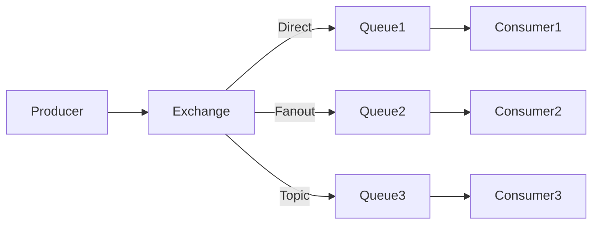

------

### ‌1-3. RabbitMQ 核心特性‌

#### ‌1-3-1、消息可靠性‌

| 机制                    | 说明                                 |
| ----------------------- | ------------------------------------ |
| ‌**消息确认（ACK）**‌     | 消费者处理完消息后发送 ACK，否则重发 |
| ‌**持久化（Durable）**‌   | 队列和消息持久化到磁盘，防止丢失     |
| ‌**事务（Transaction）**‌ | 确保消息发送的原子性（性能较低）     |
| ‌**Publisher Confirms**‌  | 生产者确认消息是否成功投递           |

#### ‌1-3-2、高级功能‌

| 功能                             | 说明                 |
| -------------------------------- | -------------------- |
| ‌**TTL（Time-To-Live）**‌          | 设置消息过期时间     |
| ‌**Dead Letter Exchange（DLX）**‌  | 处理失败或超时的消息 |
| ‌**Priority Queue**‌               | 优先级队列           |
| ‌**RPC（Remote Procedure Call）**‌ | 请求-响应模式        |

------

### ‌1-4、RabbitMQ 使用示例（Spring Boot）

‌**4.1 添加依赖**‌

```xml
<dependency>
    <groupId>org.springframework.boot</groupId>
    <artifactId>spring-boot-starter-amqp</artifactId>
</dependency>
```

‌**4.2 配置 RabbitMQ**‌

```yaml
spring:
  rabbitmq:
    host: localhost
    port: 5672
    username: guest
    password: guest
    virtual-host: /
```

‌**4.3 发送消息（Producer）**‌

```java
@RestController
public class MessageController {
    @Autowired
    private RabbitTemplate rabbitTemplate;

    @PostMapping("/send")
    public String sendMessage(@RequestParam String message) {
        rabbitTemplate.convertAndSend("my-exchange", "my.routing.key", message);
        return "Message sent!";
    }
}
```

‌**4.4 接收消息（Consumer）**‌

```java
@Component
public class MessageListener {
    @RabbitListener(queues = "my-queue")
    public void receiveMessage(String message) {
        System.out.println("Received: " + message);
    }
}
```

‌**4.5 配置 Exchange & Queue**‌

```java
@Configuration
public class RabbitMQConfig {
    @Bean
    public TopicExchange myExchange() {
        return new TopicExchange("my-exchange");
    }

    @Bean
    public Queue myQueue() {
        return new Queue("my-queue", true); // durable=true
    }

    @Bean
    public Binding binding() {
        return BindingBuilder.bind(myQueue())
                .to(myExchange())
                .with("my.routing.key");
    }
}
```

------

### ‌1-5、RabbitMQ vs Kafka vs RocketMQ‌

| 特性         | RabbitMQ           | Kafka            | RocketMQ         |
| ------------ | ------------------ | ---------------- | ---------------- |
| ‌**协议**‌     | AMQP               | 自定义协议       | 自定义协议       |
| ‌**吞吐量**‌   | 中（万级 QPS）     | 高（百万级 QPS） | 高（十万级 QPS） |
| ‌**延迟**‌     | 低（毫秒级）       | 中（秒级）       | 低（毫秒级）     |
| ‌**持久化**‌   | 支持               | 支持             | 支持             |
| ‌**适用场景**‌ | 实时消息、任务队列 | 日志、大数据流   | 金融、电商订单   |

------

### ‌1-6、常见问题‌

‌**Q1: 消息丢失怎么办？**‌

- ‌**生产者**‌：使用 `publisher confirms` 确认消息投递。
- ‌**Broker**‌：设置 `durable=true` 持久化队列和消息。
- ‌**消费者**‌：手动 ACK，处理失败后重试或进入死信队列（DLX）。

‌**Q2: 如何保证消息顺序？**‌

- ‌**单队列单消费者**‌：确保消息按顺序消费。
- ‌**Kafka/RocketMQ**‌ 更适合严格顺序场景。

‌**Q3: 如何提高吞吐量？**‌

- ‌**批量发送**‌（`batchSize` 配置）。
- ‌**多消费者**‌（`prefetchCount` 优化）。
- ‌**集群部署**‌（镜像队列）。

------

‌**总结**‌

- ‌**RabbitMQ 适合**‌：实时消息、任务队列、微服务通信。
- ‌**Kafka 适合**‌：日志收集、大数据流处理。
- ‌**RocketMQ 适合**‌：金融级高可靠场景。

‌**推荐学习资源**‌：

- [RabbitMQ 官方文档](https://www.rabbitmq.com/documentation.html)
- [Spring AMQP 文档](https://spring.io/projects/spring-amqp)


## 2、rocketMQ

百万级消息队列系统，天然分布式高并发高可用，Java原生编写

### 2-1、核心架构与设计理念

#### 2-1-1、四大核心组件

```mermaid
graph LR
    P[Producer] -->|1.发送消息| B[Broker集群]
    B -->|2.持久化存储| D[(存储系统)]
    C[Consumer] -->|3.拉取消息| B
    N[NameServer] -->|4.路由同步| P
    N -->|5.路由同步| C

```

- 组件职责说明

  1. ‌**Producer**‌
     - 通过NameServer获取Broker路由信息
     - 支持同步/异步/单向三种发送模式
     - 默认采用轮询策略选择消息队列
  2. ‌**Broker**‌
     - 接收消息并持久化到CommitLog
     - 维护消费队列(ConsumeQueue)索引
     - 支持主从同步复制保证高可用
  3. ‌**NameServer**‌
     - 无状态路由注册中心
     - 30秒心跳检测机制维护Broker列表
     - 客户端每30秒主动拉取最新路由
  4. ‌**Consumer**‌
     - 支持集群/广播两种消费模式
     - 采用长轮询机制拉取消息（默认5s超时）
     - 消费进度(offset)持久化到Broker

  关键交互时序

  1. 启动阶段：Broker向所有NameServer注册路由信息
  2. 生产阶段：Producer从NameServer获取Topic路由表→选择队列发送消息
  3. 消费阶段：
     - Consumer从NameServer获取Broker地址
     - 向Master/Slave建立长连接拉取消息
  4. 故障转移：NameServer检测Broker下线→通知客户端更新路由表

#### 2-2-2、核心设计特性

- ‌**消息存储模型**‌：

  ```java
  // 存储结构示例
  commitlog/
    00000000000000000000  // 主存储文件
  consumequeue/
    TopicA/0/00000000000000000000  // 消费队列索引
  ```

  - 顺序写+随机读设计（CommitLog+ConsumeQueue）
  - 单机支持10万级TPS

- ‌**消息投递保证**‌：

  | 保证级别      | 实现机制               |
  | ------------- | ---------------------- |
  | At Least Once | 消费成功后才提交offset |
  | Exactly Once  | 事务消息+幂等校验      |

### 2-2、关键特性详解

#### 2-2-1、消息类型

```java
// 发送不同类型消息示例
// 普通消息
producer.send(new Message("TopicTest", "TagA", "HelloWorld".getBytes()));

// 延迟消息（支持18个固定级别）
Message msg = new Message("TopicTest", "TagB", "DelayedMsg".getBytes());
msg.setDelayTimeLevel(3);  // 10秒延迟:ml-citation{ref="2,4" data="citationList"}

// 事务消息
TransactionSendResult result = producer.sendMessageInTransaction(msg, null);

// 顺序消息

```

#### 2-2-2、消费模式对比

| 模式         | 实现方式                  | 适用场景     |
| ------------ | ------------------------- | ------------ |
| ‌**集群消费**‌ | 相同GroupID消费者分摊消息 | 业务消息处理 |
| ‌**广播消费**‌ | 所有消费者接收全量消息    | 配置信息推送 |

#### 2-2-3、消息过滤

- ‌Tag过滤（服务端过滤）：

  ```java
  // 消费者只接收TagA或TagC的消息
  consumer.subscribe("TopicTest", "TagA || TagC");
  ```

- ‌SQL92过滤（需Broker开启enablePropertyFilter）：

  ```sql
  a > 5 AND b = 'hello'
  ```

### 2-3、高可用设计

#### 2-3-1、Broker部署模式

| 模式     | 数据同步方式 | 故障转移时间 |
| -------- | ------------ | ------------ |
| 异步复制 | 主从异步复制 | 30秒级       |
| 同步双写 | 主从同步刷盘 | 秒级         |

#### 2-3-2、读写分离机制

```mermaid
sequenceDiagram
    Producer->>Broker-Master: 写入消息
    Broker-Master->>Broker-Slave: 同步数据
    Consumer->>Broker-Slave: 拉取消息（SlaveReadEnable=true）
```

### 2-4、最佳实践

#### 2-4-1、性能调优参数

```properties
# broker.conf 关键参数
flushDiskType=ASYNC_FLUSH  # 异步刷盘（高性能）
mapedFileSizeConsumeQueue=300000  # 消费队列文件大小(单位字节)
useReentrantLockWhenPutMessage=true  # 高并发场景锁优化
```

#### 2-4-2、监控指标

- ‌关键监控项：
  - 堆积量（consumerOffset - minOffset）
  - 写入/消费TPS
  - 存储文件年龄（超过4小时报警）

### 2-5、5.0版本新特性（2025）

1. ‌**轻量级Proxy模式**‌：

   ```bash
   ./mqadmin proxy -n nameserver:9876 -p 8080
   ```

   - 分离计算与存储，支持K8s弹性扩缩容

2. ‌**多语言SDK增强**‌：

   - 支持gRPC协议通信
   - 提供Rust/Go语言客户端

3. ‌**流式处理增强**‌：

   ```java
   // 流式消费API
   consumer.consumeStream((List<Message> msgs) -> {
       msgs.forEach(msg -> process(msg));
       return ConsumeResult.SUCCESS;
   });
   ```

> 注：生产环境建议使用4.9+ LTS版本（截至2025年最新为5.0.2）

## 3、Kafka

千万级分布式事件流处理

### 3-1、核心架构与设计理念

1. 分布式消息系统架构

```mermaid
graph TD
    P[Producer] -->|发布消息| B[Broker集群]
    B -->|副本同步| B
    C[Consumer Group] -->|订阅消息| B
    Z[ZooKeeper] -->|集群协调| B
```

- ‌核心组件：
  - ‌**Broker**‌：消息存储与处理节点（无主从区分）
  - ‌**ZooKeeper**‌：集群元数据管理（Kafka 3.0+逐步移除依赖）
  - ‌**Producer**‌：支持同步/异步发送
  - ‌**Consumer**‌：基于消费者组的并行消费

2. 核心设计特性

- ‌**分区(Partition)机制**‌：

  ```java
  // 生产者指定分区策略
  producer.send(new ProducerRecord<>(
      "topic", 
      partition,  // 显式指定分区
      key,        // 相同key路由到同一分区
      value
  ));
  ```

  - 单个分区内消息有序
  - 默认采用轮询策略分配分区

- ‌**高吞吐原理**‌：

  - 顺序磁盘I/O（比随机内存访问更快）
  - 零拷贝(Zero-Copy)技术
  - 批量发送与压缩

### 3-2、关键特性详解

1. 消息存储模型

```bash
# 日志文件结构示例
/topic-0/
   00000000000000000000.log  # 数据文件
   00000000000000000000.index # 位移索引
   00000000000000000000.timeindex # 时间索引
```

- ‌**分段(Segment)存储**‌：

  - 默认1GB分段，过期数据自动删除
  - 索引文件实现快速定位

- ‌**保留策略**‌：

  | 策略类型 | 配置参数                | 说明           |
  | -------- | ----------------------- | -------------- |
  | 时间保留 | log.retention.hours=168 | 默认保留7天25  |
  | 大小保留 | log.retention.bytes=1GB | 总日志大小限制 |

2. 消费模式对比

| 模式               | 特点                                             |
| ------------------ | ------------------------------------------------ |
| ‌**消费者组模式**‌   | 同组消费者分摊分区（每个分区只被一个消费者消费） |
| ‌**独立消费者模式**‌ | 每个消费者读取全量数据（适用于监控等场景）       |

### 3-3、高可用设计

1. 副本机制

```mermaid
graph LR
    P[Producer] -->|Leader| B1[Broker1]
    B1 -->|Follower| B2[Broker2]
    B1 -->|Follower| B3[Broker3]
```

- ‌**ISR集合**‌（In-Sync Replicas）：

  - 包含所有与Leader保持同步的副本
  - 通过`replica.lag.time.max.ms`检测落后副本

- ‌**选举策略**‌：

  | 策略                        | 特点                                    |
  | --------------------------- | --------------------------------------- |
  | unclean.leader.enable=false | 只从ISR选举（默认）                     |
  | unclean.leader.enable=true  | 允许非ISR副本成为Leader（可能丢失数据） |

### 3-4、最佳实践

1. 关键配置优化

```properties
# server.properties
num.network.threads=8  # 网络线程数（建议核数+1）
num.io.threads=32      # 磁盘IO线程数（建议3*核数）
log.flush.interval.messages=10000  # 刷盘消息间隔
socket.send.buffer.bytes=1024000    # 发送缓冲区大小
```

2. 监控指标

- ‌核心监控项：
  - 分区Leader分布均衡性
  - 消费延迟（`consumer_lag`）
  - 网络吞吐量（`bytes_in/bytes_out`）
  - ISR波动次数（`under_replicated_partitions`）

### 3-5、3.0+版本新特性（2025）

1. ‌**KIP-500（移除ZooKeeper）**‌：

   ```bash
   # 启动自包含模式的Kafka
   bin/kafka-storage.sh format -t $CLUSTER_ID -c config/kraft.properties
   bin/kafka-server-start.sh config/kraft.properties
   ```

   - 采用KRaft协议实现自管理

2. ‌**增量协作重平衡**‌：

   - 消费者组再平衡时间缩短90%+
   - 支持动态分区分配策略

3. ‌**分层存储（Tiered Storage）**‌：

   ```properties
   # 配置远程存储
   remote.storage.enable=true
   remote.log.metadata.manager.class=org.apache.kafka.server.log.remote.storage.NoOpRemoteLogMetadataManager
   ```

   - 冷数据自动转存对象存储（如S3）

## 4、MQTT协议

### 4-1、协议基础

#### 4-1-1、核心定义

MQTT（Message Queuing Telemetry Transport）是一种基于发布/订阅模式的轻量级通讯协议，构建于TCP/IP协议之上，由IBM于1999年开发。该协议专为硬件性能受限的远程设备和网络状况不佳的环境设计。

#### 4-1-2、协议特点

- ‌**极简设计**‌：最小报文仅2字节
- ‌**低带宽消耗**‌：适合卫星链路等受限环境
- ‌**异步通信**‌：发布者与订阅者完全解耦
- ‌**QoS支持**‌：提供三种消息传递质量等级

### 4-2、核心架构

#### 4-2-1、 组件模型

```mermaid
graph LR
    P[Publisher] -->|发布消息| B[Broker]
    B -->|路由消息| S1[Subscriber1]
    B -->|路由消息| S2[Subscriber2]
```

- ‌**Broker**‌：消息代理服务器，负责消息路由
- ‌**Publisher**‌：消息发布客户端
- ‌**Subscriber**‌：消息订阅客户端
- ‌**Topic**‌：消息分类的层级标签（如"sensor/temp"）

#### 4-2-2、通信流程

1. 客户端与Broker建立TCP连接
2. 订阅者订阅感兴趣的主题
3. 发布者向主题发布消息
4. Broker将消息推送给匹配的订阅者

### 4-3、关键技术特性

#### 4-3-1、服务质量等级(QoS)

| 等级 | 保证程度 | 典型应用场景   |
| ---- | -------- | -------------- |
| QoS0 | 最多一次 | 环境传感器数据 |
| QoS1 | 至少一次 | 设备状态更新   |
| QoS2 | 恰好一次 | 金融交易场景   |

#### 4-3-2、主题(Topic)设计

- ‌**层级结构**‌：用"/"分隔（如"factory/device1/temp"）
- ‌通配符：
  - `+`：单级匹配（"+/temp"）
  - `#`：多级匹配（"factory/#"）

#### 4-3-3、安全机制

- TLS/SSL加密传输
- 用户名/密码认证
- 客户端证书认证

### 4-4、行业应用

#### 4-4-1、典型应用场景

- ‌**工业物联网**‌：石油管道遥测（原始应用场景）
- ‌**电力系统**‌：变电站设备通信
- ‌**航天领域**‌：星载系统消息交互
- ‌**智能家居**‌：设备状态同步

#### 4-4-2、实际部署案例

- ‌**上海航天电子**‌：基于MQTT的星载应用系统，实现模块间低耦合通信
- ‌**贵州电网**‌：变电站物联网设备MQTT协议自动化测试系统

### 4-5、协议演进

1. 版本发展

- 1999：IBM首次发布
- 2013：成为OASIS开放标准
- 2019：MQTT 5.0发布（新增会话过期等特性）
- 2024：MQTT 5.1.1成为ISO标准（ISO/IEC 20922）

2. 2025年技术趋势

- ‌**边缘计算集成**‌：轻量级Broker部署在边缘节点
- ‌**协议扩展**‌：支持gRPC等新型传输层
- ‌**AI增强**‌：智能主题路由优化


# 六、常用框架解析

## 1、Netty好，得学

异步事件驱动的高性能网络通信应用框架，用于快速开发高性能、高可靠性的网络服务器、客户端程序。运用在各个框架组件上Dubbo、gRPC、springgateway、xxl-job等等

### 1-1、基础汇总

#### 1-1-1、‌Netty核心概念‌

1. ‌**定义与定位**‌
   Netty是一个‌**异步事件驱动**‌的网络应用框架，用于快速开发高性能、高可靠性的网络服务器和客户端程序。
   - ‌**地位**‌：在Java网络框架中的地位类比Spring在JavaEE中的地位。
   - ‌**应用场景**‌：Cassandra、Spark、RocketMQ等知名框架均基于Netty实现网络通信。
2. ‌**核心优势**‌
   - ‌**高性能**‌：基于NIO（非阻塞IO），支持零拷贝机制优化数据传输；
   - ‌**易用性**‌：统一API（支持HTTP/Socket/WebSocket等），简化复杂网络编程；
   - ‌**扩展性**‌：模块化设计（如灵活的线程模型、可插拔的组件）。

------

#### 1-1-2、‌核心组件与架构‌

1. ‌**核心组件**‌

   | ‌**组件**‌          | ‌**作用**‌                                                     |
   | ----------------- | ------------------------------------------------------------ |
   | `EventLoop`       | 事件循环线程，处理I/O操作和任务调度（每个`Channel`绑定一个`EventLoop`）； |
   | `Channel`         | 网络连接抽象，支持TCP/UDP等协议；                            |
   | `ChannelPipeline` | 责任链模式，串联多个`ChannelHandler`处理数据（如编解码、业务逻辑）； |
   | `ByteBuf`         | 高性能字节缓冲区，支持池化、直接内存分配和动态扩容。         |

2. ‌**线程模型**‌

   - ‌**主从Reactor多线程**‌：改进自Reactor模式，`bossGroup`处理连接，`workerGroup`处理I/O；
   - ‌**对比传统NIO**‌：解决NIO的API复杂性和Epoll空轮询Bug。

------

#### 1-1-3、‌关键特性‌

1. ‌**零拷贝机制**‌
   通过`FileRegion`和`CompositeByteBuf`减少内存拷贝次数，提升大文件传输效率。
2. ‌**协议支持**‌
   - 内置HTTP/WebSocket/SSL等协议；
   - 支持Protobuf等序列化框架。
3. ‌**动态扩展能力**‌
   - ‌**拦截器**‌：通过`ChannelHandler`实现日志、加密等功能；
   - ‌**流量控制**‌：基于`ChannelFuture`的异步回调机制。

------

#### 1-1-4、‌Netty与NIO的关系‌

1. ‌**基于NIO优化**‌
   - 解决原生NIO的复杂性（如`Selector`、`Buffer`手动管理问题）；
   - 提供更友好的API（如`ByteBuf`替代`ByteBuffer`）。
2. ‌**性能对比**‌
   - ‌**吞吐量**‌：Netty的零拷贝和线程模型显著优于传统NIO；
   - ‌**稳定性**‌：避免NIO的Epoll空轮询导致的CPU 100%问题。

------

#### 1-1-5、‌典型应用场景‌

1. ‌**RPC框架**‌（如Dubbo）
   利用Netty实现高性能远程调用。
2. ‌**消息队列**‌（如RocketMQ）
   处理高并发网络通信。
3. ‌**实时通信**‌
   支持WebSocket长连接（如聊天室、推送系统）。

### 1-2、原理剖析


### 1-3、疑难杂症

#### 1-3-1、如何解决nio空轮训

​	一、‌**问题背景**‌

NIO 的 `Selector.select()` 方法在无事件时可能因底层 `epoll` 实现缺陷‌**提前返回**‌（返回 `0` 但未阻塞），导致 CPU 空转（100% 占用）。

- ‌**触发条件**‌：`Selector` 无就绪事件却‌**非预期唤醒**‌，且连续发生。
- ‌**影响**‌：`EventLoop` 线程空跑，浪费资源

二、‌**解决方案核心逻辑**‌

Netty 通过 ‌**检测-重建**‌ 机制规避该问题：

1. ‌**空轮询计数**‌
   - 每次 `select()` 调用后，`selectCnt` 计数器自增；
   - 若正常唤醒（有事件/超时），重置 `selectCnt=0`。
2. ‌**阈值判定**‌
   - 当 `selectCnt` 超过阈值（默认 `512`），判定为 NIO 空轮询 Bug。
3. ‌**Selector 重建**‌
   - ‌**创建新 Selector**‌：替换旧实例36；
   - ‌**迁移 Channel**‌：将旧 `Selector` 注册的 `Channel` 重新绑定到新 `Selector`；
   - ‌**关闭旧 Selector**‌：释放资源。

------

三、‌**关键实现细节**‌

1. ‌**检测逻辑**‌

   - 通过unexpectedSelectorWakeup()方法判断异常唤醒：

     ```java
     if (selectedKeys == 0 && !hasTasks() && selectCnt > threshold) {
         rebuildSelector(); // 触发重建
     }
     ```

   - 结合‌**历史平均事件数**‌辅助判断（避免误判）。

2. ‌**重建流程**‌

   - 反射获取旧 `Selector` 的 `selectedKeys` 和 `publicSelectedKeys` 字段；
   - 通过 `rebuildSelector0()` 完成迁移。

3. ‌**性能优化**‌

   - ‌**延迟重建**‌：仅当连续空轮询超阈值时触发，避免频繁开销；
   - ‌**线程安全**‌：迁移期间暂停事件处理，保证一致性

检测+重建

```mermaid
graph TD
    A[Selector.select方法] --> B{是否正常唤醒?}
    B -->|是| C[重置 selectCnt=0]
    B -->|否| D[selectCnt++]
    D --> E{selectCnt > 512?}
    E -->|是| F[重建Selector]
    E -->|否| A
    F --> G[迁移Channel]
    G --> H[关闭旧Selector]

```


#### 1-3-2、如何解决粘包拆包

一、‌**问题本质与原因**‌

1. ‌**粘包**‌：多个数据包被合并为一个TCP包发送，接收端无法区分原始消息边界。

2. ‌**拆包**‌：单个数据包被拆分为多个TCP包传输，接收端需重组。

3. ‌**根本原因**‌：TCP是面向字节流的协议，无消息边界，且受TCP缓冲区大小、Nagle算法等影响。

4. 一、‌**粘包现象（多个包合并）**‌

   1. ‌**案例1：连续小包合并**‌
      - ‌**场景**‌：客户端连续发送两条短消息`"HELLO"`和`"WORLD"`，服务端却一次性收到`"HELLOWORLD"`。
      - ‌**原因**‌：TCP缓冲区将多个小包合并发送（Nagle算法或缓冲区未满）。
   2. ‌**案例2：数据粘连**‌
      - ‌**场景**‌：A包`"ABC"`和B包`"123"`被合并为`"ABC123"`，无法区分原始消息边界。

   ------

   二、‌**拆包现象（单包拆分）**‌

   1. ‌**案例1：大数据包分割**‌
      - ‌**场景**‌：发送`"NETTY_IS_GOOD"`，接收端分两次收到`"NETTY_"`和`"IS_GOOD"`。
      - ‌**原因**‌：数据超过TCP缓冲区大小（MSS限制）。
   2. ‌**案例2：半包+粘包混合**‌
      - ‌**场景**‌：A包`"DATA"`和B包`"STREAM"`被拆分为`"DAT"`（A包部分）和`"ASTREAM"`（A包剩余+B包）。

5. 

   ```mermaid
   graph LR
       A[发送端] -->|正常包| B[包1+包2独立]
       A -->|粘包| C[包1+包2合并]
       A -->|拆包| D[包1拆分->包1_1+包1_2]
       A -->|混合| E[包1_1+包2粘合]
   
   ```

   

------

二、‌**核心解决方案**‌

Netty通过‌**编解码器（Encoder/Decoder）**‌实现以下四种主流方案：

1. ‌**固定长度协议（FixedLengthFrameDecoder）**‌

- ‌**原理**‌：强制每个数据包为固定长度（如1024字节），不足则补空字符。

- ‌**适用场景**‌：简单协议，数据长度稳定。

- ‌代码示例：

  ```java
  pipeline.addLast(new FixedLengthFrameDecoder(1024));
  ```

2. ‌**分隔符协议（DelimiterBasedFrameDecoder）**‌

- ‌**原理**‌：以特殊字符（如`\n`、`\r\n`）标记包结尾。

- ‌**优势**‌：灵活，适合文本协议（如HTTP）。

- ‌代码示例‌：

  ```java
  pipeline.addLast(new DelimiterBasedFrameDecoder(1024, Unpooled.wrappedBuffer("\n".getBytes())));
  ```

3. ‌**长度字段协议（LengthFieldBasedFrameDecoder）**‌

- ‌**原理**‌：自定义协议头包含长度字段，接收端按长度截取完整包。

- ‌结构：

  ```text
  +--------+----------+  
  | Length | Content  |  
  +--------+----------+  
  ```

- ‌代码示例：

  ```java
  pipeline.addLast(new LengthFieldBasedFrameDecoder(1024, 0, 4, 0, 4));
  ```

4. ‌**自定义协议（MessageToMessageCodec）**‌

- ‌**原理**‌：完全自定义编解码逻辑，如添加魔数、校验位等。
- ‌**适用场景**‌：复杂业务协议（如RPC）。
- ‌关键步骤‌：
  - 定义协议类（含长度字段`len`和内容`content`）；
  - 实现`encode()`和`decode()`方法。

------

三、‌**方案对比与选型**‌

| ‌**方案**‌   | ‌**优点**‌           | ‌**缺点**‌             | ‌**适用场景**‌         |
| ---------- | ------------------ | -------------------- | -------------------- |
| 固定长度   | 实现简单，解析高效 | 浪费带宽（补空字符） | 固定格式的二进制协议 |
| 分隔符     | 灵活，兼容文本协议 | 需转义分隔符，防冲突 | HTTP、日志流         |
| 长度字段   | 精准控制，扩展性强 | 协议设计稍复杂       | 高性能RPC/消息队列   |
| 自定义协议 | 完全适配业务需求   | 开发成本高           | 复杂私有协议         |

------

四、‌**底层机制与优化**‌

1. ‌**ByteBuf处理**‌：Netty的`ByteBuf`支持动态扩容和切片，避免拆包时的内存拷贝。
2. ‌**滑动窗口**‌：通过`ChannelPipeline`的链式处理逐步解析数据。
3. ‌**异常处理**‌：自动丢弃不完整包或触发`TooLongFrameException`

```mermaid
graph TD
    A[粘包/拆包问题] --> B{解决方案}
    B --> C[固定长度]
    B --> D[分隔符]
    B --> E[长度字段]
    B --> F[自定义协议]
    C --> G[FixedLengthFrameDecoder]
    D --> H[DelimiterBasedFrameDecoder]
    E --> I[LengthFieldBasedFrameDecoder]
    F --> J[MessageToMessageCodec]

```

#### 1-3-3、零拷贝技术

‌**定义**‌

- 零拷贝（Zero-Copy）通过减少或消除数据在内存间的冗余拷贝，直接在内核空间完成数据传输，显著提升I/O性能

```mermaid
graph TD
    subgraph 传统I/O[传统I/O:4次拷贝]
        A[磁盘] -->|DMA拷贝| B[内核缓冲区]
        B -->|CPU拷贝| C[用户缓冲区]
        C -->|CPU拷贝| D[Socket缓冲区]
        D -->|DMA拷贝| E[网络设备]
    end
    

    subgraph 零拷贝[零拷贝:2次拷贝]
        F[磁盘] -->|DMA拷贝| G[内核缓冲区]
        G -->|DMA拷贝| H[网络设备]
    end

```


## 2、Mybatis的使用

半ORM框架，灵活好用

### 2-1、使用方式之两种

#### 2-1-1、接口方法上注解

​	简单使用CRUD时，接口方法上添加@select@update@insert@delete，加上具体SQL即可操作数据库

```java
核心实现逻

在 Java 接口方法上直接使用 @Select、@Insert 等注解编写 SQL，无需 XML 文件。
示例代码：
java
@Insert("INSERT INTO user(name) VALUES(#{name})")
void insertUser(@Param("name") String name);
通过 SqlSession.getMapper() 获取代理对象调用方法。
‌适用场景‌

简单 CRUD 操作或快速原型开发；
微服务等轻量级项目，减少配置文件数量。
‌优势‌

代码简洁，开发效率高；
避免 XML 与 Java 代码频繁切换
```


#### 2-1-2、mapper.xml

这种适合复杂项目，接口和mapper文件一一对应，声明同一命名空间

```xml
核心实现逻

通过编写 mapper.xml 文件定义 SQL 语句，与 Java 接口方法绑定，实现 SQL 与代码分离。
典型配置示例：
<insert id="batchInsertData" parameterType="list">
    INSERT INTO table_name (字段) VALUES 
    <foreach item="item" collection="list" separator=",">
        (#{item.property})
    </foreach>
</insert>
支持动态 SQL 和批量操作。
‌适用场景‌
复杂 SQL 语句（如多表关联、动态条件）；
需要精细控制 SQL 性能优化的场景（如批量插入）。
‌优势‌
SQL 可视化，便于维护和调试；
支持高级映射（如结果集嵌套）
    #和$在SQL语句中使用，#是参数
```

#### 2-1-3、#和$在SQL语句中的使用区别

------

一、‌**核心机制差异**‌

1. ‌**`#{}`（预编译占位符）**‌

   - 原理：转换为 JDBC 的 `PreparedStatement` 参数占位符（`?`），执行时安全绑定参数值。

   - 示例：

     ```xml
     SELECT * FROM user WHERE id = #{id}
     ```

     解析为：

     ```xml
     SELECT * FROM user WHERE id = ?
     ```

   - ‌**安全性**‌：自动转义特殊字符，防止 SQL 注入。

2. ‌**`${}`（字符串直接替换）**‌

   - 原理：直接拼接参数值到 SQL 中，无预编译处理。

   - 示例：

     ```xml
     SELECT * FROM ${tableName} WHERE id = 1
     ```

     若tableName=user，解析为：

     ```xml
     SELECT * FROM user WHERE id = 1
     ```

   - ‌**风险**‌：存在 SQL 注入漏洞（如输入 `' OR 1=1 --` 可篡改逻辑）。

------

二、‌**使用场景对比**‌

| ‌**场景**‌                   | ‌**推荐方式**‌ | ‌**原因**‌                                                 |
| -------------------------- | ------------ | -------------------------------------------------------- |
| 普通参数绑定（如ID、数值） | `#{}`        | 安全、高效（预编译复用）                                 |
| 动态表名/列名              | `${}`        | 需直接拼接 SQL 片段（如分表场景）                        |
| 排序字段（`ORDER BY`）     | `${}`        | `#{}` 会添加引号导致语法错误（如 `ORDER BY "age"` 无效） |

------

三、‌**性能与类型处理**‌

1. ‌**`#{}` 优势**‌
   - ‌**预编译缓存**‌：同一 SQL 多次执行仅编译一次，提升效率；
   - ‌**自动类型转换**‌：Java 类型与 JDBC 类型自动匹配（如 `String` → `VARCHAR`）。
2. ‌**`${}` 限制**‌
   - ‌**无类型处理**‌：直接拼接可能导致类型错误（如字符串未加引号）；
   - ‌**动态分表需配置**‌：需设置 `statementType="STATEMENT"` 禁用预编译。

------

四、‌**安全建议**‌

1. 优先使用 `#{}`，仅在必须动态拼接 SQL 时使用 `${}`；
2. 使用 `${}` 时，必须对输入值做严格校验或白名单过滤。

------

总结流程图

```mermaid
graph LR
    A[参数占位符] --> B[#]
    A --> C[$]
    B --> D[预编译防注入]
    B --> E[自动类型转换]
    C --> F[动态SQL拼接]
    C --> G[需手动防注入]
```

### 2-2、常用标签

#### 2-2-1、基础CRUD

1. ‌**`<select>`**‌

   - ‌**作用**‌：执行查询操作，将结果映射到 Java 对象。

   - ‌关键属性：

     - `id`：唯一标识符，对应接口方法名；
     - `resultType`/`resultMap`：指定返回类型或自定义映射规则；
     - `parameterType`：参数类型（可省略，自动推断）。

   - ‌示例：

     ```xml
     <select id="findUserById" resultType="User">
         SELECT * FROM user WHERE id = #{id}
     </select>
     ```

2. ‌**`<insert>`**‌

   - ‌**作用**‌：插入数据，支持主键回填。

   - ‌关键属性：

     - `useGeneratedKeys`：启用自增主键；
     - `keyProperty`：主键值赋给对象的哪个属性。

   - ‌示例：

     ```xml
     <insert id="addUser" parameterType="User" useGeneratedKeys="true" keyProperty="id">
         INSERT INTO user (name) VALUES (#{name})
     </insert>
     ```

3. ‌**`<update>` 与 `<delete>`**‌

   - ‌**共同点**‌：均需通过 `id` 绑定方法，`parameterType` 指定参数。
   - ‌**注意**‌：必须包含条件（如 `WHERE`），否则会操作全表

#### 2-2-2、动态标签

1. ‌**条件控制标签**‌

   - ‌`<if>`：根据条件动态拼接 SQL。

     ```xml
     <select id="findUser">
         SELECT * FROM user WHERE 1=1
         <if test="name != null">AND name = #{name}</if>
     </select>
     ```

   - ‌**`<choose>/<when>/<otherwise>`**‌：实现多条件分支（类似 `if-else`）。

2. ‌**循环与集合处理**‌

   - ‌`<foreach>`‌：遍历集合，常用于IN查询或批量操作。

     ```xml
     <delete id="batchDelete">
         DELETE FROM user WHERE id IN
         <foreach item="id" collection="list" open="(" separator="," close=")">
             #{id}
         </foreach>
     </delete>
     ```

3. ‌**辅助标签**‌

   - ‌**`<where>`**‌：智能添加 `WHERE` 关键字，自动去除多余 `AND`/`OR`；
   - ‌**`<set>`**‌：用于 `UPDATE` 语句，自动处理逗号。

------

#### 2-2-3、‌高级映射与复用标签‌

1. ‌**`<resultMap>`**‌

   - ‌**作用**‌：自定义复杂结果集映射（如一对一、一对多）。

   - ‌示例‌：

     ```xml
     <resultMap id="userMap" type="User">
         <id property="id" column="user_id"/>
         <result property="name" column="user_name"/>
     </resultMap>
     ```

2. ‌**SQL 片段复用**‌

   - ‌`<sql>` + `<include>`：定义可重用的 SQL 片段。

     ```xml
     <sql id="userColumns">id, name, age</sql>
     <select id="selectUser" resultType="User">
         SELECT <include refid="userColumns"/> FROM user
     </select>
     ```

------

#### 2-2-4、‌其他实用标签‌

- ‌**`<bind>`**‌：创建变量，简化表达式；
- ‌**`<trim>`**‌：灵活处理字符串前缀/后缀；

### 2-3、原理剖析

#### 2-3-1、整合springboot之自动配置

​	springboot有starter，mybatis通过自定义starter，整合到springboot框架中，基本流程就是META_INF下创建spring.factories文件，在此文件下配置autoconfigration的自定义配置类的完全限定名，springboot会自动扫描META_INF下的spring.factories文件中的自动配置类，从而自动配置和导入mybatis功能，开发者只需在配置文件中配置参数即可。

#### 2-3-2、MyBatis 运行原理深度解析

------

一、‌**核心架构分层**‌

MyBatis 采用分层设计，主要分为 ‌**接口层**‌、‌**核心处理层**‌ 和 ‌**基础支撑层**‌：

1. ‌接口层
   - 提供 `SqlSession` API（如 `selectOne()`、`insert()`），开发者通过它与 MyBatis 交互。
2. ‌核心处理层
   - ‌**SQL 解析**‌：将 XML注解中的 SQL 转换为 `MappedStatement` 对象；
   - ‌**参数映射**‌：将 Java 对象属性映射到 SQL 参数（`#{}` 替换为 `?`）；
   - ‌**SQL 执行**‌：通过 `Executor` 执行 SQL 并处理结果集。
3. ‌基础支撑层
   - 连接管理（`DataSource`）、事务控制（`Transaction`）、缓存（`Cache`）等。

------

二、‌**启动阶段：配置加载**‌

1. ‌解析配置文件
   - `SqlSessionFactoryBuilder` 读取 `mybatis-config.xml`，构建 `Configuration` 对象（全局配置中心）；
   - 加载 Mapper 接口和 XML 文件，解析为 `MappedStatement`（存储 SQL 和映射规则）。
2. ‌Mapper 动态代理
   - 通过 `MapperProxy` 为接口生成代理类，调用方法时关联对应的 `MappedStatement`。

------

三、‌**执行阶段：SQL 处理流程**‌

1. ‌SQL 会话创建

   - 通过 `SqlSessionFactory` 创建 `SqlSession`（封装了与数据库的交互）。

2. ‌参数处理

   - 将方法参数转换为 SQL 参数：

     ```java
     // 示例：方法调用
     userMapper.selectUserById(1);
     // 转换为 SQL：SELECT * FROM user WHERE id = ?
     ```

   - `TypeHandler` 处理 Java 类型与 JDBC 类型的转换。

3. ‌SQL 执行

   - ‌执行器（Executor）‌：
     - ‌**SimpleExecutor**‌：默认执行器，每次执行新 SQL；
     - ‌**ReuseExecutor**‌：复用预处理语句（`PreparedStatement`）；
     - ‌**BatchExecutor**‌：批量操作优化。
   - ‌缓存机制：
     - 一级缓存（`SqlSession` 级别）默认开启；
     - 二级缓存（`Mapper` 级别）需手动配置。

4. ‌结果映射

   - 通过 `ResultSetHandler` 将 `ResultSet` 转换为 Java 对象（依赖 `<resultMap>` 规则）。

------

四、‌**动态 SQL 处理**‌

1. ‌解析过程‌

   - XML 中的 `<if>`、`<foreach>` 等标签被解析为 `SqlNode` 对象；
   - 执行时根据参数动态拼接为完整 SQL（通过 `DynamicSqlSource`）。

2. ‌示例转换

   ```xml
   <select id="findUser">
       SELECT * FROM user 
       <where>
           <if test="name != null">AND name = #{name}</if>
       </where>
   </select>
   ```

   - 若参数 `name` 为 `null`，最终 SQL 为 `SELECT * FROM user`。

------

五、‌**扩展机制**‌

1. ‌插件（Interceptor）
   - 可拦截 `Executor`、`StatementHandler` 等组件，实现分页、性能监控。
2. ‌类型处理器（TypeHandler）
   - 自定义复杂类型（如 JSON、枚举）与数据库类型的转换。

------

总结：MyBatis 运行流程图

```mermaid
graph TD
    A[启动阶段] --> B[加载 mybatis-config.xml]
    B --> C[构建 Configuration 对象]
    C --> D[解析 Mapper.xml 为 MappedStatement]
    D --> E[生成 Mapper 接口代理类]
    
    F[执行阶段] --> G[调用 SqlSession API]
    G --> H[参数映射与 SQL 拼接]
    H --> I[Executor 执行 SQL]
    I --> J[结果集映射为对象]
    J --> K[返回结果]
```

‌**关键设计思想**‌：

- ‌**解耦 SQL 与代码**‌：通过 XML/注解集中管理 SQL；
- ‌**灵活映射**‌：`ResultMap` 处理复杂对象关系；
- ‌**动态扩展**‌：插件机制支持功能定制


## 3、SkyWalking解析

### 3-1、核心架构与原理

分布式集群架构基本图示

```mermaid
graph TD
    A[客户端应用] -->|调用链&性能指标| B[SkyWalking Agent]
    B -->|发送数据| C[OAP Backend]
    C -->|数据存储| D[Elasticsearch/H2等]
    C -->|提供API| E[UI界面]
    E -->|访问监控数据| F[用户]
    
    subgraph SkyWalking集群
        C1[OAP节点1]
        C2[OAP节点2]
        C3[OAP节点3]
        C1 -->|数据同步| Zookeeper
        C2 -->|数据同步| Zookeeper
        C3 -->|数据同步| Zookeeper
    end
    
    subgraph Elasticsearch集群
        D1[Elasticsearch节点1]
        D2[Elasticsearch节点2]
        D3[Elasticsearch节点3]
        D1 -->|数据同步| D2
        D2 -->|数据同步| D3
        D1 -->|数据同步| D3
    end
    
    C -->|数据存储| D1
    C -->|数据存储| D2
    C -->|数据存储| D3

```

解释：

1. ‌**客户端应用**‌：这是被监控的微服务应用，它们通过集成SkyWalking Agent来收集调用链和性能指标等数据。
2. ‌**SkyWalking Agent**‌：嵌入到应用程序中的探针，负责收集服务的调用链、性能指标等数据，并将这些数据发送给OAP服务。
3. ‌**OAP(Backend,可观测性分析平台）)**‌：后端服务，负责接收从Agent发送的信息，进行数据处理和存储。OAP服务可以部署为集群模式，以提高高可用性和扩展性。在这个图中，我们展示了三个OAP节点，它们通过Zookeeper进行数据同步和协调。
4. ‌**Elasticsearch/H2等**‌：OAP服务常用的数据存储后端。在这个图中，我们展示了Elasticsearch集群作为数据存储后端，它也可以部署为集群模式以提高性能和可靠性。
5. ‌**UI界面**‌：提供实时监控和图形化展示功能，用户可以通过Web访问，以便更好地理解系统性能。UI界面通过访问OAP服务提供的API来获取监控数据。
6. ‌**用户**‌：最终用户，他们通过访问UI界面来查看和分析监控数据。

请注意，这只是一个简化的架构图，实际的SkyWalking分布式集群架构可能会更加复杂，包括更多的组件和细节。此外，具体的部署方式和配置也会根据实际需求和环境而有所不同。

#### 3-1-1、多层架构设计

- ‌**探针层**‌：通过 Java Agent、.NET Core Agent 等植入监控程序，实现代码无侵入式数据采集
- ‌**收集层**‌：接收探针数据并完成预处理，支持 GRPC 高效通信协议
- ‌**存储层**‌：提供 Elasticsearch、MySQL、TiDB 等多存储方案，支持 PB 级数据处理
- ‌**可视化层**‌：提供拓扑图、调用链火焰图、性能趋势分析等可视化工具

#### 3-1-2、数据模型

- ‌**Trace**‌：完整请求链路标识（全局唯一 Trace ID）
- ‌**Span**‌：单个服务节点的操作记录，包含时间戳、标签等元数据
- ‌**Span Context**‌：上下文传递机制，支持跨服务调用链追踪

### 3-2、核心功能特性

#### 3-2-1、全链路监控能力

- 支持 Dubbo、SpringCloud、gRPC 等主流框架自动埋点
- 实现跨服务、跨语言（Java/.NET/Node.js）调用追踪
- 关联应用层事件与网络层传输数据，精准定位异常节点

#### 3-2-2、性能诊断体系

- 实时统计响应时间、吞吐量、错误率等关键指标
- JVM 监控（GC 次数、堆内存使用等）与服务依赖分析
- 智能告警模块支持自定义阈值规则

### 3-3、技术优势对比

| 特性       | SkyWalking           | Zipkin                 |
| ---------- | -------------------- | ---------------------- |
| 埋点方式   | 字节码增强（无侵入） | 代码侵入式             |
| 数据采集   | GRPC 高性能传输      | HTTP 轮询              |
| 可视化能力 | 拓扑图+指标聚合      | 基础链路展示           |
| 存储扩展   | 多存储引擎支持       | 主要依赖 Elasticsearch |

### 3-4、典型应用场景

1. ‌**微服务治理**‌
   - 识别服务调用瓶颈，优化链路耗时最长的「黄金路径」
   - 构建服务依赖拓扑图，预防级联故障
2. ‌**云原生环境**‌
   - 支持 Kubernetes 容器编排监控
   - 结合 Istio 服务网格实现全栈可观测
3. ‌**复杂业务系统**‌
   - 电商交易链路追踪（订单→支付→物流）
   - 金融系统合规审计与故障回溯

### 3-5、演进趋势

- ‌**智能根因分析**‌：结合机器学习算法实现异常自动定位
- ‌**边缘计算支持**‌：优化物联网场景下的端侧数据采集
- ‌**多协议扩展**‌：新增 QUIC、RSocket 等新型协议适配

> 注：最新发布的 SkyWalking 9.3 版本已支持 Wasm 模块化探针，显著降低资源消耗


# 七、常见业务系统中的核心要素

大型业务系统中核心接口请求量最大可达百万级，在如此巨大流量情况下如何有效维护系统稳定性至关重要。

## 1、常规业务系统介绍

```mermaid
graph TD
    %% 客户端层
    A[客户端] -->|HTTP/HTTPS| B(API网关)
    A -->|WebSocket| B
    A -->|移动端API| B

    %% API网关层
    B --> C[鉴权/限流]
    B --> D[动态路由]
    B --> E[熔断降级]
    C -->|JWT/OAuth2| F[认证服务]
    D --> G[服务发现]

    %% 业务服务层
    subgraph 微服务集群
        F --> H[用户服务]
        G --> I[商品服务]
        G --> J[订单服务]
        K[支付服务] --> L[消息队列]
    end

    %% 基础设施层
    H --> M[(MySQL主从)]
    I --> N[(Redis集群)]
    J --> O[(MongoDB分片)]
    L --> P[Kafka]
    P --> Q[日志服务]
    P --> R[库存服务]

    %% 容灾设计
    M --> S[数据库备份]
    N --> T[缓存预热]
    O --> U[数据分片迁移]

```

网约车项目

```mermaid
graph TD
    %% 用户端交互入口
    A[用户端] -->|1. 发起出行请求| B(订单服务)
    
    %% 订单服务协同流程
    B -->|2. 查询可用司机| C{司机状态服务}
    B -->|3. 请求路线规划| D[地图服务]
    B -->|4. 验证用户资质| E[用户管理服务]
    
    %% 司机状态服务联动
    C -->|5. 推送司机位置数据| B
    C -->|6. 同步接单状态变更| B
    C -->|7. 更新服务分数据| E
    
    %% 地图服务深度调用
    D -->|8. 获取实时交通数据| F[实时路况服务]
    D -->|9. POI数据检索| G[地理信息数据库]
    
    %% 订单完成流程
    B -->|10. 发起支付请求| H[支付服务]
    H -->|11. 返回支付结果| B
    B -->|12. 更新行程记录| I[日志服务]
    
    %% 异常处理链路
    C -->|13. 上报异常行为| J[风控服务]
    J -->|14. 触发司机限制| C

```


### 1-1、关键设计说明

1. ‌**分层架构**‌
   - ‌**客户端层**‌：支持多协议接入，适配Web/移动端/物联网设备
   - ‌**API网关层**‌：集成鉴权、动态路由和熔断功能，使用Spring Cloud Gateway或Zuul实现
   - ‌**服务集群**‌：按业务拆分独立服务，通过服务发现（如Nacos）动态注册节点
2. ‌**高并发设计**‌
   - 读写分离：MySQL主从库分离读写请求，Redis集群缓存热点数据
   - 异步处理：支付等耗时操作通过Kafka消息队列解耦，保障最终一致性
3. ‌**高可用机制**‌
   - 熔断降级：Hystrix/Sentinel实现服务级故障隔离
   - 多级缓存：Redis集群+本地缓存（Caffeine）减少数据库压力
   - 数据持久化：MongoDB分片存储非结构化数据，定期备份关键数据库
4. ‌**监控体系**‌（未图示）
   - Prometheus采集指标，Grafana可视化展示，ELK集中管理日志

## 2、常见业务系统中的问题

### 2-1、高并发场景下的不确定

#### 2-1-1、数据传输性能

数据传输的性能直接影响响应速度，不同业务系统对时间的要求不同。一些实时性业务系统对响应时间有着严格的要求，最多可能也就60-100ms，但一般的saas、企业erp、采购等非实时性系统中对时间并没那么严格。

数据编码：protobuf、hessian、thrift的编码器、xml、Java原生的序列化

高效的编码器能够使得传输的数据很少，但能代表全部意思。protobuf中使用http2.0协议，使服务生产和消费方遵循相同协议或契约，只发送关键数据

#### 2-1-2、是否需要限流降级？

单一核心接口的大流量请求势必引发服务宕机，重者系统局部瘫痪，所以需要做好“防火墙”预防，无论在nginx层，还是在网关层，对接口的限流操作都要十分重视。

分布式环境下的限流

我们都知道微服务环境中都是多实例的（一个服务有多个实例），

#### 2-1-3、分布式环境下的高并发

和服务器物理资源有关

和tomcat、jetty服务器有关

和负载均衡策略有关

多实例

和存取介质有关（缓存、磁盘）

和具体业务场景有关

### 2-2、分布式环境中的数据一致性


### 2-3、大数据量的存取问题


## 3、常用解决方案


## 5、如何系统性解决

​	云原生环境下，高并发高可用已为常态，


# 八、高级运维之云原生

## 1、自动化流水线

### 1-1、基础设施准备

1. ‌**代码托管**‌
   - 使用GitLab/Gitee管理微服务代码库，需配置SSH-KEY实现Jenkins无密拉取代码45
   - 分支策略建议：`main`-生产环境、`dev`-集成测试、`feature`-功能开发5
2. ‌**环境隔离**‌
   - 通过Kubernetes Namespace隔离开发/测试/生产环境8
   - 数据库按环境独立部署，使用Flyway管理Schema变更6

------

### 1-2、核心流水线设计

```mermaid
graph LR
    A[代码提交] --> B(Jenkins/GitLab CI触发)
    B --> C{并行构建}
    C --> D[单元测试]
    C --> E[代码扫描]
    D --> F[打包Docker镜像]
    E --> F
    F --> G[推送镜像仓库]
    G --> H[K8S滚动更新]
    H --> I[自动化测试]
    I --> J[生产发布]
```

1. ‌**构建阶段**‌
   - Maven多模块构建：按需单独编译特定服务（如网关）提升效率
   - 制品管理：将JAR包和Docker镜像存储到Nexus/Harbor
2. ‌**部署阶段**‌
   - 通过`kubectl apply -f deployment.yaml`更新K8S服务
   - Rancher流水线集成：自动执行镜像构建→仓库推送→集群部署
3. ‌**验证阶段**‌
   - 集成Postman自动化测试，结合Prometheus监控服务健康度

------

### 1-3、关键技术选型

| 组件          | 推荐方案                   | 作用                 |
| ------------- | -------------------------- | -------------------- |
| ‌**CI/CD引擎**‌ | Jenkins Pipeline/GitLab CI | 流水线编排与任务调度 |
| ‌**容器化**‌    | Docker + BuildKit          | 构建轻量化镜像       |
| ‌**编排工具**‌  | Kubernetes + Helm          | 服务部署与版本管理   |
| ‌**配置中心**‌  | Nacos/Apollo               | 多环境配置统一管理   |

------

### 1-4、高级优化项

1. ‌**安全加固**‌
   - 镜像扫描：Trivy集成到流水线检测漏洞
   - 密钥管理：Vault动态注入数据库密码
2. ‌**故障自愈**‌
   - 配置K8S Liveness探针自动重启异常容器
   - 日志告警：ELK收集错误日志触发企业微信通知
3. ‌**多云支持**‌
   - Terraform跨云编排基础设施，实现阿里云/华为云一键部署

------

### 1-5、典型问题解决方案

- ‌**OOM异常**‌：在K8S部署文件中限制容器内存，并配置`-XX:MaxRAMPercentage`参数
- ‌**构建缓慢**‌：使用Maven镜像仓库缓存依赖，并行构建独立微服务

> 注：完整实现参考阿里云效流水线或Rancher自动化部署模板


## 2、基础设施即服务

## 3、多租户共享资源


# 九、经典算法

## 1、算法分类与特性对比

1. ‌**按实现方式分类**‌：

   - ‌**交换类**‌：冒泡排序、快速排序
   - ‌**插入类**‌：插入排序、希尔排序
   - ‌**选择类**‌：选择排序、堆排序
   - ‌**非比较类**‌：计数排序、桶排序、基数排序

2. ‌**关键特性对比**‌：

   | 算法名称 | 平均时间复杂度 | 最差时间复杂度 | 空间复杂度 | 稳定性     | 适用场景       |
   | -------- | -------------- | -------------- | ---------- | ---------- | -------------- |
   | 冒泡排序 | O(n²)          | O(n²)          | O(1)       | 稳定       | 小规模数据     |
   | 选择排序 | O(n²)          | O(n²)          | O(1)       | 数组不稳定 | 小规模数据     |
   | 插入排序 | O(n²)          | O(n²)          | O(1)       | 稳定       | 基本有序数据   |
   | 希尔排序 | O(nlogn)       | O(n²)          | O(1)       | 不稳定     | 中等规模数据   |
   | 归并排序 | O(nlogn)       | O(nlogn)       | O(n)       | 稳定       | 大规模数据     |
   | 快速排序 | O(nlogn)       | O(n²)          | O(logn)    | 不稳定     | 大规模随机数据 |
   | 堆排序   | O(nlogn)       | O(nlogn)       | O(1)       | 不稳定     | 大规模数据     |
   | 计数排序 | O(n+k)         | O(n+k)         | O(k)       | 稳定       | 整数范围小     |
   | 桶排序   | O(n+k)         | O(n²)          | O(n+k)     | 稳定       | 均匀分布数据   |
   | 基数排序 | O(nk)          | O(nk)          | O(n+k)     | 稳定       | 多位数整数     |

```mermaid
graph TD
A[排序算法]
B[比较类排序]
C[非比较类排序]
D[交换排序]
E[插入排序]
F[选择排序]
G[归并排序]
H[基数排序]
I[桶排序]
J[计数排序]
K[冒泡排序]
L[快速排序]
M[直接插入排序]
N[希尔排序]
O[简单选择排序]
P[堆排序]

A --> B
A --> C
B --> D
B --> E
B --> F
B --> G
C --> H
C --> I
C --> J
D --> K
D --> L
E --> M
E --> N
F --> O
F --> P
```


## 2、核心算法原理

1. ‌**冒泡排序**‌：
   - 通过相邻元素两两比较交换，使最大/最小元素逐渐"冒泡"到顶端
   - 优化：可设置标志位减少不必要的比较
2. ‌**快速排序**‌：
   - 分治思想：选取基准值将数组分为两个子序列递归排序
   - 关键操作：partition函数实现元素分组
3. ‌**堆排序**‌：
   - 构建最大堆/最小堆，通过堆调整实现排序
   - 分为建堆和排序两个阶段
4. ‌**归并排序**‌：
   - 典型分治算法：分解→解决→合并
   - 需要额外O(n)空间存储临时数组

## 3、特殊场景算法

1. ‌**线性时间排序**‌：
   - 计数排序：统计元素出现次数直接确定位置
   - 基数排序：按位排序（LSD/MSD）
   - 桶排序：数据分桶后各自排序
2. ‌**插入排序变种**‌：
   - 希尔排序：通过增量序列实现跳跃式插入
   - 折半插入：使用二分查找优化插入位置查找

## 4、搜索算法


# 十、大数据时代

## 1 

## 2、常用大数据采集处理一体化


```mermaid
%% 大数据架构图（Mermaid 绘制）
flowchart TD
    %% ========== 数据采集层 ==========
    subgraph 数据采集层
        A[移动App/Web] -->|HTTP/日志| B[Flume/Nginx]
        C[IoT设备] -->|MQTT/传感器数据| D[Kafka Producer]
        E[数据库] -->|CDC日志| F[Debezium]
        B & D & F --> G[Kafka Cluster]
    end

    %% ========== 数据处理层 ==========
    subgraph 计算层
        G -->|实时流| H[Flink Streaming]
        G -->|批量数据| I[Flink Batch]
        H --> J[窗口聚合/CEP]
        I --> K[ETL/Join]
    end

    %% ========== 数据存储层 ==========
    subgraph 存储层
        J & K --> L[(HDFS/对象存储)]
        L --> M[Delta Lake/Iceberg]
        M --> N[数据湖元数据]
        L --> O[HBase/ClickHouse]
    end

    %% ========== 数据服务层 ==========
    subgraph 应用层
        O & M --> P[API服务]
        P --> Q[BI工具\nTableau/Superset]
        P --> R[实时大屏]
        P --> S[推荐系统]
    end

    %% ========== 资源管理层 ==========
    subgraph 资源管理层
        T[YARN/K8s] -->|资源调度| H & I
        U[Prometheus] -->|监控| G & H & T
    end

```


### 架构关键组件说明‌

1. ‌**数据采集层**‌
   - ‌**Kafka**‌ 作为统一入口，接收来自 Flume（日志）、MQTT（IoT）、Debezium（数据库变更）的数据
   - 支持 ‌**流式**‌（实时）和 ‌**批量**‌（离线）两种摄入模式
2. ‌**计算层**‌
   - ‌**Flink Streaming**‌：处理实时数据（如风控、监控告警）
   - ‌**Flink Batch**‌：离线 ETL、数据清洗
   - 典型操作：窗口聚合、复杂事件处理（CEP）、多流 Join
3. ‌**存储层**‌
   - ‌**数据湖**‌（Delta Lake/Iceberg）：存储原始数据 + 结构化表
   - ‌**OLAP引擎**‌（ClickHouse/HBase）：支持高性能查询
   - ‌**元数据管理**‌：统一管理表结构、分区、版本
4. ‌**应用层**‌
   - 通过 ‌**REST API**‌ 对外提供数据服务
   - 支撑 BI 分析、实时大屏、推荐系统等场景
5. ‌**资源管理层**‌
   - ‌**YARN/K8s**‌：统一调度 Flink/Spark 计算资源
   - ‌**Prometheus**‌：监控 Kafka/Flink 的吞吐量、延迟等指标

------

### ‌技术栈扩展建议‌

- ‌**实时数仓**‌：用 Kafka + Flink + Hudi 构建 Lambda 架构
- ‌**数据治理**‌：集成 Apache Atlas 管理数据血缘
- ‌**机器学习**‌：在 Flink 中嵌入 TensorFlow/PyTorch 模型


## 3、Kafka 集群拓扑详细架构图

```mermaid
%% Kafka集群拓扑架构（Mermaid绘制）
flowchart TD
    %% ========== 生产者层 ==========
    subgraph 生产者层
        A[Web服务] -->|异步写入| B[Kafka Producer]
        C[IoT设备] -->|MQTT网关| B
        D[数据库CDC] -->|Debezium| B
    end

    %% ========== Kafka集群核心 ==========
    subgraph Kafka集群
        subgraph Broker1
            E[Leader Partition P0] -->|副本同步| F[Follower Partition P0]
            G[Leader Partition P1] -->|副本同步| H[Follower Partition P1]
        end

        subgraph Broker2
            I[Leader Partition P1] -->|副本同步| J[Follower Partition P1]
            K[Leader Partition P2] -->|副本同步| L[Follower Partition P2]
        end

        subgraph Broker3
            M[Leader Partition P2] -->|副本同步| N[Follower Partition P0]
            O[Leader Partition P0] -->|副本同步| P[Follower Partition P2]
        end
    end

    %% ========== 消费者层 ==========
    subgraph 消费者组1
        Q[Flink Worker1] -->|消费P0| E
        R[Flink Worker2] -->|消费P1| G
    end

    subgraph 消费者组2
        S[Spark Worker] -->|消费P2| K
    end

    %% ========== 协调服务 ==========
    Z[ZooKeeper集群] -->|选举Controller| Broker1
    Z -->|存储元数据| Broker2
    Z -->|监控状态| Broker3

    %% ========== 数据流向说明 ==========
    B -->|发布消息| Broker1 & Broker2 & Broker3
    style B stroke:#ff0000,stroke-width:2px
    style Q stroke:#0000ff,stroke-width:2px
    style S stroke:#0000ff,stroke-width:2px

```

### 核心组件说明‌

1. ‌**Broker 节点**‌
   - 每个 Broker 包含多个 ‌**Partition（分区）**‌，分区分为 Leader（处理读写）和 Follower（副本）
   - 示例中展示 3 个 Broker 的副本分布（通过 `replication-factor=3` 实现高可用）
2. ‌**生产者/消费者**‌
   - ‌**生产者**‌：通过 `acks=all` 参数确保消息写入所有副本
   - ‌**消费者组**‌：不同组可重复消费，同组内分区分配给不同 Worker 实现并行
3. ‌**ZooKeeper 作用**‌
   - 管理 Broker 注册、Leader 选举（Kafka 3.0+ 可逐步替换为 KRaft 模式）
   - 存储 Topic/Partition 元数据（如 `__consumer_offsets`）
4. ‌**副本同步机制**‌
   - 绿色箭头表示 ISR（In-Sync Replicas）同步复制
   - 故障时自动切换 Leader（如 Broker1 宕机，P0 的 Follower 晋升为 Leader）

------

### ‌关键配置参数‌

| 参数                             | 说明                      | 推荐值              |
| -------------------------------- | ------------------------- | ------------------- |
| `num.partitions`                 | 每个 Topic 的分区数       | ≥消费者并行度       |
| `default.replication.factor`     | 副本数                    | 3（生产环境）       |
| `min.insync.replicas`            | 最小同步副本数            | 2（保证可用性）     |
| `unclean.leader.election.enable` | 允许不同步副本成为 Leader | false（防数据丢失） |

------

### ‌扩展场景‌

1. ‌跨机房部署

   ```mermaid
   flowchart LR
       A[生产者] -->|就近写入| B[本地Kafka集群]
       B -->|MirrorMaker2| C[异地灾备集群]
   ```

2. ‌Flink 精确一次消费

   ```java
   // 启用Checkpoint并配置Kafka偏移量提交
   env.enableCheckpointing(5000);
   props.setProperty("isolation.level", "read_committed");
   ```

## 4 、Flink 作业链

以下是关于 ‌**Flink 作业链（Operator Chain）**‌ 的详细解析，综合了执行原理、优化机制及配置方法：

------

### ‌1. 作业链的核心概念‌

- ‌**定义**‌：Flink 会将多个算子（Operator）链接（Chain）成一个 ‌**Task Pipeline**‌，在同一个线程中执行，减少线程切换和网络序列化开销。
- ‌条件：
  - 算子间为 ‌**One-to-One**‌ 数据传输（如 `map`→`filter`）。
  - 并行度相同且未禁用链化。
- ‌**优化目标**‌：提升吞吐量，降低延迟。

------

### ‌2. 作业链的生成流程‌

Flink 执行图的转换过程中，作业链在 ‌**StreamGraph → JobGraph**‌ 阶段生成：

1. ‌**StreamGraph**‌：用户代码初始生成的逻辑拓扑，每个算子独立。
2. ‌JobGraph‌：
   - 合并符合条件的算子为 ‌**Operator Chain**‌（如 `Source`→`Map`→`Filter`）。
   - 每个 Chain 对应一个 ‌**Task**‌，由同一线程执行。

```mermaid
%% Flink作业链生成示例（Mermaid绘制）
flowchart LR
    A[Source] --> B[Map] --> C[Filter] --> D[Sink]
    style A fill:#f9f,stroke:#333
    style B fill:#bbf,stroke:#333
    style C fill:#bbf,stroke:#333
    style D fill:#f9f,stroke:#333
```

（虚线框内为合并后的 Task6）

------

### ‌3. 关键配置与调优‌

| ‌**配置项**‌                   | ‌**作用**‌                             | ‌**示例/建议**‌                |
| ---------------------------- | ------------------------------------ | ---------------------------- |
| `pipeline.operator-chaining` | 全局启用/禁用链化                    | `true`（默认）               |
| `disableOperatorChaining()`  | 代码中禁用特定算子的链化             | `map(...).disableChaining()` |
| `slotSharingGroup`           | 设置槽共享组，影响链内算子的资源分配 | `slotSharingGroup("groupA")` |

------

### ‌4. 与资源调度的关系‌

- ‌**Slot 共享**‌：同一作业链的算子默认共享 ‌**Slot 共享组**‌，避免跨节点通信。
- ‌**资源隔离**‌：通过 `slotSharingGroup` 强制拆分链，实现 CPU/内存隔离。

------

### ‌5. 常见问题‌

- ‌**性能下降**‌：链过长可能导致线程阻塞，需通过 `disableChaining` 拆分。
- ‌**调试工具**‌：通过 Flink WebUI 查看 ‌**Operator Chain**‌ 可视化效果

## 5、HDFS存储原始数据 → HBase提供实时查询接口‌？

以下是 ‌**HDFS 数据导入 HBase 实现实时查询**‌ 的完整方案，涵盖关键步骤、技术实现及优化建议：

------

### ‌1. 数据准备与格式转换‌

- ‌**HDFS 数据要求**‌
  确保原始数据包含 ‌**RowKey 设计**‌（如用户ID、时间戳等唯一标识），这是 HBase 高效查询的基础。

  - 若数据无明确 RowKey，需通过预处理生成（如 MD5 哈希或复合键）。

- ‌**格式转换工具**‌

  - ‌HBase BulkLoad：将 HDFS 数据转换为 HFile 格式（HBase 底层存储格式），避免直接写入的性能开销。

    ```bash
    # 示例：使用 MapReduce 生成 HFile
    hadoop jar hbase-mapreduce.jar importtsv \
      -Dimporttsv.columns=HBASE_ROW_KEY,cf:col1,cf:col2 \
      -Dimporttsv.bulk.output=/hfile_output_path \
      my_table /hdfs/input_path
    ```

------

### ‌2. 数据导入 HBase‌

#### ‌方法一：BulkLoad（高吞吐）‌

1. ‌**生成 HFile**‌：通过 `ImportTsv` 或自定义 MapReduce 作业转换数据。

2. ‌加载至 HBase‌：

   ```bash
   hbase org.apache.hadoop.hbase.mapreduce.LoadIncrementalHFiles /hfile_output_path my_table
   ```

   优势：绕过 RegionServer 直接写 HDFS，适合海量数据初始化导入。

#### ‌方法二：API 写入（实时增量）‌

- 通过 ‌HBase Java API

  ‌ 逐行写入：

  ```java
  // 示例：Put 操作写入单行数据
  Table table = connection.getTable(TableName.valueOf("my_table"));
  Put put = new Put(Bytes.toBytes("row1"));
  put.addColumn(Bytes.toBytes("cf"), Bytes.toBytes("col1"), Bytes.toBytes("value1"));
  table.put(put);
  ```

  适用场景：小规模实时数据同步。

------

### ‌3. 实时查询优化‌

- ‌**RowKey 设计**‌

  - ‌**散列化**‌：避免热点问题（如时间戳前缀加盐）。
  - ‌**范围查询优化**‌：按查询频率排序（如用户ID+时间戳）。

- ‌**索引与缓存**‌

  - ‌**Bloom Filter**‌：加速 RowKey 存在性判断，减少磁盘 IO。
  - ‌**Block Cache**‌：缓存频繁访问的数据块。

- ‌**预分区（Pre-splitting）**‌
  建表时按 RowKey 范围预分区，避免后期自动分裂导致的性能波动：

  ```
  create 'my_table', {NAME => 'cf'}, {SPLITS => ['a', 'm', 'z']}
  ```

------

### ‌4. 验证与监控‌

- ‌数据一致性检查

  通过 HBase Shell 或 API 抽样查询，对比 HDFS 原始数据：

  ```
  scan 'my_table', {LIMIT => 10}
  ```

- ‌性能监控

  - ‌**HBase Metrics**‌：关注 `RegionServer` 的读写延迟及 MemStore 使用情况。
  - ‌**HDFS 吞吐量**‌：监控 BulkLoad 期间的 HDFS 带宽占用。

------

### ‌5. 典型问题解决‌

- ‌**热点问题**‌：通过 ‌**Salting**‌ 或 ‌**Hash RowKey**‌ 分散写入压力。
- ‌**BulkLoad 失败**‌：检查 HFile 权限及 RegionServer 状态。

------

### ‌总结流程‌

```mermaid
graph LR
A[HDFS 原始数据] --> B{RowKey 设计}
B --> C[BulkLoad 生成 HFile]
B --> D[API 实时写入]
C --> E[加载至 HBase]
D --> E
E --> F[实时查询优化]
F --> G[监控与调优]
```

通过上述步骤，可实现 ‌**HDFS 冷数据**‌与 ‌**HBase 热查询**‌的高效协同。


## 附上

### Memaid语法解析

1. **`graph LR`**
   - 声明这是一个从左到右（Left-to-Right）的流程图
2. **节点定义**
   - `A[服务]`：矩形节点，显示文本为"服务"
   - `B(Fluentd/Filebeat)`：圆角矩形节点
   - `C[...]` 和 `D[...]`：同类型节点
3. **连接线**
   - `-->`：箭头连接线
   - `|日志输出|`：连线上的文字标签

### 支持的图标

|      |
| ---- |

| 类型   | 声明方式            | 用途               |
| :----- | :------------------ | :----------------- |
| 流程图 | `graph TD`/`LR` | 系统架构、流程描述 |
| 序列图 | `sequenceDiagram` | 交互时序           |
| 类图   | `classDiagram`    | 面向对象结构       |
| 状态图 | `stateDiagram`    | 状态转换           |
| 甘特图 | `gantt`           | 项目时间规划       |
| 饼图   | `pie`             | 比例分布           |
