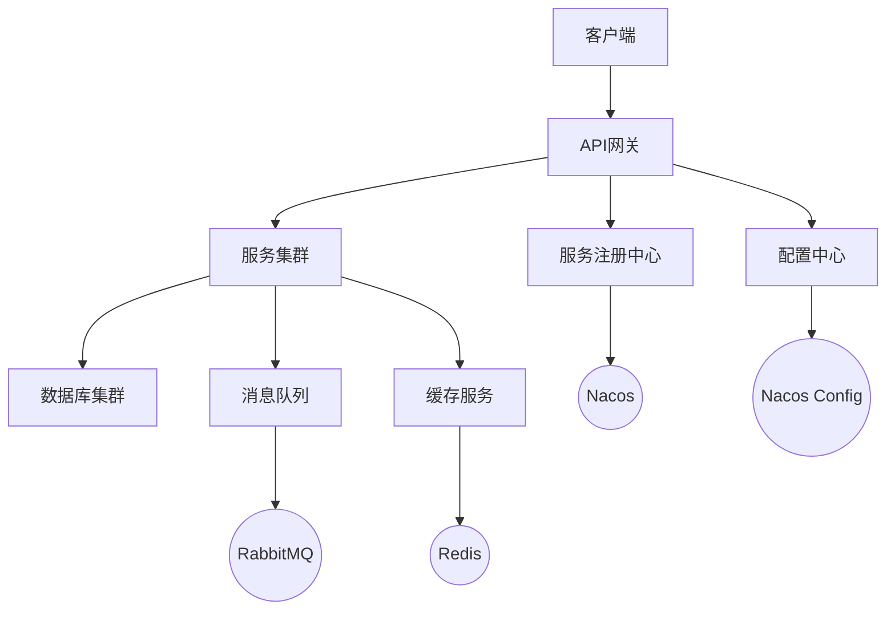
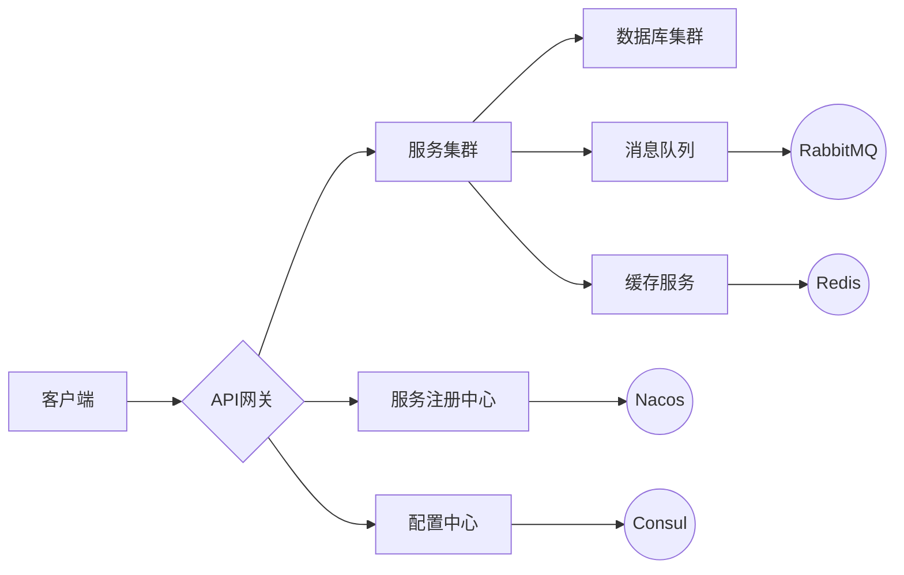
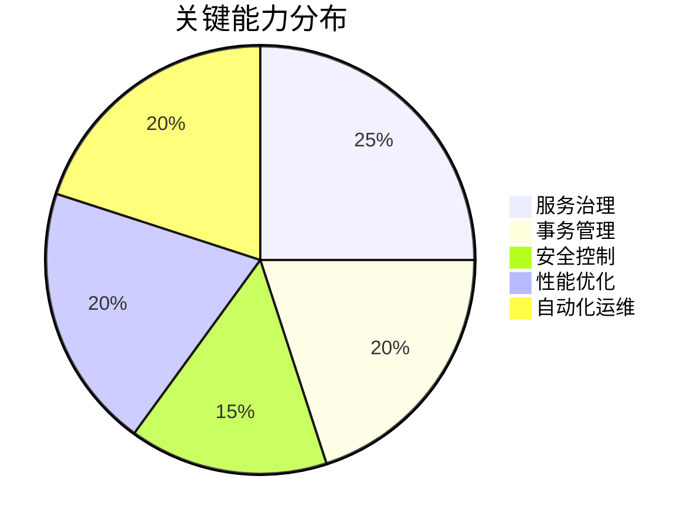

# 微服务架构实践指南


## 📋 目录
- [项目概述](#项目概述)
- [技术栈](#技术栈)
- [系统架构](#系统架构)
- [核心组件](#核心组件)
- [最佳实践](#最佳实践)
- [开发指南](#开发指南)
- [部署说明](#部署说明)
- [贡献指南](#贡献指南)

## 🎯 项目概述

本项目是一个基于 Spring Cloud Alibaba 的微服务架构实践项目，旨在提供一套完整的微服务解决方案。通过本项目，你可以学习到：

- 微服务架构的设计与实现
- 分布式系统的核心组件使用
- 高可用、高性能的系统构建方法
- 微服务治理的最佳实践

## 🛠 技术栈

### 核心框架
- Spring Cloud Alibaba 2023.0.0
- Spring Boot 3.2.0
- Spring Cloud 2023.0.0

### 基础设施
- 服务注册与发现：Nacos
- 配置中心：Nacos Config
- API 网关：Spring Cloud Gateway
- 服务通信：OpenFeign
- 熔断降级：Sentinel
- 链路追踪：SkyWalking
- 消息队列：RabbitMQ
- 缓存服务：Redis

## 🏗 系统架构



## 📦 核心组件

### 服务治理
- 服务注册与发现
- 负载均衡
- 服务熔断
- 服务降级
- 服务限流

### 配置管理
- 动态配置
- 配置版本控制
- 配置加密
- 配置热更新

### 网关服务
- 路由转发
- 请求过滤
- 权限认证
- 流量控制

### 监控告警
- 服务监控
- 链路追踪
- 日志收集
- 告警通知

## 💡 最佳实践

### 服务拆分原则
- 单一职责
- 高内聚低耦合
- 业务边界清晰
- 独立部署能力

### 数据一致性
- 分布式事务
- 最终一致性
- 补偿机制
- 幂等性处理

### 性能优化
- 服务缓存
- 异步处理
- 批量操作
- 资源隔离

## 🚀 开发指南

### 环境要求
- JDK 17+
- Maven 3.8+
- Docker 20.10+
- Git 2.30+

### 开发规范
- 遵循阿里巴巴Java开发手册
- 使用统一的代码格式化工具
- 编写完整的单元测试
- 保持代码注释的及时更新

## 📦 部署说明

### 容器化部署
```bash
# 构建镜像
docker build -t microservice-app .

# 运行容器
docker-compose up -d
```

### 环境配置
- 开发环境：dev
- 测试环境：test
- 预发环境：staging
- 生产环境：prod

## 🤝 贡献指南

欢迎提交 Issue 和 Pull Request 来帮助改进这个项目。在提交代码前，请确保：

1. 代码符合项目的编码规范
2. 添加必要的单元测试
3. 更新相关文档
4. 通过 CI 检查

## 📄 许可证

本项目采用 Apache 2.0 许可证 - 详见 [LICENSE](../LICENSE) 文件



## 技术体系矩阵

### 基础组件

| 领域     | 解决方案           | 推荐工具              |
| -------- | ------------------ | --------------------- |
| 服务发现 | 动态注册与发现机制 | Nacos, Consul, Eureka |
| 配置中心 | 分布式配置管理     | Nacos Config, Apollo  |
| API网关  | 路由/过滤/鉴权     | Spring Cloud Gateway  |
| 服务通信 | RPC与REST          | OpenFeign, gRPC       |
| 熔断降级 | 故障隔离与恢复     | Sentinel, Hystrix     |
| 链路追踪 | 全链路监控         | SkyWalking, Zipkin    |



