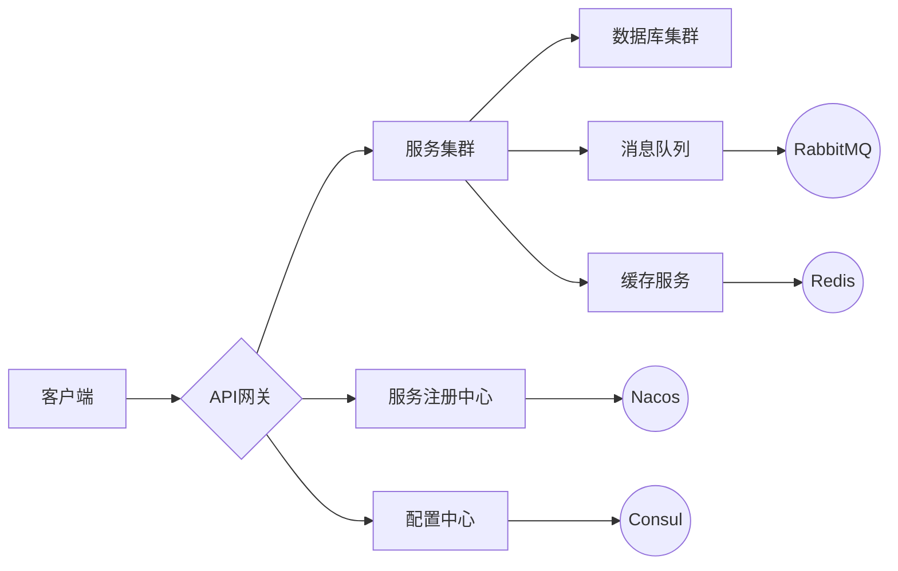
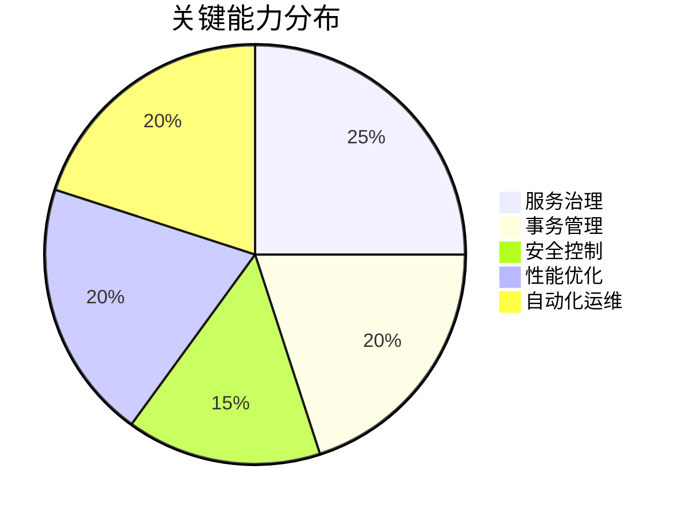

# 微服务架构实践指南

## 技术栈组成
&zwnj;**核心框架**&zwnj;  
✅ Spring Cloud Alibaba 2023.0.0  
✅ Spring Boot 3.2.0  
✅ Spring Cloud 2023.0.0

&zwnj;**关键组件**&zwnj;  

## 技术体系矩阵

### 基础组件

| 领域     | 解决方案           | 推荐工具              |
| -------- | ------------------ | --------------------- |
| 服务发现 | 动态注册与发现机制 | Nacos, Consul, Eureka |
| 配置中心 | 分布式配置管理     | Nacos Config, Apollo  |
| API网关  | 路由/过滤/鉴权     | Spring Cloud Gateway  |
| 服务通信 | RPC与REST          | OpenFeign, gRPC       |
| 熔断降级 | 故障隔离与恢复     | Sentinel, Hystrix     |
| 链路追踪 | 全链路监控         | SkyWalking, Zipkin    |

