[toc]

# 序

​	对，没错，就叫做“面镜”，不是面经而是一面镜子，一面让人原形毕露的镜子。学海无涯苦作舟，想必这个学字深入人心，作为一名后端开发人员，需要掌握的东西可太多了，最麻烦的就是无法系统地学习各种知识。现在好了，不用东拼西凑了，更不用付费阅读了，都在这了。这面镜子是我自己的“照妖镜”，照出瑕疵，也希望能够帮助各位，在升职加薪的路上能够披荆斩棘，一路向前。内容错误处，望请批正。

-- 猫鱼儿

# 一、数据库理论

业务系统离不开数据的存储与查询。

## 1、MongoDB

### 1-1、基本概念

集合（表）、文档（记录）、字段（字段）

### 1-2、存储引擎与索引

3.2版本后，使用WiredTiger存储引擎，B+树结构，存储单元为page，分为**root page、internal page、leaf page**，每一个节点是一个page，非叶子节点为索引节点，数据存储在叶子节点上

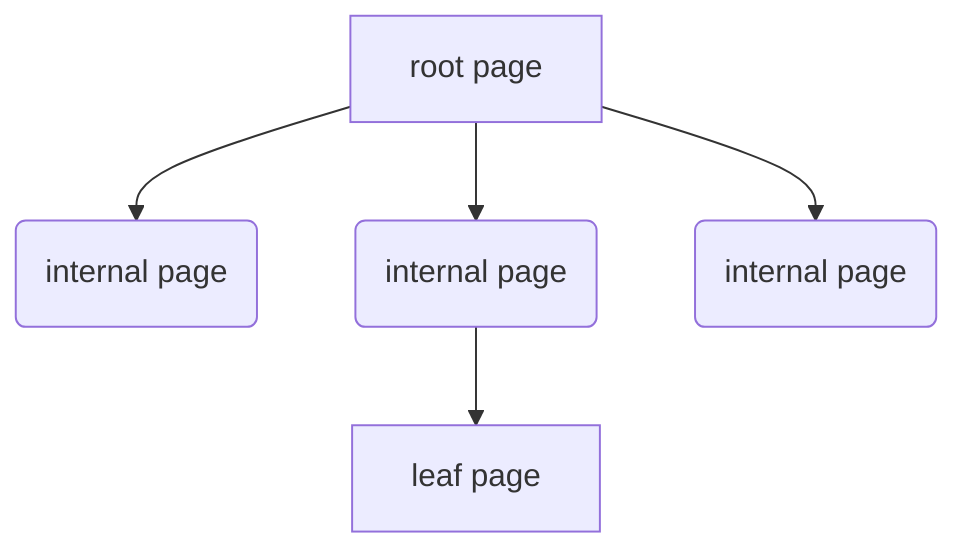

索引：

单键值索引、

复合索引（联合索引）、

多键索引（一个字段下可能是一个数组，存在多键情况）

哈希索引：顾名思义，字段哈希值索引

文本索引：内容检索，全文索引，一般通过一个或者多个字符串对文档内容进行索引

### 1-3、分片复制集群

三个组件router server、config server、sharding server。

router server：接受前段连接请求，然后根据config server进行路由转发

config server：存储元数据信息，不存具体业务数据

sharding server（主从结构）：数据实际储存位置，多主多从，高可用高并发

类似Redis的集群分片

## 2、Redis

内存型数据库，c语言编写，旨在加速查存

### 2-1、基本数据类型剖析

string、set、zset、list、map

### 2-2、为什么好用？

### 2-3、用在哪些场景？

### 2-4、

## 3、MySQL

关系型数据库，强结构型数据库，5.5版本后为默认存储引擎

### 3-1、MySQL基本结构

### 3-2、MySQL存储引擎

### 3-3、MySQL优化分析

# 二、Spring全家桶

## 1、SpringBoot

​	SpringBoot是Spring的成功后继者，继承了优秀的IOC/DI、AOP、模块化特点，IOC是设计原则，DI是实现

DI实现方式：

1、构造器注入（推荐，后面讲）

2、Setter注入

3、field注入

### 1-1、三大核心特性

#### 1-1-1、自动装配

​	1、开发者仅需引入依赖添加配置信息即可使用，是因为springboot是基于约定的，所有组件都需要基于starter引入到springboot框架，约定每一个自定义starter中都需要在META-IFO文件夹下创建spring.factories文件，此文件对应着自动配置类的完全限定名。

2、springboot容器会扫描该文件，涉及@autoconfigration@SelectorImport以及相关接口

#### 1-1-2、starter依赖

伟大的约定，具有了第三方的扩展能力。

自定义starter

一、引入starter相关依赖包（starter、process、parent）

二、编写自动配置类

三、编写ConfigrationProperties类，接收配置信息

四、（核心）classpath下创建META-IFO文件夹，在该文件夹下创建spring.factories。将自动配置类引入到这里。

#### 1-1-3、嵌入式服务器

tomcat、jetty、undertow

### 1-2、注解的使用

#### 1-2-1、常见注解

@Service、@Component、@Controller、@Configuration、@Repository

@Bean、@postConstruct

@Autowired、@Resource、@scope

@RequestMapping @Pathvariable  @RequestParam @RequestBody


#### 1-2-2、使用场景

行一、注册为spring容器的bean

行二、@bean可以灵活地注册为bean，使用第三方组件想进入spring容器的

行三、数据请求时，@RequestMapping用于地址uri映射，@Pathvariable用于url的？前面参数，@RequestParam用于？后面参数，@RequestBody用于请求体

### 1-3、理解spring容器

applicationcontext继承了beanFactory根接口，并且扩展了国际化、监听器注册等功能。


#### 1-3-1、beanFactory和FactoryBean区别？

1、beanFactory是spring容器的根接口，getBean、containsBean、getType方法。是spring容器的顶层设计

2、FactoryBean其实就是工具人，具备生产某一种bean的能力。getObject、getObjectType

**核心区别对比**‌

| ‌**维度**‌         | ‌**BeanFactory**‌             | ‌**FactoryBean**‌                            |
| ---------------- | --------------------------- | ------------------------------------------ |
| ‌**角色**‌         | 容器（管理所有 Bean）       | 特殊 Bean（生产其他 Bean）                 |
| ‌**获取对象**‌     | 直接返回 Bean 实例          | 返回 `getObject()` 方法创建的代理/复杂对象 |
| ‌**设计目的**‌     | 提供基础的依赖注入能力      | 扩展 Spring 的实例化逻辑                   |
| ‌**典型使用场景**‌ | 所有 Spring Bean 的基础管理 | 集成第三方框架（如 MyBatis、Hibernate）    |

#### 1-3-2、bean的生命周期

1、加载beanDefinition->实例化->属性填充->初始化->缓存使用->销毁

2、详细阶段说明

1. ‌**加载Bean定义**‌
   - 容器解析XML/注解配置生成BeanDefinition
   - 触发`BeanFactoryPostProcessor`修改定义
2. ‌**实例化**‌
   - 调用构造器创建原始对象（反射或工厂方法）
   - 注意：此时属性均为默认值
3. ‌**属性填充**‌
   - 通过`populateBean()`完成依赖注入
   - 包括@Autowired/@Value等注解处理
4. ‌**Aware接口注入**‌
   - 回调`BeanNameAware`/`ApplicationContextAware`等接口
5. ‌**初始化扩展点**‌
   - `@PostConstruct`标注的方法
   - `InitializingBean.afterPropertiesSet()`
   - XML中配置的`init-method`
6. ‌**AOP代理生成**‌
   - 通过`BeanPostProcessor.postProcessAfterInitialization`创建代理对象
7. ‌**销毁阶段**‌
   - `@PreDestroy`标注的方法
   - `DisposableBean.destroy()`
   - XML中配置的`destroy-method`

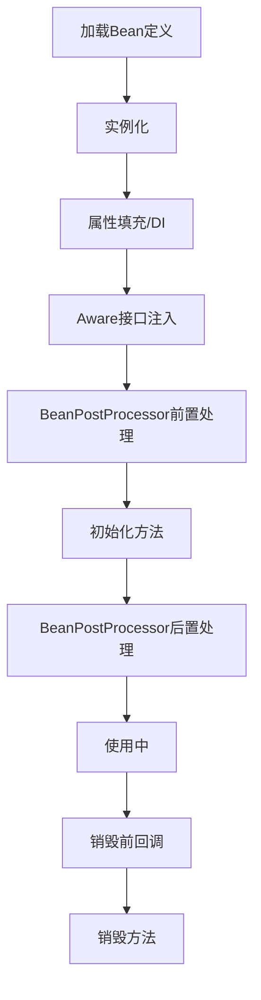

#### 1-3-3、循环依赖

问题描述

1. ‌**属性注入循环依赖**‌

   ```java
   @Component
   public class A {
       @Autowired
       private B b;  // A 依赖 B
   }
   
   @Component
   public class B {
       @Autowired
       private A a;  // B 又依赖 A
   }
   ```

   - ‌**解决方式**‌：通过 ‌**三级缓存**‌ 提前暴露未初始化的 Bean 引用。

2. ‌**构造器注入循环依赖**‌

   ```java
   @Component
   public class A {
       private final B b;
       public A(B b) { this.b = b; }  // 构造器依赖 B
   }
   
   @Component
   public class B {
       private final A a;
       public B(A a) { this.a = a; }  // 构造器依赖 A
   }
   ```

   - ‌**无法解决**‌：Spring 会直接抛出 `BeanCurrentlyInCreationException`

三级缓存定义与作用

1. ‌**一级缓存（singletonObjects）**‌
   - 存储已完成初始化（实例化+依赖注入+初始化）的完整Bean
   - 通过`getBean()`直接获取的最终对象来源
2. ‌**二级缓存（earlySingletonObjects）**‌
   - 存储已实例化但未完成初始化的"早期对象"
   - 解决多线程环境下重复创建代理对象的问题
3. ‌**三级缓存（singletonFactories）**‌
   - 存储生成对象的`ObjectFactory`工厂（Lambda表达式）
   - 核心作用：在存在AOP代理时，确保返回的是代理对象而非原始对象


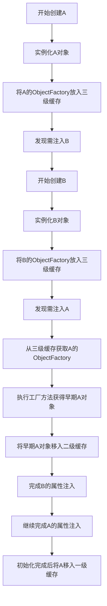

### 1-4、事务管理

#### 1-4-1、声明式

@transaction

#### 1-4-2、编程式

transactiontemplate

#### 1-4-3、事务传播


## 2、SpringCloud升级

### 2-1、基本五大组件

注册中心：eureka/consul/Nacos/zookeeper

负载均衡：Ribbon

远程调用：feign

网关：gateway/zunnl

熔断：Hystrix

### 2-2、如何理解各组件

#### 2-2-1 注册中心

​	eureka是ap模型，注重可用性，zookeeper是cp，侧向于一致性结果

#### 2-2-2 负载均衡

​	Ribbon和feign组合使用，在调用过后，需要执行相应的负载均衡策略，选择其中一个实例进行转发。

IRule自定义负载均衡策略，常见有轮询/权重/随机/最好可行

#### 2-2-3 网关

​	对外接口的聚合，提供认证鉴权/动态路由/流量控制/请求响应处理;权限控制、负载均衡、路由转发、监控、安全控制黑名单和白名单等

认证鉴权：登陆验证（Qauth2/JWT）

动态路由：屏蔽内部接口（安全性），通过路由转发提供服务

流量控制：应对大流量时，能够提供防火墙功能，防止冲垮内部服务，配置独立的线程池/接口限流/服务降级等

请求响应再处理：通过前置/后置过滤器

- ‌**前置过滤器（Pre Filter）**‌

  - 在请求路由到下游服务前执行，可进行请求头修改、参数校验等操作
  - 典型应用场景：JWT 鉴权、请求参数加密、流量标记

- ‌**后置过滤器（Post Filter）**‌

  - 在下游服务返回响应后执行，用于修改响应数据或记录日志
  - 典型应用场景：响应数据脱敏、统一错误格式封装

  ### 过滤器分类

  | 类型           | 作用范围 | 执行阶段 | 示例                                     |
  | -------------- | -------- | -------- | ---------------------------------------- |
  | ‌**全局过滤器**‌ | 所有路由 | Pre/Post | `NettyWriteResponseFilter`（响应写入）25 |
  | ‌**局部过滤器**‌ | 指定路由 | Pre/Post | `AddRequestHeader`（添加请求头）         |

```java
@Component
@Order(-1)  // 最高优先级
public class AuthFilter implements GlobalFilter {
    @Override
    public Mono<Void> filter(ServerWebExchange exchange, GatewayFilterChain chain) {
        // Pre 处理逻辑
        return chain.filter(exchange).then(Mono.fromRunnable(() -> {
            // Post 处理逻辑
        }));
    }
}

```

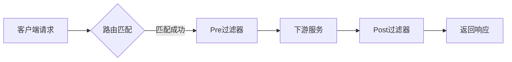

#### 2-2-4 feign

​	Rest API风格的调用，定义接口，定义方法，通过动态代理实现调用。

#### 2-2-5 熔断降级

Hystrix和reillence4j。

熔断降级有什么区别？


### 2-3、SpringCloud alibaba中的Nacos

alibaba cloud中服务注册中心，同时是配置中心

#### 2-3-1 注册中心

配置服务器地址添加必要注解，根据server.name注册服务

#### 2-3-2 配置中心

使用方法：命名空间隔离+多层次配置

云环境中通常在部署实例时，会在镜像脚本Dockfile中添加 [CMD] jar -jar .... spring.profiles.active=dev/test/prod

参数值随着不同的环境变化，从而起到加载不同配置文件作用，通常配置文件数据私密，不会在服务中出现，只会配置不同隔离环境的命名空间，从Nacos的服务器中获取配置信息。

```yaml
--spring.profiles.active=dev、test、prod
可以在application.yaml文件中单独配置
# 测试环境独立配置
spring:
  profiles: test
  cloud:
    nacos:
      config:
        server-addr: 192.168.1.100:8848  # 测试环境Nacos地址
        namespace: test-ns-id

# 生产环境独立配置
---
spring:
  profiles: prod
  cloud:
    nacos:
      config:
        server-addr: 10.0.0.100:8848  # 生产环境Nacos地址
        namespace: prod-ns-id
进行环境隔离
```

#### 2-3-3 配置动态更新

核心原理

1.长轮询监听。客户端向服务端注册一个监听器，服务端开始数30s，30s内有变更，通知给客户端

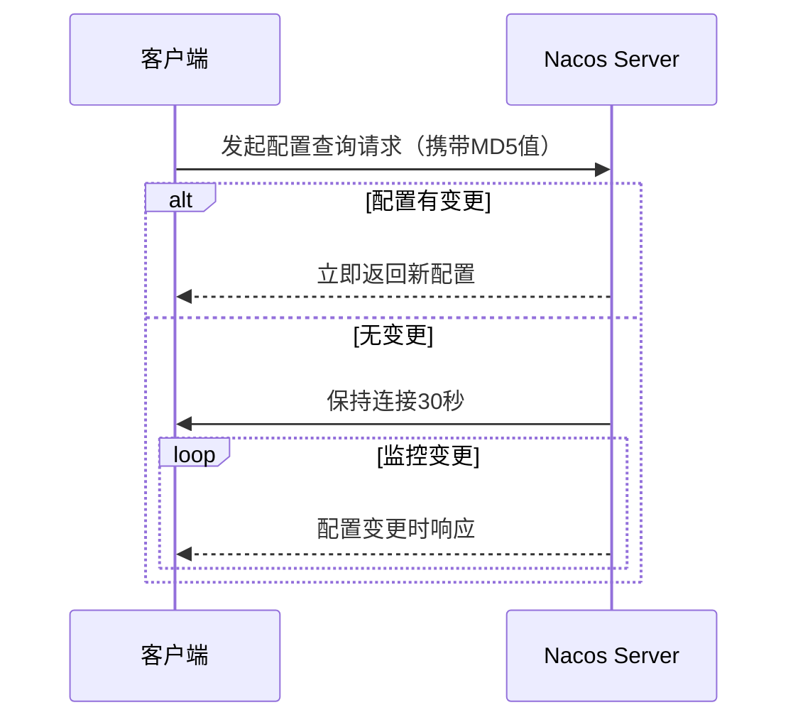

2.事件驱动更新

有变更，通知给客户端，本地通过@RefreshScope或者@ConfigurationProperties重新初始化

#### 2-3-4 Nacos 中的实现细节

1. ‌**客户端行为**‌
   - 首次启动拉取配置后，立即注册监听器并开启长轮询
   - 每次请求携带本地配置的MD5值，服务端通过对比判断是否变更
2. ‌**服务端处理**‌
   - 无变更时：TCP连接保持打开状态（非HTTP轮询），减少重复握手开销
   - 有变更时：立即返回新配置并关闭当前连接
3. ‌**超时控制**‌
   - 默认30秒超时后，客户端会重新发起长轮询请求
   - 服务端配置`nacos.config.long-poll.timeout`可调整该阈值

# 三、计算机网络

## 1 

# 四、Java仔摸底

## 1、JVM虚拟机运行时数据区

## 2、基础知识点汇总

## 3、数据结构

### 4 、GC算法

# 五、消息队列

## 1、rabbitMQ介绍


## 2、rocketMQ理解

## 3、kafaka应用

## 4、MQTT协议

# 六、常用框架解析

## 1、Netty好，得学

异步事件驱动的高性能网络通信应用框架，用于快速开发高性能、高可靠性的网络服务器、客户端程序。运用在各个框架组件上Dubbo、gRPC、springgateway、xxl-job等等

### 1-1、基础汇总

#### 1-1-1、‌**Netty核心概念**‌

1. ‌**定义与定位**‌
   Netty是一个‌**异步事件驱动**‌的网络应用框架，用于快速开发高性能、高可靠性的网络服务器和客户端程序。
   - ‌**地位**‌：在Java网络框架中的地位类比Spring在JavaEE中的地位。
   - ‌**应用场景**‌：Cassandra、Spark、RocketMQ等知名框架均基于Netty实现网络通信。
2. ‌**核心优势**‌
   - ‌**高性能**‌：基于NIO（非阻塞IO），支持零拷贝机制优化数据传输；
   - ‌**易用性**‌：统一API（支持HTTP/Socket/WebSocket等），简化复杂网络编程；
   - ‌**扩展性**‌：模块化设计（如灵活的线程模型、可插拔的组件）。

------

#### 1-1-2、‌**核心组件与架构**‌

1. ‌**核心组件**‌

   | ‌**组件**‌          | ‌**作用**‌                                                     |
   | ----------------- | ------------------------------------------------------------ |
   | `EventLoop`       | 事件循环线程，处理I/O操作和任务调度（每个`Channel`绑定一个`EventLoop`）； |
   | `Channel`         | 网络连接抽象，支持TCP/UDP等协议；                            |
   | `ChannelPipeline` | 责任链模式，串联多个`ChannelHandler`处理数据（如编解码、业务逻辑）； |
   | `ByteBuf`         | 高性能字节缓冲区，支持池化、直接内存分配和动态扩容。         |

2. ‌**线程模型**‌

   - ‌**主从Reactor多线程**‌：改进自Reactor模式，`bossGroup`处理连接，`workerGroup`处理I/O；
   - ‌**对比传统NIO**‌：解决NIO的API复杂性和Epoll空轮询Bug。

------

#### 1-1-3、‌**关键特性**‌

1. ‌**零拷贝机制**‌
   通过`FileRegion`和`CompositeByteBuf`减少内存拷贝次数，提升大文件传输效率。
2. ‌**协议支持**‌
   - 内置HTTP/WebSocket/SSL等协议；
   - 支持Protobuf等序列化框架。
3. ‌**动态扩展能力**‌
   - ‌**拦截器**‌：通过`ChannelHandler`实现日志、加密等功能；
   - ‌**流量控制**‌：基于`ChannelFuture`的异步回调机制。

------

#### 1-1-4、‌**Netty与NIO的关系**‌

1. ‌**基于NIO优化**‌
   - 解决原生NIO的复杂性（如`Selector`、`Buffer`手动管理问题）；
   - 提供更友好的API（如`ByteBuf`替代`ByteBuffer`）。
2. ‌**性能对比**‌
   - ‌**吞吐量**‌：Netty的零拷贝和线程模型显著优于传统NIO；
   - ‌**稳定性**‌：避免NIO的Epoll空轮询导致的CPU 100%问题。

------

#### 1-1-5、‌**典型应用场景**‌

1. ‌**RPC框架**‌（如Dubbo）
   利用Netty实现高性能远程调用。
2. ‌**消息队列**‌（如RocketMQ）
   处理高并发网络通信。
3. ‌**实时通信**‌
   支持WebSocket长连接（如聊天室、推送系统）。

### 1-2、原理剖析


### 1-3、疑难杂症

#### 1-3-1、如何解决nio空轮训

​	一、‌**问题背景**‌

NIO 的 `Selector.select()` 方法在无事件时可能因底层 `epoll` 实现缺陷‌**提前返回**‌（返回 `0` 但未阻塞），导致 CPU 空转（100% 占用）。

- ‌**触发条件**‌：`Selector` 无就绪事件却‌**非预期唤醒**‌，且连续发生。
- ‌**影响**‌：`EventLoop` 线程空跑，浪费资源

二、‌**解决方案核心逻辑**‌

Netty 通过 ‌**检测-重建**‌ 机制规避该问题：

1. ‌**空轮询计数**‌
   - 每次 `select()` 调用后，`selectCnt` 计数器自增；
   - 若正常唤醒（有事件/超时），重置 `selectCnt=0`。
2. ‌**阈值判定**‌
   - 当 `selectCnt` 超过阈值（默认 `512`），判定为 NIO 空轮询 Bug。
3. ‌**Selector 重建**‌
   - ‌**创建新 Selector**‌：替换旧实例36；
   - ‌**迁移 Channel**‌：将旧 `Selector` 注册的 `Channel` 重新绑定到新 `Selector`；
   - ‌**关闭旧 Selector**‌：释放资源。

------

三、‌**关键实现细节**‌

1. ‌**检测逻辑**‌

   - 通过unexpectedSelectorWakeup()方法判断异常唤醒：

     ```java
     if (selectedKeys == 0 && !hasTasks() && selectCnt > threshold) {
         rebuildSelector(); // 触发重建
     }
     ```

   - 结合‌**历史平均事件数**‌辅助判断（避免误判）。

2. ‌**重建流程**‌

   - 反射获取旧 `Selector` 的 `selectedKeys` 和 `publicSelectedKeys` 字段；
   - 通过 `rebuildSelector0()` 完成迁移。

3. ‌**性能优化**‌

   - ‌**延迟重建**‌：仅当连续空轮询超阈值时触发，避免频繁开销；
   - ‌**线程安全**‌：迁移期间暂停事件处理，保证一致性

检测+重建

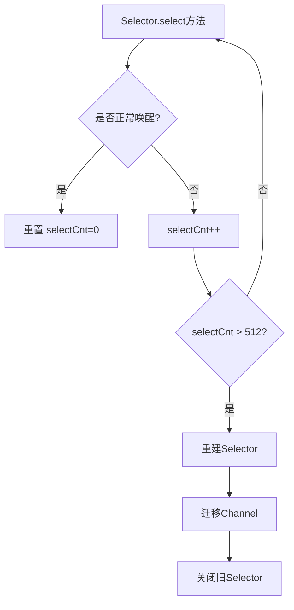


#### 1-3-2、如何解决粘包拆包

一、‌**问题本质与原因**‌

1. ‌**粘包**‌：多个数据包被合并为一个TCP包发送，接收端无法区分原始消息边界。

2. ‌**拆包**‌：单个数据包被拆分为多个TCP包传输，接收端需重组。

3. ‌**根本原因**‌：TCP是面向字节流的协议，无消息边界，且受TCP缓冲区大小、Nagle算法等影响。

4. 一、‌**粘包现象（多个包合并）**‌

   1. ‌**案例1：连续小包合并**‌
      - ‌**场景**‌：客户端连续发送两条短消息`"HELLO"`和`"WORLD"`，服务端却一次性收到`"HELLOWORLD"`。
      - ‌**原因**‌：TCP缓冲区将多个小包合并发送（Nagle算法或缓冲区未满）。
   2. ‌**案例2：数据粘连**‌
      - ‌**场景**‌：A包`"ABC"`和B包`"123"`被合并为`"ABC123"`，无法区分原始消息边界。

   ------

   二、‌**拆包现象（单包拆分）**‌

   1. ‌**案例1：大数据包分割**‌
      - ‌**场景**‌：发送`"NETTY_IS_GOOD"`，接收端分两次收到`"NETTY_"`和`"IS_GOOD"`。
      - ‌**原因**‌：数据超过TCP缓冲区大小（MSS限制）。
   2. ‌**案例2：半包+粘包混合**‌
      - ‌**场景**‌：A包`"DATA"`和B包`"STREAM"`被拆分为`"DAT"`（A包部分）和`"ASTREAM"`（A包剩余+B包）。

5. 

   ```mermaid
   graph LR
       A[发送端] -->|正常包| B[包1+包2独立]
       A -->|粘包| C[包1+包2合并]
       A -->|拆包| D[包1拆分->包1_1+包1_2]
       A -->|混合| E[包1_1+包2粘合]
   
   ```

   

------

二、‌**核心解决方案**‌

Netty通过‌**编解码器（Encoder/Decoder）**‌实现以下四种主流方案：

1. ‌**固定长度协议（FixedLengthFrameDecoder）**‌

- ‌**原理**‌：强制每个数据包为固定长度（如1024字节），不足则补空字符。

- ‌**适用场景**‌：简单协议，数据长度稳定。

- ‌代码示例：

  ```java
  pipeline.addLast(new FixedLengthFrameDecoder(1024));
  ```

2. ‌**分隔符协议（DelimiterBasedFrameDecoder）**‌

- ‌**原理**‌：以特殊字符（如`\n`、`\r\n`）标记包结尾。

- ‌**优势**‌：灵活，适合文本协议（如HTTP）。

- ‌代码示例‌：

  ```java
  pipeline.addLast(new DelimiterBasedFrameDecoder(1024, Unpooled.wrappedBuffer("\n".getBytes())));
  ```

3. ‌**长度字段协议（LengthFieldBasedFrameDecoder）**‌

- ‌**原理**‌：自定义协议头包含长度字段，接收端按长度截取完整包。

- ‌结构：

  ```text
  +--------+----------+  
  | Length | Content  |  
  +--------+----------+  
  ```

- ‌代码示例：

  ```java
  pipeline.addLast(new LengthFieldBasedFrameDecoder(1024, 0, 4, 0, 4));
  ```

4. ‌**自定义协议（MessageToMessageCodec）**‌

- ‌**原理**‌：完全自定义编解码逻辑，如添加魔数、校验位等。
- ‌**适用场景**‌：复杂业务协议（如RPC）。
- ‌关键步骤‌：
  - 定义协议类（含长度字段`len`和内容`content`）；
  - 实现`encode()`和`decode()`方法。

------

三、‌**方案对比与选型**‌

| ‌**方案**‌   | ‌**优点**‌           | ‌**缺点**‌             | ‌**适用场景**‌         |
| ---------- | ------------------ | -------------------- | -------------------- |
| 固定长度   | 实现简单，解析高效 | 浪费带宽（补空字符） | 固定格式的二进制协议 |
| 分隔符     | 灵活，兼容文本协议 | 需转义分隔符，防冲突 | HTTP、日志流         |
| 长度字段   | 精准控制，扩展性强 | 协议设计稍复杂       | 高性能RPC/消息队列   |
| 自定义协议 | 完全适配业务需求   | 开发成本高           | 复杂私有协议         |

------

四、‌**底层机制与优化**‌

1. ‌**ByteBuf处理**‌：Netty的`ByteBuf`支持动态扩容和切片，避免拆包时的内存拷贝。
2. ‌**滑动窗口**‌：通过`ChannelPipeline`的链式处理逐步解析数据。
3. ‌**异常处理**‌：自动丢弃不完整包或触发`TooLongFrameException`

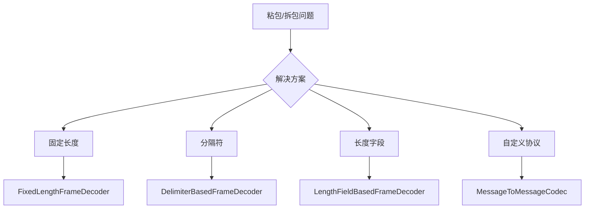

#### 1-3-3、零拷贝技术

‌**定义**‌

- 零拷贝（Zero-Copy）通过减少或消除数据在内存间的冗余拷贝，直接在内核空间完成数据传输，显著提升I/O性能

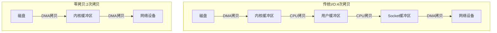


## 2、Mybatis的使用

半ORM框架，灵活好用

### 2-1、使用方式之两种

#### 2-1-1、接口方法上注解

​	简单使用CRUD时，接口方法上添加@select@update@insert@delete，加上具体SQL即可操作数据库

```java
核心实现逻

在 Java 接口方法上直接使用 @Select、@Insert 等注解编写 SQL，无需 XML 文件。
示例代码：
java
@Insert("INSERT INTO user(name) VALUES(#{name})")
void insertUser(@Param("name") String name);
通过 SqlSession.getMapper() 获取代理对象调用方法。
‌适用场景‌

简单 CRUD 操作或快速原型开发；
微服务等轻量级项目，减少配置文件数量。
‌优势‌

代码简洁，开发效率高；
避免 XML 与 Java 代码频繁切换
```


#### 2-1-2、mapper.xml

这种适合复杂项目，接口和mapper文件一一对应，声明同一命名空间

```xml
核心实现逻

通过编写 mapper.xml 文件定义 SQL 语句，与 Java 接口方法绑定，实现 SQL 与代码分离。
典型配置示例：
<insert id="batchInsertData" parameterType="list">
    INSERT INTO table_name (字段) VALUES 
    <foreach item="item" collection="list" separator=",">
        (#{item.property})
    </foreach>
</insert>
支持动态 SQL 和批量操作。
‌适用场景‌
复杂 SQL 语句（如多表关联、动态条件）；
需要精细控制 SQL 性能优化的场景（如批量插入）。
‌优势‌
SQL 可视化，便于维护和调试；
支持高级映射（如结果集嵌套）
    #和$在SQL语句中使用，#是参数
```

#### 2-1-3、#和$在SQL语句中的使用区别

------

一、‌**核心机制差异**‌

1. ‌**`#{}`（预编译占位符）**‌

   - 原理：转换为 JDBC 的 `PreparedStatement` 参数占位符（`?`），执行时安全绑定参数值。

   - 示例：

     ```xml
     SELECT * FROM user WHERE id = #{id}
     ```

     解析为：

     ```xml
     SELECT * FROM user WHERE id = ?
     ```

   - ‌**安全性**‌：自动转义特殊字符，防止 SQL 注入。

2. ‌**`${}`（字符串直接替换）**‌

   - 原理：直接拼接参数值到 SQL 中，无预编译处理。

   - 示例：

     ```xml
     SELECT * FROM ${tableName} WHERE id = 1
     ```

     若tableName=user，解析为：

     ```xml
     SELECT * FROM user WHERE id = 1
     ```

   - ‌**风险**‌：存在 SQL 注入漏洞（如输入 `' OR 1=1 --` 可篡改逻辑）。

------

二、‌**使用场景对比**‌

| ‌**场景**‌                   | ‌**推荐方式**‌ | ‌**原因**‌                                                 |
| -------------------------- | ------------ | -------------------------------------------------------- |
| 普通参数绑定（如ID、数值） | `#{}`        | 安全、高效（预编译复用）                                 |
| 动态表名/列名              | `${}`        | 需直接拼接 SQL 片段（如分表场景）                        |
| 排序字段（`ORDER BY`）     | `${}`        | `#{}` 会添加引号导致语法错误（如 `ORDER BY "age"` 无效） |

------

三、‌**性能与类型处理**‌

1. ‌**`#{}` 优势**‌
   - ‌**预编译缓存**‌：同一 SQL 多次执行仅编译一次，提升效率；
   - ‌**自动类型转换**‌：Java 类型与 JDBC 类型自动匹配（如 `String` → `VARCHAR`）。
2. ‌**`${}` 限制**‌
   - ‌**无类型处理**‌：直接拼接可能导致类型错误（如字符串未加引号）；
   - ‌**动态分表需配置**‌：需设置 `statementType="STATEMENT"` 禁用预编译。

------

四、‌**安全建议**‌

1. 优先使用 `#{}`，仅在必须动态拼接 SQL 时使用 `${}`；
2. 使用 `${}` 时，必须对输入值做严格校验或白名单过滤。

------

总结流程图

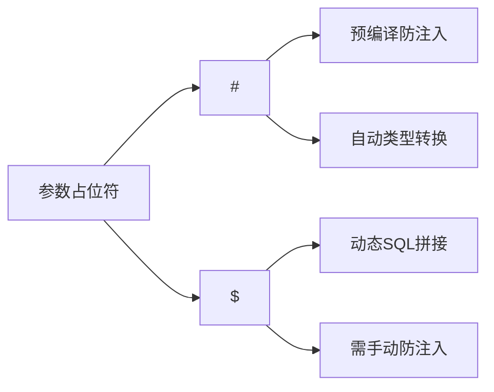

### 2-2、常用标签

#### 2-2-1、基础CRUD

1. ‌**`<select>`**‌

   - ‌**作用**‌：执行查询操作，将结果映射到 Java 对象。

   - ‌关键属性：

     - `id`：唯一标识符，对应接口方法名；
     - `resultType`/`resultMap`：指定返回类型或自定义映射规则；
     - `parameterType`：参数类型（可省略，自动推断）。

   - ‌示例：

     ```xml
     <select id="findUserById" resultType="User">
         SELECT * FROM user WHERE id = #{id}
     </select>
     ```

2. ‌**`<insert>`**‌

   - ‌**作用**‌：插入数据，支持主键回填。

   - ‌关键属性：

     - `useGeneratedKeys`：启用自增主键；
     - `keyProperty`：主键值赋给对象的哪个属性。

   - ‌示例：

     ```xml
     <insert id="addUser" parameterType="User" useGeneratedKeys="true" keyProperty="id">
         INSERT INTO user (name) VALUES (#{name})
     </insert>
     ```

3. ‌**`<update>` 与 `<delete>`**‌

   - ‌**共同点**‌：均需通过 `id` 绑定方法，`parameterType` 指定参数。
   - ‌**注意**‌：必须包含条件（如 `WHERE`），否则会操作全表

#### 2-2-2、动态标签

1. ‌**条件控制标签**‌

   - ‌`<if>`：根据条件动态拼接 SQL。

     ```xml
     <select id="findUser">
         SELECT * FROM user WHERE 1=1
         <if test="name != null">AND name = #{name}</if>
     </select>
     ```

   - ‌**`<choose>/<when>/<otherwise>`**‌：实现多条件分支（类似 `if-else`）。

2. ‌**循环与集合处理**‌

   - ‌`<foreach>`‌：遍历集合，常用于IN查询或批量操作。

     ```xml
     <delete id="batchDelete">
         DELETE FROM user WHERE id IN
         <foreach item="id" collection="list" open="(" separator="," close=")">
             #{id}
         </foreach>
     </delete>
     ```

3. ‌**辅助标签**‌

   - ‌**`<where>`**‌：智能添加 `WHERE` 关键字，自动去除多余 `AND`/`OR`；
   - ‌**`<set>`**‌：用于 `UPDATE` 语句，自动处理逗号。

------

#### 三、‌**高级映射与复用标签**‌

1. ‌**`<resultMap>`**‌

   - ‌**作用**‌：自定义复杂结果集映射（如一对一、一对多）。

   - ‌示例‌：

     ```xml
     <resultMap id="userMap" type="User">
         <id property="id" column="user_id"/>
         <result property="name" column="user_name"/>
     </resultMap>
     ```

2. ‌**SQL 片段复用**‌

   - ‌`<sql>` + `<include>`：定义可重用的 SQL 片段。

     ```xml
     <sql id="userColumns">id, name, age</sql>
     <select id="selectUser" resultType="User">
         SELECT <include refid="userColumns"/> FROM user
     </select>
     ```

------

#### 四、‌**其他实用标签**‌

- ‌**`<bind>`**‌：创建变量，简化表达式；
- ‌**`<trim>`**‌：灵活处理字符串前缀/后缀；

### 2-3、原理剖析

#### 2-3-1、整合springboot之自动配置

​	springboot有starter，mybatis通过自定义starter，整合到springboot框架中，基本流程就是META_INF下创建spring.factories文件，在此文件下配置autoconfigration的自定义配置类的完全限定名，springboot会自动扫描META_INF下的spring.factories文件中的自动配置类，从而自动配置和导入mybatis功能，开发者只需在配置文件中配置参数即可。

#### 2-3-2、MyBatis 运行原理深度解析

------

#### 一、‌**核心架构分层**‌

MyBatis 采用分层设计，主要分为 ‌**接口层**‌、‌**核心处理层**‌ 和 ‌**基础支撑层**‌：

1. ‌接口层
   - 提供 `SqlSession` API（如 `selectOne()`、`insert()`），开发者通过它与 MyBatis 交互。
2. ‌核心处理层
   - ‌**SQL 解析**‌：将 XML注解中的 SQL 转换为 `MappedStatement` 对象；
   - ‌**参数映射**‌：将 Java 对象属性映射到 SQL 参数（`#{}` 替换为 `?`）；
   - ‌**SQL 执行**‌：通过 `Executor` 执行 SQL 并处理结果集。
3. ‌基础支撑层
   - 连接管理（`DataSource`）、事务控制（`Transaction`）、缓存（`Cache`）等。

------

#### 二、‌**启动阶段：配置加载**‌

1. ‌解析配置文件
   - `SqlSessionFactoryBuilder` 读取 `mybatis-config.xml`，构建 `Configuration` 对象（全局配置中心）；
   - 加载 Mapper 接口和 XML 文件，解析为 `MappedStatement`（存储 SQL 和映射规则）。
2. ‌Mapper 动态代理
   - 通过 `MapperProxy` 为接口生成代理类，调用方法时关联对应的 `MappedStatement`。

------

#### 三、‌**执行阶段：SQL 处理流程**‌

1. ‌SQL 会话创建

   - 通过 `SqlSessionFactory` 创建 `SqlSession`（封装了与数据库的交互）。

2. ‌参数处理

   - 将方法参数转换为 SQL 参数：

     ```java
     // 示例：方法调用
     userMapper.selectUserById(1);
     // 转换为 SQL：SELECT * FROM user WHERE id = ?
     ```

   - `TypeHandler` 处理 Java 类型与 JDBC 类型的转换。

3. ‌SQL 执行

   - ‌执行器（Executor）‌：
     - ‌**SimpleExecutor**‌：默认执行器，每次执行新 SQL；
     - ‌**ReuseExecutor**‌：复用预处理语句（`PreparedStatement`）；
     - ‌**BatchExecutor**‌：批量操作优化。
   - ‌缓存机制：
     - 一级缓存（`SqlSession` 级别）默认开启；
     - 二级缓存（`Mapper` 级别）需手动配置。

4. ‌结果映射

   - 通过 `ResultSetHandler` 将 `ResultSet` 转换为 Java 对象（依赖 `<resultMap>` 规则）。

------

#### 四、‌**动态 SQL 处理**‌

1. ‌解析过程‌

   - XML 中的 `<if>`、`<foreach>` 等标签被解析为 `SqlNode` 对象；
   - 执行时根据参数动态拼接为完整 SQL（通过 `DynamicSqlSource`）。

2. ‌示例转换

   ```xml
   <select id="findUser">
       SELECT * FROM user 
       <where>
           <if test="name != null">AND name = #{name}</if>
       </where>
   </select>
   ```

   - 若参数 `name` 为 `null`，最终 SQL 为 `SELECT * FROM user`。

------

#### 五、‌**扩展机制**‌

1. ‌插件（Interceptor）
   - 可拦截 `Executor`、`StatementHandler` 等组件，实现分页、性能监控。
2. ‌类型处理器（TypeHandler）
   - 自定义复杂类型（如 JSON、枚举）与数据库类型的转换。

------

### 总结：MyBatis 运行流程图

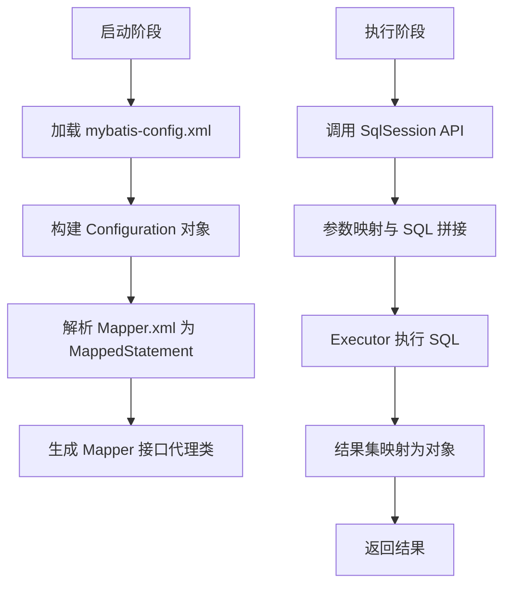

‌**关键设计思想**‌：

- ‌**解耦 SQL 与代码**‌：通过 XML/注解集中管理 SQL；
- ‌**灵活映射**‌：`ResultMap` 处理复杂对象关系；
- ‌**动态扩展**‌：插件机制支持功能定制

# 七、高并发、大数据量解决方案

大型业务系统中核心接口请求量最大可达百万级，在如此巨大流量情况下如何有效维护系统稳定性至关重要。

## 1、高并发有多高？


## 2、数据量有多大？

## 3、常见业务系统中的问题

## 4、开发角度解决问题

## 5、如何系统性解决

# 八、高级运维之云原生

# 九、经典算法

## 1、排序算法

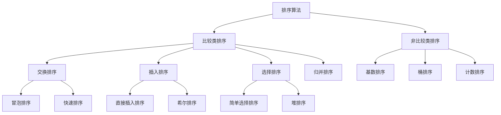


### 1-1、交换类

#### 1-1-1、冒泡排序

```java
fff
```


### 1-2、插入类

### 1-3、选择类

## 2、搜索算法


### 2-1、

## 3、

# 十、大数据时代


## 附上

### Memaid语法解析

1. **`graph LR`**
   - 声明这是一个从左到右（Left-to-Right）的流程图
2. **节点定义**
   - `A[服务]`：矩形节点，显示文本为"服务"
   - `B(Fluentd/Filebeat)`：圆角矩形节点
   - `C[...]` 和 `D[...]`：同类型节点
3. **连接线**
   - `-->`：箭头连接线
   - `|日志输出|`：连线上的文字标签

### 支持的图标

|      |
| ---- |

| 类型   | 声明方式            | 用途               |
| :----- | :------------------ | :----------------- |
| 流程图 | `graph TD`/`LR` | 系统架构、流程描述 |
| 序列图 | `sequenceDiagram` | 交互时序           |
| 类图   | `classDiagram`    | 面向对象结构       |
| 状态图 | `stateDiagram`    | 状态转换           |
| 甘特图 | `gantt`           | 项目时间规划       |
| 饼图   | `pie`             | 比例分布           |
