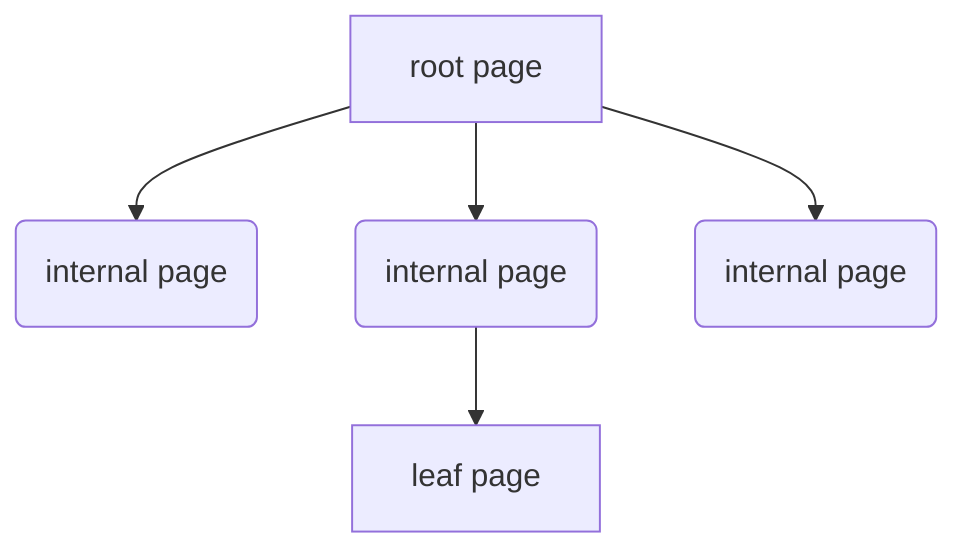
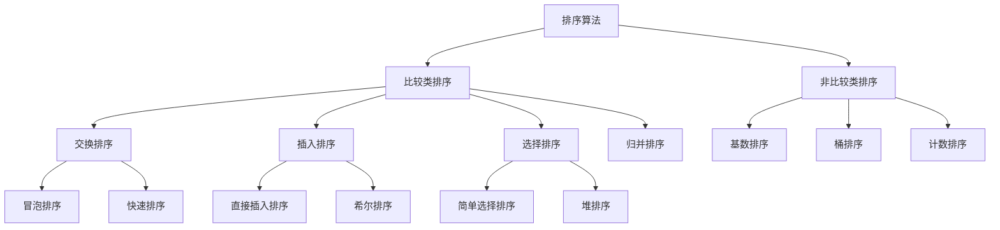

[toc]

# 序

    对，没错，就叫做“面镜”，不是面经而是一面镜子，一面让人原形毕露的镜子。学海无涯苦作舟，想必这个学字深入人心，作为一名后端开发人员，需要掌握的东西可太多了，最麻烦的就是无法系统地学习各种知识。现在好了，不用东拼西凑了，更不用付费阅读了，都在这了。这面镜子是我自己的“照妖镜”，照出瑕疵，也希望能够帮助各位，在升职加薪的路上能够披荆斩棘，一路向前。内容错误处，望请批正。
    
    -- 猫鱼儿

# 一、数据库理论

业务系统离不开数据的存储与查询。

## 1、MongoDB

### 1-1、基本概念

集合（表）、文档（记录）、字段（字段）

### 1-2、存储引擎与索引

3.2版本后，使用WiredTiger存储引擎，B+树结构，存储单元为page，分为**root page、internal page、leaf page**，每一个节点是一个page，非叶子节点为索引节点，数据存储在叶子节点上

索引：

单键值索引、

复合索引（联合索引）、

多键索引（一个字段下可能是一个数组，存在多键情况）

哈希索引：顾名思义，字段哈希值索引

文本索引：内容检索，全文索引，一般通过一个或者多个字符串对文档内容进行索引

### 1-3、分片复制集群

三个组件router server、config server、sharding server。

router server：接受前段连接请求，然后根据config server进行路由转发

config server：存储元数据信息，不存具体业务数据

sharding server（主从结构）：数据实际储存位置，多主多从，高可用高并发

类似Redis的集群分片

## 2、Redis

内存型数据库，c语言编写，旨在加速查存

### 2-1、基本数据类型剖析

string、set、zset、list、map

### 2-2、为什么好用？

### 2-3、用在哪些场景？

### 2-4、

## 3、MySQL

关系型数据库，强结构型数据库，5.5版本后为默认存储引擎

### 3-1、MySQL基本结构

### 3-2、MySQL存储引擎

### 3-3、MySQL优化分析

# 二、SPRING全家桶

## 1、SpringBoot基础

### 1-1、基本特性

### 1-2、注解的使用

### 1-3、理解

## 2、SpringCloud升级

### 2-1、基本五大组件

### 2-2、如何理解各组件

### 2-3、SpringCloud alibaba中的Nacos

# 三、计算机网络

# 四、Java仔摸底

## 1、JVM虚拟机运行时模型

## 2、基础知识点汇总

## 3、数据结构

# 五、消息队列

## 1、rabbitMQ介绍

## 2、rocketMQ理解

## 3、kafaka应用

## 4、MQTT协议

# 六、常用框架解析

## 1、Netty的介绍

## 2、Mybatis的使用

### 2-1、使用方式之两种

### 2-2、原理剖析

# 七、高并发、大数据量解决方案

大型业务系统中核心接口请求量最大可达百万级，在如此巨大流量情况下如何有效维护系统稳定性至关重要。

## 1、高并发有多高？

## 2、数据量有多大？

## 3、常见业务系统中的问题

## 4、开发角度解决问题

## 5、如何系统性解决

# 八、高级运维之云原生

# 九、经典算法

## 1、排序算法

### 1-1、交换类

#### 1-1-1、冒泡排序

### 1-2、插入类

### 1-3、选择类

## 2、搜索算法

### 2-1、

## 3、

# 十、大数据时代

## 附

### Memaid语法解析

1. **`graph LR`**
   - 声明这是一个从左到右（Left-to-Right）的流程图
2. **节点定义**
   - `A[服务]`：矩形节点，显示文本为"服务"
   - `B(Fluentd/Filebeat)`：圆角矩形节点
   - `C[...]` 和 `D[...]`：同类型节点
3. **连接线**
   - `-->`：箭头连接线
   - `|日志输出|`：连线上的文字标签

### 支持的图标

|      |
| ---- |

| 类型   | 声明方式            | 用途               |
| :----- | :------------------ | :----------------- |
| 流程图 | `graph TD`/`LR` | 系统架构、流程描述 |
| 序列图 | `sequenceDiagram` | 交互时序           |
| 类图   | `classDiagram`    | 面向对象结构       |
| 状态图 | `stateDiagram`    | 状态转换           |
| 甘特图 | `gantt`           | 项目时间规划       |
| 饼图   | `pie`             | 比例分布           |
