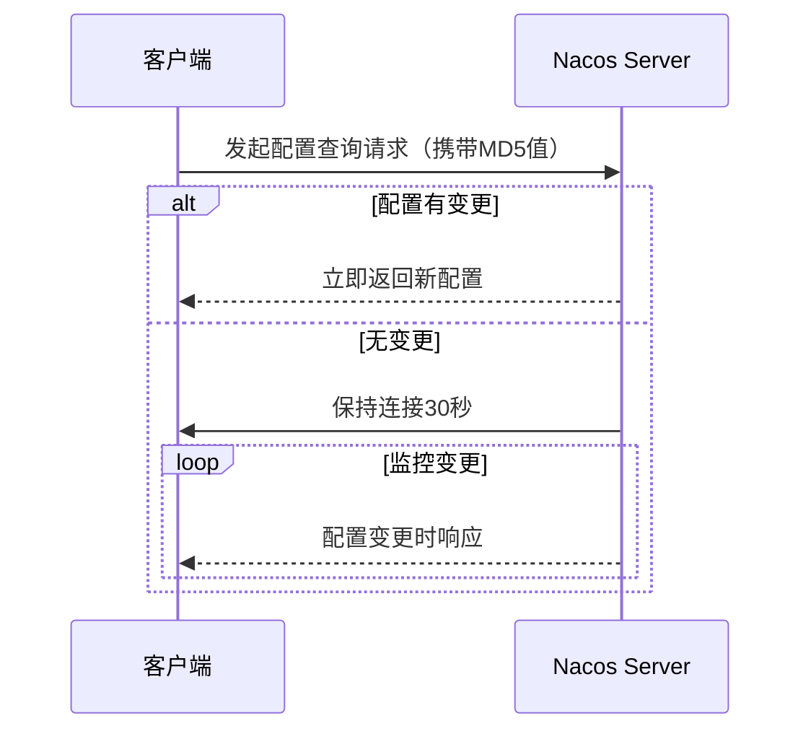

[toc]

# 序

​	对，没错，就叫做“面镜”，不是面经而是一面镜子，一面让人原形毕露的镜子。学海无涯苦作舟，想必这个学字深入人心，作为一名后端开发人员，需要掌握的东西可太多了，最麻烦的就是无法系统地学习各种知识。现在好了，不用东拼西凑了，更不用付费阅读了，都在这了。这面镜子是我自己的“照妖镜”，照出瑕疵，也希望能够帮助各位，在升职加薪的路上能够披荆斩棘，一路向前。内容错误处，望请批正。

-- 猫鱼儿

# 一、数据库理论

业务系统离不开数据的存储与查询。

## 1、MongoDB

### 1-1、基本概念

集合（表）、文档（记录）、字段（字段）

### 1-2、存储引擎与索引

3.2版本后，使用WiredTiger存储引擎，B+树结构，存储单元为page，分为**root page、internal page、leaf page**，每一个节点是一个page，非叶子节点为索引节点，数据存储在叶子节点上


索引：

单键值索引、

复合索引（联合索引）、

多键索引（一个字段下可能是一个数组，存在多键情况）

哈希索引：顾名思义，字段哈希值索引

文本索引：内容检索，全文索引，一般通过一个或者多个字符串对文档内容进行索引

### 1-3、分片复制集群

三个组件router server、config server、sharding server。

router server：接受前段连接请求，然后根据config server进行路由转发

config server：存储元数据信息，不存具体业务数据

sharding server（主从结构）：数据实际储存位置，多主多从，高可用高并发

类似Redis的集群分片

## 2、Redis

内存型数据库，c语言编写，旨在加速查存

### 2-1、基本数据类型剖析

string、set、zset、list、map

### 2-2、为什么好用？

### 2-3、用在哪些场景？

### 2-4、

## 3、MySQL

关系型数据库，强结构型数据库，5.5版本后为默认存储引擎

### 3-1、MySQL基本结构

### 3-2、MySQL存储引擎

### 3-3、MySQL优化分析

# 二、SPRING全家桶

## 1、SpringBoot基础

### 1-1、基本特性

### 1-2、注解的使用

### 1-3、理解

## 2、SpringCloud升级

### 2-1、基本五大组件

注册中心：eureka/consul/Nacos/zookeeper

负载均衡：Ribbon

远程调用：feign

网关：gateway/zunnl

熔断：Hystrix

### 2-2、如何理解各组件

#### 2-2-1 注册中心

​	eureka是ap模型，注重可用性，zookeeper是cp，侧向于一致性结果

#### 2-2-2 负载均衡

​	Ribbon和feign组合使用，在调用过后，需要执行相应的负载均衡策略，选择其中一个实例进行转发。

IRule自定义负载均衡策略，常见有轮询/权重/随机/最好可行

#### 2-2-3 网关

​	对外接口的聚合，提供认证鉴权/动态路由/流量控制/请求响应处理;权限控制、负载均衡、路由转发、监控、安全控制黑名单和白名单等

认证鉴权：登陆验证（Qauth2/JWT）

动态路由：屏蔽内部接口（安全性），通过路由转发提供服务

流量控制：应对大流量时，能够提供防火墙功能，防止冲垮内部服务，配置独立的线程池/接口限流/服务降级等

请求响应再处理：通过前置/后置过滤器

- ‌**前置过滤器（Pre Filter）**‌

  - 在请求路由到下游服务前执行，可进行请求头修改、参数校验等操作
  - 典型应用场景：JWT 鉴权、请求参数加密、流量标记

- ‌**后置过滤器（Post Filter）**‌

  - 在下游服务返回响应后执行，用于修改响应数据或记录日志
  - 典型应用场景：响应数据脱敏、统一错误格式封装

  ### 过滤器分类

  | 类型           | 作用范围 | 执行阶段 | 示例                                     |
  | -------------- | -------- | -------- | ---------------------------------------- |
  | ‌**全局过滤器**‌ | 所有路由 | Pre/Post | `NettyWriteResponseFilter`（响应写入）25 |
  | ‌**局部过滤器**‌ | 指定路由 | Pre/Post | `AddRequestHeader`（添加请求头）         |

```java
@Component
@Order(-1)  // 最高优先级
public class AuthFilter implements GlobalFilter {
    @Override
    public Mono<Void> filter(ServerWebExchange exchange, GatewayFilterChain chain) {
        // Pre 处理逻辑
        return chain.filter(exchange).then(Mono.fromRunnable(() -> {
            // Post 处理逻辑
        }));
    }
}

```


#### 2-2-4 feign

​	Rest API风格的调用，定义接口，定义方法，通过动态代理实现调用。

#### 2-2-5 熔断降级

Hystrix和reillence4j。

熔断降级有什么区别？


### 2-3、SpringCloud alibaba中的Nacos

alibaba cloud中服务注册中心，同时是配置中心

#### 2-3-1 注册中心

配置服务器地址添加必要注解，根据server.name注册服务

#### 2-3-2 配置中心

使用方法：命名空间隔离+多层次配置

云环境中通常在部署实例时，会在镜像脚本Dockfile中添加 [CMD] jar -jar .... spring.profiles.active=dev/test/prod

参数值随着不同的环境变化，从而起到加载不同配置文件作用，通常配置文件数据私密，不会在服务中出现，只会配置不同隔离环境的命名空间，从Nacos的服务器中获取配置信息。

```yaml
--spring.profiles.active=dev、test、prod
可以在application.yaml文件中单独配置
# 测试环境独立配置
spring:
  profiles: test
  cloud:
    nacos:
      config:
        server-addr: 192.168.1.100:8848  # 测试环境Nacos地址
        namespace: test-ns-id

# 生产环境独立配置
---
spring:
  profiles: prod
  cloud:
    nacos:
      config:
        server-addr: 10.0.0.100:8848  # 生产环境Nacos地址
        namespace: prod-ns-id
进行环境隔离
```

#### 2-3-3 配置动态更新

核心原理

1.长轮询监听。客户端向服务端注册一个监听器，服务端开始数30s，30s内有变更，通知给客户端



2.事件驱动更新

有变更，通知给客户端，本地通过@RefreshScope或者@ConfigurationProperties重新初始化

#### 2-3-4 Nacos 中的实现细节

1. ‌**客户端行为**‌
   - 首次启动拉取配置后，立即注册监听器并开启长轮询
   - 每次请求携带本地配置的MD5值，服务端通过对比判断是否变更
2. ‌**服务端处理**‌
   - 无变更时：TCP连接保持打开状态（非HTTP轮询），减少重复握手开销
   - 有变更时：立即返回新配置并关闭当前连接
3. ‌**超时控制**‌
   - 默认30秒超时后，客户端会重新发起长轮询请求
   - 服务端配置`nacos.config.long-poll.timeout`可调整该阈值

# 三、计算机网络

## 1 

# 四、Java仔摸底

## 1、JVM虚拟机运行时数据区

## 2、基础知识点汇总

## 3、数据结构

### 4 

# 五、消息队列

## 1、rabbitMQ介绍

## 2、rocketMQ理解

## 3、kafaka应用

## 4、MQTT协议

# 六、常用框架解析

## 1、Netty的介绍

## 2、Mybatis的使用

### 2-1、使用方式之两种

### 2-2、原理剖析

# 七、高并发、大数据量解决方案

大型业务系统中核心接口请求量最大可达百万级，在如此巨大流量情况下如何有效维护系统稳定性至关重要。

## 1、高并发有多高？


## 2、数据量有多大？

## 3、常见业务系统中的问题

## 4、开发角度解决问题

## 5、如何系统性解决

# 八、高级运维之云原生

# 九、经典算法

## 1、排序算法


### 1-1、交换类

#### 1-1-1、冒泡排序


### 1-2、插入类

### 1-3、选择类

## 2、搜索算法


### 2-1、

## 3、

# 十、大数据时代


## 附

### Memaid语法解析

1. **`graph LR`**
   - 声明这是一个从左到右（Left-to-Right）的流程图
2. **节点定义**
   - `A[服务]`：矩形节点，显示文本为"服务"
   - `B(Fluentd/Filebeat)`：圆角矩形节点
   - `C[...]` 和 `D[...]`：同类型节点
3. **连接线**
   - `-->`：箭头连接线
   - `|日志输出|`：连线上的文字标签

### 支持的图标

|      |
| ---- |

| 类型   | 声明方式            | 用途               |
| :----- | :------------------ | :----------------- |
| 流程图 | `graph TD`/`LR` | 系统架构、流程描述 |
| 序列图 | `sequenceDiagram` | 交互时序           |
| 类图   | `classDiagram`    | 面向对象结构       |
| 状态图 | `stateDiagram`    | 状态转换           |
| 甘特图 | `gantt`           | 项目时间规划       |
| 饼图   | `pie`             | 比例分布           |
